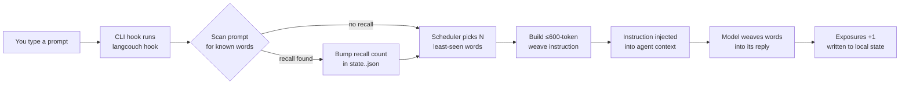

# LangCouch 🛋️

**Learn a language without getting off the couch — or leaving your terminal.**

LangCouch weaves target-language words into your AI agent's replies (the *diglot weave* technique): you work as usual, and Claude Code's answers gradually get laced with Spanish words — 3–5 per reply at first, then more frequent and more complex, up to collocations and simple constructions. No lessons. Immersion instead of studying.

> You: "why is the deploy failing?"
> Agent: "The problem is the **puerta** (door)… or rather, port 8080 — an old process is holding it. See **abajo** …"


## How it works

Browser extensions (Toucan, Vocabo) rewrite the page DOM. In a CLI there is no post-hoc rewrite — so LangCouch injects a short instruction (≤600 tokens) through a CLI hook, and the model does the weaving itself. The core knows nothing about any CLI — adapters are thin (architecture inspired by [context-mode](https://github.com/mksglu/context-mode)).



- **Concept-keyed vocabulary**: meanings live once in `concepts.json` (id, pos, tier, glosses per native language); each `wordlists/<lang>.json` is a thin concept→lemma map, so adding a language is one small file and glosses never drift
- **Wordlists**: ~400 core content words per language (noun/verb/adj/adv), no function words — English, German, French, Italian, Spanish, Portuguese, and Turkish included, plus en-GB, es-419 and pt-BR variants; adding yours is one JSON file your AI agent can produce by following [docs/AddLanguage.md](docs/AddLanguage.md); tier field reserves room for the →1000-word band, unlocked when the core is ~80% absorbed
- **Per-language progress**: state lives in `~/.langcouch/state.<lang>.json`, keyed by concept id — progress survives lemma fixes and can be compared across languages ("you know *sun* in 3 of 5")
- **SRS-lite**: least-shown words first, rotation, absorbed words drop into a ≤20% review tail
- **Recall signal**: exposure is not knowledge — a word counts as absorbed only after you actively use it (it shows up in your own prompt, or you pass a `quiz`) or after a much larger passive dose
- **Levels 1–10**: words → collocations (4+) → simple constructions (7+), driven by `grammar/<lang>.json` unlock rules
- **State**: local in `~/.langcouch/` (human-readable JSON)
- **Native language**: set `"native"` in `~/.langcouch/config.json` (default `en`) — glosses in the weave and accepted quiz answers follow it (`en`, `ru` and `uz` (Uzbek, Latin script) glosses ship for all concepts; when you learn your own native language, e.g. `en` with native `en`, glosses fall back to another language)

### Privacy

The hook runs locally. It reads your prompt only to scan it for words you've already seen (the recall signal) — your prompt is never logged, sent over the network, or stored anywhere. The only thing written to disk is the per-language state file in `~/.langcouch/`, which you can inspect, back up, or `rm -rf` at any time. LangCouch has no network surface and no telemetry.

### Supported languages

| Code | Language | Words | Tier-1 coverage | Grammar constructions |
|---|---|---|---|---|
| `en` | English (US)    | 402 | 100% | — |
| `en-GB` | British English | variant: 8 words over `en` | 100% | — |
| `de` | German     | 402 | 100% | — |
| `fr` | French     | 402 | 100% | — |
| `it` | Italian    | 402 | 100% | — |
| `es` | Spanish (Spain) | 402 | 100% | 10 |
| `es-419` | Latin American Spanish | variant: 9 words over `es` | 100% | 10 (from `es`) |
| `pt` | Portuguese (Portugal) | 402 | 100% | — |
| `pt-BR` | Brazilian Portuguese | variant: 8 words over `pt` | 100% | — |
| `tr` | Turkish    | 402 | 100% | — |

Every bundled list went through a second-model audit (a different vendor than the one that wrote it). English verbs are listed as `to work`, `to love`: English nouns and verbs often share a spelling, and each concept needs its own word. The weave still inflects them in context (*worked*, *she loves*).

Adding your language is one JSON file. Just for yourself: run `/langcouch:add-language Georgian` in Claude Code, and the file lands in `~/.langcouch/wordlists/`, where it survives plugin updates. For everyone: open a PR, see [docs/AddLanguage.md](docs/AddLanguage.md). The doc is written so an AI coding agent can do it end-to-end.

Regional variants work the same way: `pt-BR.json` lists only the words where Brazilian Portuguese differs from `pt`, the rest comes from the base, and progress is tracked separately. `/langcouch:add-language Brazilian Portuguese` builds one; `/langcouch:lang pt-br` switches to it.

### Supported CLIs

| CLI | Status | Install | Mechanism |
|---|---|---|---|
| Claude Code | **Production** | `/plugin marketplace add shmsk/LangCouch` → `/plugin install langcouch@langcouch`, or `langcouch install claude` | `UserPromptSubmit` hook (context injection, reliable) |
| opencode | **Production** (plugin) + **experimental** (fallback) | `langcouch install opencode [--scope project\|user]` | `experimental.chat.messages.transform` plugin hook + AGENTS.md self-serve fallback |
| Codex CLI | **Experimental** | `langcouch install codex` | Self-serve `AGENTS.md` section (model runs `langcouch hook` itself — no real hook, compliance varies by model) |

Adding yours is welcome — see [CONTRIBUTING.md](CONTRIBUTING.md). The hook contract any adapter must satisfy: never break the host session (on any error, print nothing and exit 0).

## Quick start

**Requirement:** [bun](https://bun.sh) or Node.js ≥ 22.6 on your machine (check with `bun -v` or `node -v`). Nothing else to install — no `npm install`, no build step. If neither is found, the plugin stays inactive and Claude tells you at session start.

### As a Claude Code plugin (recommended)

```
/plugin marketplace add shmsk/LangCouch
/plugin install langcouch@langcouch
# restart the session — replies start weaving Spanish (default: es, level 2)
```

Zero setup: the hook bootstraps its own config on first use. Control it from inside Claude Code with `/langcouch:status`, `/langcouch:lang pt`, `/langcouch:level up`, `/langcouch:pause` / `/langcouch:resume`, and add your own language with `/langcouch:add-language <language>`.
### Manual hook install

```bash
git clone https://github.com/shmsk/LangCouch && cd LangCouch
bun install
bun src/cli.ts init                       # create ~/.langcouch
bun src/cli.ts install claude            # hook into the project's .claude/settings.json
# restart your Claude Code session — replies start weaving Spanish
```

Don't combine both installs — and if you do anyway, a duplicate-delivery guard keeps the counting honest. The interactive `quiz` runs in a terminal: use the manual clone, or call the CLI inside the plugin cache (`~/.claude/plugins/cache/langcouch/…/scripts/cli.sh quiz`).

### As an opencode plugin

```
git clone https://github.com/shmsk/LangCouch && cd LangCouch
bun install
bun src/cli.ts install opencode           # project scope (.opencode/plugin/)
#   or:  bun src/cli.ts install opencode --scope user   # global (~/.config/opencode/plugin/)
# quit and restart opencode — replies start weaving Spanish
```

One command installs two paths, both active at once:

- **Plugin (primary, reliable)** — auto-discovered by opencode. Hooks `experimental.chat.messages.transform` to run `langcouch hook` on your latest user message and inject the `<langcouch>` block into context. Works on every model.
- **AGENTS.md section (fallback, experimental)** — if you disable plugins or the plugin can't load, the model is instructed to run `langcouch hook` itself at the start of each reply. Model-compliance-dependent (same status as the Codex adapter below).

A duplicate-delivery guard keeps the counting honest if both paths fire for the same prompt.

## Commands

| Command | What it does |
|---|---|
| `init` | create the config (idempotent) |
| `status` | level and progress for every language with state |
| `lang [code]` | switch target language / list available ones (your own are marked `local`) |
| `validate <code> [--full]` | check a wordlist, e.g. one you added in `~/.langcouch/wordlists/` |
| `level <1-10\|up\|down>` | weaving intensity |
| `quiz [n]` | absorption check (default 5 words); a failed word goes back into rotation |
| `pause` / `resume` | kill switch for weaving |
| `instruction` | print the weave instruction (without marking exposures) |
| `hook` | CLI-hook mode (marks exposures and scans your prompt for recalls; exits 0 on any error so it never breaks the host session) |
| `install claude [--scope project\|user]` | register the UserPromptSubmit hook |
| `install opencode [--scope project\|user]` | install the plugin + AGENTS.md fallback for opencode |
| `install codex` | experimental: self-serve section in AGENTS.md |

## Development

```bash
bun test                            # core unit tests
bunx tsc --noEmit                   # typecheck
bun tests/validate-wordlist.ts      # validate concepts + all wordlists (add --full for coverage)
```

Contributions welcome — the most valuable one is your language, and [docs/AddLanguage.md](docs/AddLanguage.md) is written so your AI agent can do it end-to-end. See [CONTRIBUTING.md](CONTRIBUTING.md).

## Roadmap

- Tier 2 vocabulary (→1000 words per language), unlocked at ~80% core absorption
- Full SM-2 spaced repetition (currently SRS-lite)
- Gemini CLI adapter
- More languages — yours? ([docs/AddLanguage.md](docs/AddLanguage.md))
