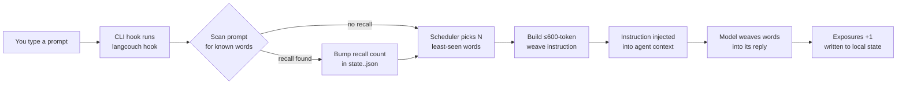

# LangCouch 🛋️

English · [Русский](README.ru.md) · [O'zbekcha](README.uz.md)

**Learn a language without getting off the couch — or leaving your terminal.**

LangCouch weaves words from the language you're learning into your AI coding agent's replies (Claude Code, opencode, Codex CLI). This is the *diglot weave* technique: you work as usual, and the answers gradually get laced with target-language words — 3–5 per reply at first, then more often and more complex, up to collocations and simple constructions. No lessons. Immersion instead of studying.

> You: "why is the deploy failing?"
> Agent: "Port 8080 is still held by a **viejo** (old) process from your **primero** (first) run this morning. Kill it with `lsof -ti :8080 | xargs kill` and the deploy will go through **ahora** (now)."

10 target languages ship out of the box. Glosses (the translation in parentheses) come in English, Russian or Uzbek.

## Why I built this

I read a lot every day, and these days most of that text is my AI agents' replies in a terminal. Reading in the language you're learning is one of the oldest ways to pick it up, and Toucan does exactly that for web pages in the browser. Nothing did it for the terminal, so I built LangCouch for myself. It's free for anyone who wants it too.

## Quick start

**Requirement:** [bun](https://bun.sh) or Node.js ≥ 22.6 (check with `bun -v` or `node -v`). If neither is found, the plugin stays inactive and Claude tells you at session start.

### As a Claude Code plugin (recommended)

```
/plugin marketplace add shmsk/LangCouch
/plugin install langcouch@langcouch
# restart the session — replies start weaving Spanish (default: es, level 2)
```

Zero setup: no `npm install`, no build step, and the hook bootstraps its own config on first use. Control it from inside Claude Code with `/langcouch:status`, `/langcouch:lang pt`, `/langcouch:level up`, `/langcouch:pause` / `/langcouch:resume`, `/langcouch:spinner on`, and add your own language with `/langcouch:add-language <language>`.

**Glosses in your language:** set `"native"` in `~/.langcouch/config.json` to `en` (default), `ru` or `uz` (Uzbek, Latin script). Glosses in the weave and accepted quiz answers follow it.

### Manual hook install

The clone path needs one `bun install` (dev dependencies only; LangCouch has no runtime dependencies).

```bash
git clone https://github.com/shmsk/LangCouch && cd LangCouch
bun install
bun src/cli.ts init                       # create ~/.langcouch
bun src/cli.ts install claude            # hook into the project's .claude/settings.json
# restart your Claude Code session — replies start weaving Spanish
```

Pick one install, not both. If you do combine them, a duplicate-delivery guard keeps the counting honest. The interactive `quiz` runs in a terminal: use the manual clone, or call the CLI inside the plugin cache (`~/.claude/plugins/cache/langcouch/…/scripts/cli.sh quiz`).

### As an opencode plugin

```
git clone https://github.com/shmsk/LangCouch && cd LangCouch
bun install
bun src/cli.ts install opencode           # project scope (.opencode/plugin/)
#   or:  bun src/cli.ts install opencode --scope user   # global (~/.config/opencode/plugin/)
# quit and restart opencode — replies start weaving Spanish
```

One command installs two paths, both active at once:

- **Plugin (primary, reliable)** — auto-discovered by opencode. Hooks `experimental.chat.messages.transform` to run `langcouch hook` on your latest user message and inject the `<langcouch>` block into context. Works on every model.
- **AGENTS.md section (fallback, experimental)** — if you disable plugins or the plugin can't load, the model is instructed to run `langcouch hook` itself at the start of each reply. Model-compliance-dependent.

A duplicate-delivery guard keeps the counting honest if both paths fire for the same prompt.

### As a Codex CLI hook

```bash
git clone https://github.com/shmsk/LangCouch && cd LangCouch
bun install
bun src/cli.ts install codex --scope user   # ~/.codex/hooks.json (or --scope project: ./.codex/hooks.json)
# start codex, open /hooks and trust the langcouch hook — replies start weaving Spanish
```

Codex skips any hook you haven't reviewed, so the `/hooks` step is needed once (and again if the hook command changes). A project-scope hook also needs the project to be trusted. If you installed the old experimental version, the installer removes its `AGENTS.md` section for you. Codex currently shows the injected instruction as a visible developer message in the transcript ([openai/codex#16933](https://github.com/openai/codex/issues/16933)); it's cosmetic.

## Will it make my agent's answers worse?

It's designed not to. The weave instruction forbids touching code blocks, inline code, identifiers, commands, paths, URLs, quotes and technical terms, and it tells the model that the meaning and quality of the reply always outweigh the weaving. The cost is one short instruction (≤600 tokens) per prompt. If you need a clean session, `/langcouch:pause` stops it instantly and `/langcouch:resume` brings it back.

## How it works

Browser extensions (Toucan, Vocabo) rewrite the page DOM. In a CLI there is no post-hoc rewrite — so LangCouch injects a short instruction through a CLI hook, and the model does the weaving itself. The core knows nothing about any CLI — adapters are thin (architecture inspired by [context-mode](https://github.com/mksglu/context-mode)).



- **Concept-keyed vocabulary**: meanings live once in `concepts.json` (id, pos, tier, glosses per native language); each `wordlists/<lang>.json` is a thin concept→lemma map, so adding a language is one small file and glosses never drift
- **Wordlists**: ~400 core content words per language (noun/verb/adj/adv), no function words; the tier field reserves room for the →1000-word band, unlocked when the core is ~80% absorbed
- **Per-language progress**: state lives in `~/.langcouch/state.<lang>.json`, keyed by concept id — progress survives lemma fixes and can be compared across languages ("you know *sun* in 3 of 5")
- **SRS-lite**: least-shown words first, rotation, absorbed words drop into a ≤20% review tail
- **Recall signal**: exposure is not knowledge — a word counts as absorbed only after you actively use it (it shows up in your own prompt, or you pass a `quiz`) or after a much larger passive dose
- **Levels 1–10**: words → collocations (4+) → simple constructions (7+), driven by `grammar/<lang>.json` unlock rules
- **Native language**: when you learn your own native language (e.g. `en` with native `en`), glosses fall back to another language

## Supported languages

| Language | Code | Words | Grammar constructions |
|---|---|---|---|
| English (US) | `en` | 402 | — |
| English (UK) | `en-GB` | 402, same as US except 9 (*colour*, *centre*, *film*…) | — |
| German | `de` | 402 | — |
| French | `fr` | 402 | — |
| Italian | `it` | 402 | — |
| Spanish (Spain) | `es` | 402 | 10 |
| Spanish (Latin America) | `es-419` | 402, same as Spain except 9 (*carro*, *computadora*, *lindo*…) | 10 |
| Portuguese (Portugal) | `pt` | 402 | — |
| Portuguese (Brazil) | `pt-BR` | 402, same as Portugal except 8 (*trem*, *celular*, *cachorro*…) | — |
| Turkish | `tr` | 402 | — |

The code is what you pass to switch languages, e.g. `/langcouch:lang es-419` (or simply `/langcouch:lang latam`).

Every bundled list went through a second-model audit (a different vendor than the one that wrote it). English verbs are listed as `to work`, `to love`: English nouns and verbs often share a spelling, and each concept needs its own word. The weave still inflects them in context (*worked*, *she loves*).

Adding your language is one JSON file. Just for yourself: run `/langcouch:add-language Georgian` in Claude Code, and the file lands in `~/.langcouch/wordlists/`, where it survives plugin updates. For everyone: open a PR, see [docs/AddLanguage.md](docs/AddLanguage.md). The doc is written so an AI coding agent can do it end-to-end.

Regional variants work the same way: `pt-BR.json` lists only the words where Brazilian Portuguese differs from `pt`, the rest comes from the base, and progress is tracked separately. `/langcouch:add-language Brazilian Portuguese` builds one; `/langcouch:lang pt-br` switches to it.

## Supported CLIs

| CLI | Status | Install | Mechanism |
|---|---|---|---|
| Claude Code | **Production** | `/plugin marketplace add shmsk/LangCouch` → `/plugin install langcouch@langcouch`, or `langcouch install claude` | `UserPromptSubmit` hook (context injection, reliable) |
| opencode | **Production** (plugin) + **experimental** (fallback) | `langcouch install opencode [--scope project\|user]` | `experimental.chat.messages.transform` plugin hook + AGENTS.md self-serve fallback |
| Codex CLI | **Production** | `langcouch install codex [--scope project\|user]` | `UserPromptSubmit` hook in `hooks.json` (context injection, reliable) |

Adding yours is welcome — see [CONTRIBUTING.md](CONTRIBUTING.md). The hook contract any adapter must satisfy: never break the host session (on any error, print nothing and exit 0).

## Commands

| Command | What it does |
|---|---|
| `init` | create the config (idempotent) |
| `status` | level and progress for every language with state |
| `lang [code]` | switch target language / list available ones (your own are marked `local`) |
| `validate <code> [--full]` | check a wordlist, e.g. one you added in `~/.langcouch/wordlists/` |
| `level <1-10\|up\|down>` | weaving intensity |
| `quiz [n]` | absorption check (default 5 words); a failed word goes back into rotation |
| `pause` / `resume` | kill switch for weaving |
| `spinner <on\|off\|status>` | opt-in: words you are learning in the Claude Code spinner tips |
| `instruction` | print the weave instruction (without marking exposures) |
| `hook` | CLI-hook mode (marks exposures and scans your prompt for recalls; exits 0 on any error so it never breaks the host session) |
| `install claude [--scope project\|user]` | register the UserPromptSubmit hook |
| `install opencode [--scope project\|user]` | install the plugin + AGENTS.md fallback for opencode |
| `install codex [--scope project\|user]` | register the UserPromptSubmit hook in Codex CLI's `hooks.json` |

## Spinner tips (opt-in)

While Claude Code is thinking, its spinner rotates tips. `/langcouch:spinner on` adds up to 5 words you are currently learning there (`LangCouch · frío = cold`), refreshed at every session start. It is a free bonus: spinner tips do not count as exposures.

A plugin cannot ship spinner tips itself, so this writes to your `~/.claude/settings.json`, carefully:

- **Off by default.** Installing LangCouch never touches your settings.
- **Only our lines.** Every added tip starts with `LangCouch · `; your own tips, `excludeDefault` and every other key are left alone. If the file is not valid JSON, nothing is written.
- **Backup + atomic write.** The original file is copied to `~/.langcouch/settings.backup.json` before the first change.
- **Clean off.** `/langcouch:spinner off` removes every `LangCouch · ` line by its prefix, and the `spinnerTipsOverride` key too if we created it.

## Privacy

The hook runs locally. It reads your prompt only to scan it for words you've already seen (the recall signal) — your prompt is never logged, sent over the network, or stored anywhere. The only thing written to disk is the per-language state file in `~/.langcouch/` (human-readable JSON), which you can inspect, back up, or `rm -rf` at any time. LangCouch has no network surface and no telemetry.

## Uninstall

- **Claude Code plugin:** if you turned the spinner on, run `/langcouch:spinner off` **first** (Claude Code has no uninstall hook, so the plugin can't clean up after itself). Then `/plugin uninstall langcouch@langcouch` and restart the session. Already uninstalled with the spinner on? Delete the lines starting with `LangCouch · ` from `spinnerTipsOverride.tips` in `~/.claude/settings.json`.
- **Manual Claude Code hook:** remove the `UserPromptSubmit` entry whose command ends in `src/cli.ts hook` in `.claude/settings.json` (or `~/.claude/settings.json` if you installed with `--scope user`).
- **opencode:** delete `langcouch.ts` from `.opencode/plugin/` (or `~/.config/opencode/plugin/`) and the section between `<!-- langcouch:start -->` and `<!-- langcouch:end -->` in `AGENTS.md`.
- **Codex CLI:** remove the `UserPromptSubmit` and `SessionStart` entries whose command ends in `src/cli.ts hook` from `~/.codex/hooks.json` (or `.codex/hooks.json` for `--scope project`).
- **Your progress:** `rm -rf ~/.langcouch` (skip this if you might come back — progress survives reinstalls).

## Contributing

The most valuable contribution is your language, and [docs/AddLanguage.md](docs/AddLanguage.md) is written so your AI agent can do it end-to-end. Dev loop, tests and ground rules are in [CONTRIBUTING.md](CONTRIBUTING.md).

## Roadmap

- Tier 2 vocabulary (→1000 words per language), unlocked at ~80% core absorption
- Full SM-2 spaced repetition (currently SRS-lite)
- Spanish gerunds in the spinner verbs ("Pensando…")
- Gemini CLI adapter
- More languages — yours? ([docs/AddLanguage.md](docs/AddLanguage.md))

## License

[MIT](LICENSE): free to use, modify, fork and redistribute.
