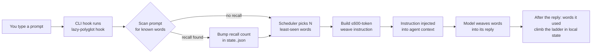

# Lazy Polyglot

English · [Русский](README.ru.md) · [O'zbekcha](README.uz.md)

**Get (almost) accidentally fluent 🙂**

Learn a language while you work, without leaving your terminal.

Lazy Polyglot weaves words from the language you're learning into your AI coding agent's replies (Claude Code, opencode, Codex CLI, Hermes Agent, OpenClaw, and Gemini CLI in beta). This is the *diglot weave* technique: you work as usual, and the answers gradually get laced with target-language words — 3–5 per reply at first, then more often and more complex, up to word-building rules, collocations and simple constructions. No lessons. Immersion instead of studying.

> You: "why is the deploy failing?"
> Agent: "Port 8080 is still held by a **viejo** (old) process from your **primero** (first) run this morning. Kill it with `lsof -ti :8080 | xargs kill` and the deploy will go through **ahora** (now)."

10 target languages ship out of the box. Glosses (the translation in parentheses) come in English, Russian or Uzbek, in whichever of them you write your message.

## What's new in 0.9.7

- **New name: Lazy Polyglot.** Same plugin, same words, same progress. Commands are now `/lazy-polyglot:…` (for example `/lazy-polyglot:status`), the CLI is `lazy-polyglot`, and your data folder is `~/.lazy-polyglot`, moved there automatically on first run. If you installed it under the old name, the switch takes about a minute: see [UPGRADING.md](UPGRADING.md).

Earlier releases are in [CHANGELOG.md](CHANGELOG.md).

## Why the new name

The plugin is going into Anthropic's official plugin directory, and the new name is quicker to understand for everyone who meets it there. Nothing else changes. If you installed the old version, remove the old marketplace with `/plugin marketplace remove langcouch`, add the new one, and your progress carries over. The steps are in [UPGRADING.md](UPGRADING.md); an AI agent can follow them for you.

## Why I built this

I read a lot every day, and these days most of that text is my AI agents' replies in a terminal. Reading in the language you're learning is one of the oldest ways to pick it up, and Toucan does exactly that for web pages in the browser. Nothing did it for the terminal, so I built Lazy Polyglot for myself. It's free for anyone who wants it too.

## Quick start

**Requirement:** [bun](https://bun.sh) or Node.js ≥ 22.6 (check with `bun -v` or `node -v`). If neither is found, the plugin stays inactive and Claude tells you at session start.

### As a Claude Code plugin (recommended)

```
/plugin marketplace add shmsk/lazy-polyglot
/plugin install lazy-polyglot@lazy-polyglot
# restart the session — replies start weaving Spanish (default: es, level 2)
```

Zero setup: no `npm install`, no build step, and the hook bootstraps its own config on first use. Control it from inside Claude Code with `/lazy-polyglot:status`, `/lazy-polyglot:lang pt`, `/lazy-polyglot:level up`, `/lazy-polyglot:mode 3`, `/lazy-polyglot:pause` / `/lazy-polyglot:resume`, `/lazy-polyglot:spinner on`, `/lazy-polyglot:placement`, and add your own language with `/lazy-polyglot:add-language <language>`.

**Flashcards:** `/cards` opens a pane in the terminal, the Desktop Code tab, VS Code and mobile. It reviews the words that are due both ways (the language you learn → yours, and from the 3rd ladder step also yours → the one you learn), then asks placement words. Lazy Polyglot itself grades and records every card, so cards and woven replies share one progress. macOS and Linux; part of Lazy Polyglot since 0.9.1. Outside the terminal each card is drawn as a flashcard (since 0.9.3). Each word and answer shows its flag and language name (since 0.9.4). Needs Claude Code 2.1.287 or newer; the Desktop app updates its own copy, so if `/cards` is missing there, update the app.

**Glosses in your language:** translations follow the language of your message. Cyrillic gets Russian; Latin gets your `native` if it is `en` or `uz` (Uzbek, Latin script), else English. `lazy-polyglot native <en|ru|uz>` (default `en`) sets the fallback for a message Lazy Polyglot can't read, and the language of quiz answers and spinner tips.

### Manual hook install

The clone path needs one `bun install` (dev dependencies only; Lazy Polyglot has no runtime dependencies).

```bash
git clone https://github.com/shmsk/lazy-polyglot && cd lazy-polyglot
bun install
bun src/cli.ts init                       # create ~/.lazy-polyglot
bun src/cli.ts install claude            # hook into the project's .claude/settings.json
# restart your Claude Code session — replies start weaving Spanish
```

Pick one install, not both. If you do combine them, a duplicate-delivery guard keeps the counting honest. The interactive `quiz` runs in a terminal: use the manual clone, or call the CLI inside the plugin cache (`~/.claude/plugins/cache/lazy-polyglot/…/scripts/cli.sh quiz`).

### As an opencode plugin

```
git clone https://github.com/shmsk/lazy-polyglot && cd lazy-polyglot
bun install
bun src/cli.ts install opencode           # project scope (.opencode/plugin/)
#   or:  bun src/cli.ts install opencode --scope user   # global (~/.config/opencode/plugin/)
# quit and restart opencode — replies start weaving Spanish
```

One command installs two paths, both active at once:

- **Plugin (primary, reliable)** — auto-discovered by opencode. Hooks `experimental.chat.messages.transform` to run `lazy-polyglot hook` on your latest user message and inject the `<lazy-polyglot>` block into context. Works on every model.
- **AGENTS.md section (fallback, experimental)** — if you disable plugins or the plugin can't load, the model is instructed to run `lazy-polyglot hook` itself at the start of each reply. Model-compliance-dependent.

A duplicate-delivery guard keeps the counting honest if both paths fire for the same prompt.

### As a Codex CLI hook

```bash
git clone https://github.com/shmsk/lazy-polyglot && cd lazy-polyglot
bun install
bun src/cli.ts install codex --scope user   # ~/.codex/hooks.json (or --scope project: ./.codex/hooks.json)
# start codex, open /hooks and trust the lazy-polyglot hook — replies start weaving Spanish
```

Codex skips any hook you haven't reviewed, so the `/hooks` step is needed once (and again if the hook command changes). A project-scope hook also needs the project to be trusted. If you installed the old experimental version, the installer removes its `AGENTS.md` section for you. Codex currently shows the injected instruction as a visible developer message in the transcript ([openai/codex#16933](https://github.com/openai/codex/issues/16933)); it's cosmetic.

### As a Gemini CLI hook (beta)

```bash
git clone https://github.com/shmsk/lazy-polyglot && cd lazy-polyglot
bun install
bun src/cli.ts install gemini --scope user   # ~/.gemini/settings.json (or --scope project: ./.gemini/settings.json)
# start gemini — replies start weaving Spanish
```

Beta: the adapter follows Gemini CLI's [hooks reference](https://github.com/google-gemini/gemini-cli/blob/main/docs/hooks/reference.md) (`BeforeAgent` adds the instruction, `AfterAgent` reads the reply back) and is covered by tests, but nobody has run it against a live Gemini CLI yet. If it doesn't weave for you, please [open an issue](https://github.com/shmsk/lazy-polyglot/issues). Gemini asks before running a new project-scope hook: allow `lazy-polyglot` when it does.

### As a Hermes Agent plugin

```bash
git clone https://github.com/shmsk/lazy-polyglot && cd lazy-polyglot
bun install
bun src/cli.ts install hermes           # $HERMES_HOME/plugins/lazy-polyglot/ (default ~/.hermes)
hermes plugins enable lazy-polyglot         # Hermes plugins are opt-in
# restart hermes — replies start weaving Spanish
```

The plugin is a small Python file that hands every turn to the Lazy Polyglot CLI through Hermes' `pre_llm_call` hook, so it works the same in the CLI and on gateway platforms like Telegram. Control it from any session with `/lazy-polyglot status`, `/lazy-polyglot lang pt`, `/lazy-polyglot level up`, `/lazy-polyglot pause` / `/lazy-polyglot resume`. You don't need Python yourself beyond what Hermes already ships with.

### As an OpenClaw plugin

```bash
git clone https://github.com/shmsk/lazy-polyglot && cd lazy-polyglot
bun install
bun src/cli.ts install openclaw         # generates the plugin in ~/.lazy-polyglot/openclaw-plugin/
openclaw plugins install --link ~/.lazy-polyglot/openclaw-plugin --force --accept-capabilities
openclaw config set plugins.entries.lazy-polyglot.hooks.allowConversationAccess true --strict-json
openclaw plugins enable lazy-polyglot
```

OpenClaw only runs prompt hooks of plugins you have allowed, so the `allowConversationAccess` line is required. The plugin uses the `before_prompt_build` hook, and `/lazy-polyglot status`, `/lazy-polyglot lang pt`, `/lazy-polyglot pause` work in any chat channel. OpenClaw's `claude-cli` provider doesn't run prompt hooks ([openclaw/openclaw#65157](https://github.com/openclaw/openclaw/issues/65157)); every other provider does.

## Will it make my agent's answers worse?

It's designed not to. The weave instruction forbids touching code blocks, inline code, identifiers, commands, paths, URLs, quotes and technical terms, and it tells the model that the meaning and quality of the reply always outweigh the weaving. The cost is one short instruction (≤600 tokens) per prompt, mostly read from the prompt cache: about 1–3% of a typical session ([details](docs/TokenUsage.md)). How four models handle it: [evals/MODELS.md](evals/MODELS.md). If you need a clean session, `/lazy-polyglot:pause` stops it instantly and `/lazy-polyglot:resume` brings it back.

## How it works

Browser extensions (Toucan, Vocabo) rewrite the page DOM. In a CLI there is no post-hoc rewrite — so Lazy Polyglot injects a short instruction through a CLI hook, and the model does the weaving itself. The core knows nothing about any CLI — adapters are thin (architecture inspired by [context-mode](https://github.com/mksglu/context-mode)).


```mermaid
flowchart LR
    A[You type a prompt] --> B[CLI hook runs<br/>lazy-polyglot hook]
    B --> C{Scan prompt<br/>for known words}
    C -->|recall found| D[Bump recall count<br/>in state.<lang>.json]
    C -->|no recall| E[Scheduler picks N<br/>least-seen words]
    D --> E
    E --> F[Build ≤600-token<br/>weave instruction]
    F --> G[Instruction injected<br/>into agent context]
    G --> H[Model weaves words<br/>into its reply]
    H --> I[After the reply: words it used<br/>climb the ladder in local state]
```

- **Concept-keyed vocabulary**: meanings live once in `concepts.json` (id, pos, tier, glosses per native language); each `wordlists/<lang>.json` is a thin concept→lemma map, so adding a language is one small file and glosses never drift
- **Wordlists**: ~400 core content words per language (noun/verb/adj/adv) plus the 30 numerals, no function words; the tier field reserves room for the →1000-word band, unlocked when the core is ~80% absorbed
- **Per-language progress**: state lives in `~/.lazy-polyglot/state.<lang>.json`, keyed by concept id — progress survives lemma fixes and can be compared across languages ("you know *sun* in 3 of 5")
- **Interval ladder**: each word comes back after 30 min, 8 h, 1 day, 4 days, 2 weeks, 1 month, then 6 months. It climbs a step only when a reply actually uses it while it is due; words that are due come first, and a quarter of each list stays open for new words
- **Honest counting**: after the reply, a Stop hook (or the host's after-reply event) reads it back, and only the words it used count as shown. A host without such an event counts the words served, as before
- **Translations fade**: a new word comes as **casa** (house). From the fourth step it appears as plain **casa**, with the translation in one closing line (`casa = house · nombre = name`). From step five (absorbed) there is no translation at all, and absorbed words come back as a rotating sample the model may use freely, so the share of the language in replies grows
- **Only where it fits, plus a nudge**: the model weaves a word only where the reply already needs its meaning, so nothing is invented to host a word. The one exception is one or two words that kept missing: those may go into a short aside or a closing line, never into code, facts or text you will copy
- **Recall signal**: exposure is not knowledge. A word you use in your own prompt, or answer right in `quiz`, climbs a step; a wrong quiz answer sends it back to the start
- **Placement test**: already know part of a language? `lazy-polyglot placement` in a terminal, or `/lazy-polyglot:placement` in Claude Code, asks the listed words you haven't absorbed yet, most common first. Each word you translate right skips the new-word stage and goes straight to the absorbed pool (reviewed in two weeks); a word you don't know just stays new. Progress saves after every word, so you can stop and carry on later. Lazy Polyglot offers the test once when you start a language, and again whenever you say the words are too easy
- **Modes**: `lazy-polyglot mode 3` is the above (default). `mode 2` weaves only words that fit, and `mode 1` asks for every listed word; both count a word when it is served
- **Levels 1–10**: words from level 1; [word-building rules](#word-building-rules) from level 2 (`patterns/<lang>.json`); collocations from 4 and simple sentences from 7, using the constructions in `grammar/<lang>.json` where a language has them
- **Native language**: when you learn your own native language (e.g. `en` with native `en`), glosses fall back to another language

## Supported languages

| Language | Code | Words | Grammar constructions | Word-building rules | Number rules | Pronunciation |
|---|---|---|---|---|---|---|
| English (US) | `en` | 432 | — | 7 (for Russian speakers) | 5 | US |
| English (UK) | `en-GB` | 432, same as US except 9 (*colour*, *centre*, *film*…) | — | 7 (from US) | 5 (1 own: *and* after hundred) | UK (248 words differ from US) |
| German | `de` | 432 | — | 8 | 7 | — |
| French | `fr` | 432 | — | 8 | 8 | ✓ |
| Italian | `it` | 432 | — | 8 | 7 | — |
| Spanish (Spain) | `es` | 432 | 10 | 8 | 7 | — |
| Spanish (Latin America) | `es-419` | 432, same as Spain except 9 (*carro*, *computadora*, *lindo*…) | 10 + 2 regional (*ustedes*, preterite for today) | 8 (from Spain) | 7 (from Spain) | — |
| Portuguese (Portugal) | `pt` | 432 | — | 8 | 6 | Portugal |
| Portuguese (Brazil) | `pt-BR` | 432, same as Portugal except 12 (*trem*, *celular*, *dezesseis*…) | — | 8 (from Portugal) | 6 (1 own: *dezesseis*) | Brazil (335 words differ from Portugal) |
| Turkish | `tr` | 432 | — | 5 | 5 | — |

The code is what you pass to switch languages, e.g. `/lazy-polyglot:lang es-419` (or simply `/lazy-polyglot:lang latam`).

Every bundled list went through a second-model audit (a different vendor than the one that wrote it). English verbs are listed as `to work`, `to love`: English nouns and verbs often share a spelling, and each concept needs its own word. The weave still inflects them in context (*worked*, *she loves*).

Adding your language is one JSON file. Just for yourself: run `/lazy-polyglot:add-language Georgian` in Claude Code, and the file lands in `~/.lazy-polyglot/wordlists/`, where it survives plugin updates. For everyone: open a PR, see [docs/AddLanguage.md](docs/AddLanguage.md). The doc is written so an AI coding agent can do it end-to-end.

Regional variants work the same way: `pt-BR.json` lists only the words where Brazilian Portuguese differs from `pt`, and the rest comes from the base. `/lazy-polyglot:add-language Brazilian Portuguese` builds one; `/lazy-polyglot:lang pt-br` switches to it.

Switching to a variant doesn't start you over. Every word spelled the same in both shares one progress pool, so if you learned Spain Spanish and move to `es-419`, you keep *casa* and all the rest and only learn the 9 words that differ. Those come first, next to the Spain word: *carro = car, Spain: coche*. Grammar works the same way: the regional constructions (*ustedes trabajan*, not *vosotros trabajáis*) come first. Where the base word is rude in the variant's region, the contrast says so: *tomar = to take, Spain: coger (vulgar in much of Latin America)*.

## Pronunciation

French, English and Portuguese are not read the way they are spelled, so their new words come with a pronunciation, in letters you already read:

| What you see | Setting |
|---|---|
| **maison** (дом) | `off` |
| **maison** [мезо́н] (дом) | `native`, the default: Russian letters, English respelling ([meh-ZAWN]) or Uzbek letters ([mezon]), in the language you write in |
| **maison** [mɛzɔ̃] (дом) | `ipa`: the International Phonetic Alphabet |

Lazy Polyglot asks once per language, showing these three with a word from your list; `/lazy-polyglot:reading off|native|ipa` changes it later. Only new words carry it, so it fades with the translation. Cards and spinner tips show it too. Spanish, Italian, German and Turkish are close enough to their spelling that they show none.

The pronunciations come from Wiktionary as IPA, one per word: American and British English, European and Brazilian Portuguese each have their own. The letters are generated from the IPA and are an approximation for reading the word aloud; IPA is the exact form. Adding pronunciations to a language is one more JSON file, see [docs/AddLanguage.md](docs/AddLanguage.md).

## Word-building rules

Many words are built the same way in several languages. *Revolution* is *revolución* in Spanish, *revolução* in Portuguese, *rivoluzione* in Italian, *révolution* in French and *революция* in Russian. Learn the rule *-tion → -ción* once, and you can read hundreds of Spanish words you already half-know. That gets the weave to phrases sooner.

- **When:** from level 2 (the default), every reply teaches one rule with an example: *-tion → -ción (revolución = revolution)*.
- **Beyond the word list:** a reply that teaches a rule may also use one more word built by it, even if that word isn't one of your ~400.
- **Your side of the rule:** the suffix is shown in your native language. An English speaker sees *-tion → -ción*, a Russian speaker sees *-ция → -ción*. Some rules exist for one side only: *-ly → -mente* for English speakers, *-ировать → -ieren* (*kopieren*) for Russian speakers.
- **Progress:** a rule counts as introduced after three replies, and then the next one starts. `status` shows it as *Word-building rules: 1/8 introduced*.
- **False friends:** a rule warns about words that look like it but mean something else, e.g. *actual = current* next to *-al*. The meaning comes in the language you write in.
- **Where the data lives:** rules in `patterns/<lang>.json`, false friends and rude words in `falseFriends/<lang>.json`. The table in [Supported languages](#supported-languages) shows how many rules each language has. Every rule and example was checked against a dictionary (mostly Wiktionary) and then audited by a second model from another vendor.

## Numbers

Every number up to 1000 is built from 30 words: 0–20, the tens, 100 and 1000. Those are on your list like any other word, at most one per reply, woven next to its digit so the fact stays readable: *the deploy took 3 (**tre**) minutes*.

- **The rest is rules.** When a numeral is in the reply, Lazy Polyglot also shows how bigger numbers are built, one rule at a time: *11–16 are fixed words: undici, dodici… (e.g. 13 = tredici)*. A reply may then use a number built that way, even if it isn't on your list.
- **Each language has its own logic.** In English you learn 11 and 12, then it's *-teen*. In French 70 is *soixante-dix* (60+10) and 80 is *quatre-vingts* (4×20). In German the unit comes first: *einundzwanzig* (one-and-twenty). In Turkish the tens are words to learn, and Uzbek speakers will recognise several (*kırk*, *elli*).
- **Progress:** a rule counts as introduced after three replies; then the word-building rule gets its slot back. `status` shows *Number rules: 2/7 introduced*.
- **Where the data lives:** numerals in the wordlists, rules in `numbers/<lang>.json`, each citing a Wiktionary page (every link checked) and reviewed by a second model.

What changed in each version is in [CHANGELOG.md](CHANGELOG.md). After an update, `status` shows the new version's changes once.

## Supported CLIs

| CLI | Status | Install | Mechanism |
|---|---|---|---|
| Claude Code | **Production** | `/plugin marketplace add shmsk/lazy-polyglot` → `/plugin install lazy-polyglot@lazy-polyglot`, or `lazy-polyglot install claude` | `UserPromptSubmit` hook (context injection, reliable); `Stop` reads the reply back |
| opencode | **Production** (plugin) + **experimental** (fallback) | `lazy-polyglot install opencode [--scope project\|user]` | `experimental.chat.messages.transform` plugin hook + AGENTS.md self-serve fallback; `session.idle` reads the reply back |
| Codex CLI | **Production** | `lazy-polyglot install codex [--scope project\|user]` | `UserPromptSubmit` hook in `hooks.json` (context injection, reliable); `Stop` reads the reply back |
| Gemini CLI | **Beta** (not live-tested yet) | `lazy-polyglot install gemini [--scope project\|user]` | `BeforeAgent` hook in `settings.json` (JSON `additionalContext`); `AfterAgent` reads the reply back |
| Hermes Agent | **Production** | `lazy-polyglot install hermes` | `pre_llm_call` plugin hook (context appended to your message); `post_llm_call` reads the reply back |
| OpenClaw | **Production** | `lazy-polyglot install openclaw` | `before_prompt_build` plugin hook (`prependContext`); `agent_end` reads the reply back |

Codex CLI, opencode, Hermes Agent and OpenClaw are installed on a clean CI runner and tested end to end ([hosts-smoke workflow](.github/workflows/hosts-smoke.yml)): the plugin loads, the block reaches the model, and real models on OpenRouter weave the words they were given.

Adding yours is welcome — see [CONTRIBUTING.md](CONTRIBUTING.md). The hook contract any adapter must satisfy: never break the host session (on any error, print nothing and exit 0).

## Commands

| Command | What it does |
|---|---|
| `init` | create the config (idempotent) |
| `status` | level and progress for every language with state |
| `lang [code]` | switch target language / list available ones (your own are marked `local`) |
| `validate <code> [--full]` | check a wordlist, e.g. one you added in `~/.lazy-polyglot/wordlists/` |
| `native [en\|ru\|uz]` | your language: translations when a message's language is unclear, quiz answers, spinner tips |
| `level <1-10\|up\|down>` | weaving intensity |
| `mode [1\|2\|3]` | weave algorithm: 3 interval ladder (default), 2 only words that fit, 1 every listed word |
| `quiz [n]` | absorption check (default 5 words); a failed word goes back into rotation |
| `placement [n] [--reset]` | check which listed words you already know: type a translation, Enter = don't know, `q` = stop; known words skip the new-word stage. `placement next [n]` / `placement answer <word>=<translation>...` do the same one batch at a time (what `/lazy-polyglot:placement` uses); `--reset` asks the "don't know" words again |
| `cards status \| next [n] \| answer … \| reveal … \| grade …` | JSON for the cards mod (`/cards`): what is due, grading and recording each card; you don't need to call it yourself |
| `pause` / `resume` | kill switch for weaving |
| `export [file\|-] [--force]` | save progress, settings and your own wordlists to one file, `~/lazy-polyglot-export-<date>.json` by default (`-` prints it; an existing file is replaced only with `--force`) |
| `import <file> [--config]` | merge an export into this machine's progress, keeping the best of both; `--config` also takes its settings |
| `reading <off\|native\|ipa\|status>` | pronunciation of new French, English and Portuguese words: in your letters (default), IPA, or none |
| `spinner <on\|off\|status>` | opt-in: words you are learning in the Claude Code spinner tips |
| `cards-status <on\|off\|status>` | opt-in: how many cards are due, in the Claude Code status line (`/cards` asks once) |
| `instruction` | print the weave instruction (without marking exposures) |
| `hook` | CLI-hook mode: before a reply, builds the instruction and scans your prompt for recalls; after it (a `Stop` payload), counts the words the reply used. Exits 0 on any error so it never breaks the host session |
| `install claude [--scope project\|user]` | register the UserPromptSubmit, SessionStart and Stop hooks |
| `install opencode [--scope project\|user]` | install the plugin + AGENTS.md fallback for opencode |
| `install codex [--scope project\|user]` | register the UserPromptSubmit, SessionStart and Stop hooks in Codex CLI's `hooks.json` |
| `install gemini [--scope project\|user]` | beta: register the BeforeAgent, SessionStart and AfterAgent hooks in Gemini CLI's `settings.json` |
| `install hermes` | install the Hermes Agent plugin into `$HERMES_HOME/plugins/lazy-polyglot/` |
| `install openclaw` | generate the OpenClaw plugin and print the commands that link and enable it |

## Spinner tips (opt-in)

While Claude Code is thinking, its spinner rotates tips. `/lazy-polyglot:spinner on` adds up to 5 words you are currently learning there (`Lazy Polyglot · frío = cold`), refreshed at every session start. It is a free bonus: spinner tips do not count as exposures.

A plugin cannot ship spinner tips itself, so this writes to your `~/.claude/settings.json`, carefully:

- **Off by default.** Installing Lazy Polyglot never touches your settings.
- **Only our lines.** Every added tip starts with `Lazy Polyglot · `; your own tips, `excludeDefault` and every other key are left alone. If the file is not valid JSON, nothing is written.
- **Backup + atomic write.** The original file is copied to `~/.lazy-polyglot/settings.backup.json` before the first change.
- **Clean off.** `/lazy-polyglot:spinner off` removes every `Lazy Polyglot · ` line by its prefix, and the `spinnerTipsOverride` key too if we created it.

## Moving to another machine

Progress lives in `~/.lazy-polyglot/`, so every CLI on one machine already shares it. To carry it to another computer:

```bash
lazy-polyglot export                 # writes ~/lazy-polyglot-export-YYYY-MM-DD.json
lazy-polyglot import ~/Downloads/lazy-polyglot-export-2026-10-01.json   # on the other machine
```

In a chat the same works as `/lazy-polyglot:export` and `/lazy-polyglot:import <file>` (Claude Code) or `/lazy-polyglot export` and `/lazy-polyglot import <file>` (Hermes, OpenClaw).

Import merges, it never overwrites. If you already started the same language on the other machine, words only it has stay, words only the export has are added, and a word both have keeps the better record: more exposures and recalls, the higher step on the review ladder. Your local settings stay unless you pass `--config`, and your own wordlists are kept if they differ. Before changing anything, import copies the old files to `~/.lazy-polyglot/backups/`. Importing the same file twice, or sending it back, changes nothing.

One trade-off: if you learned the same word on both machines, its counts are not added up (5 and 10 become 10, not 15). Adding them would count everything twice the moment a file goes back and forth.

## Privacy

The hook runs locally. It reads your prompt only to scan it for words you've already seen (the recall signal) — your prompt is never logged, sent over the network, or stored anywhere. The only thing written to disk is the per-language state file in `~/.lazy-polyglot/` (human-readable JSON), which you can inspect, back up, or `rm -rf` at any time. Lazy Polyglot has no network surface and no telemetry.

Once a reply is finished, the hook also reads it (the host hands it over, or Claude Code's local transcript has it) to count only the words the reply actually used. The words offered for the current turn wait in `~/.lazy-polyglot/served.json` until then. The reply is not stored, and nothing leaves your machine. `lazy-polyglot mode 1` or `mode 2` turns this off.

## Uninstall

- **Claude Code plugin:** if you turned the spinner on, run `/lazy-polyglot:spinner off` **first** (Claude Code has no uninstall hook, so the plugin can't clean up after itself). Then `/plugin uninstall lazy-polyglot@lazy-polyglot` and restart the session. Already uninstalled with the spinner on? Delete the lines starting with `Lazy Polyglot · ` from `spinnerTipsOverride.tips` in `~/.claude/settings.json`.
- **Manual Claude Code hook:** remove the `UserPromptSubmit`, `SessionStart` and `Stop` entries whose command ends in `src/cli.ts hook` in `.claude/settings.json` (or `~/.claude/settings.json` if you installed with `--scope user`).
- **opencode:** delete `lazy-polyglot.ts` from `.opencode/plugin/` (or `~/.config/opencode/plugin/`) and the section between `<!-- lazy-polyglot:start -->` and `<!-- lazy-polyglot:end -->` in `AGENTS.md`.
- **Codex CLI:** remove the `UserPromptSubmit`, `SessionStart` and `Stop` entries whose command ends in `src/cli.ts hook` from `~/.codex/hooks.json` (or `.codex/hooks.json` for `--scope project`).
- **Gemini CLI:** remove the `BeforeAgent`, `SessionStart` and `AfterAgent` entries named `lazy-polyglot` from `~/.gemini/settings.json` (or `.gemini/settings.json` for `--scope project`).
- **Hermes Agent:** `hermes plugins disable lazy-polyglot`, then delete `~/.hermes/plugins/lazy-polyglot/` (or under your `$HERMES_HOME`).
- **OpenClaw:** `openclaw plugins uninstall lazy-polyglot`, then delete `~/.lazy-polyglot/openclaw-plugin/`.
- **Your progress:** `rm -rf ~/.lazy-polyglot` (skip this if you might come back — progress survives reinstalls).

## Feedback

Got an idea, or is something annoying you? Either is useful.

- **A concrete wish:** [open a feature request](https://github.com/shmsk/lazy-polyglot/issues/new?template=feature-request.md).
- **A rough idea or a question:** [start a discussion](https://github.com/shmsk/lazy-polyglot/discussions).
- **Something broken:** [file a bug](https://github.com/shmsk/lazy-polyglot/issues/new?template=bug-report.md).

## Contributing

The most valuable contribution is your language, and [docs/AddLanguage.md](docs/AddLanguage.md) is written so your AI agent can do it end-to-end. Dev loop, tests and ground rules are in [CONTRIBUTING.md](CONTRIBUTING.md).

## Roadmap

- Grammar constructions beyond Spanish (pt, it, fr, de, en, tr), with regional overlays for pt-BR and en-GB
- Tier 2 vocabulary (→1000 words per language), unlocked at ~80% core absorption
- Lexical chunks (whole phrases) once most of the core is absorbed
- Spanish gerunds in the spinner verbs ("Pensando…")
- Gemini CLI out of beta, after a live run
- More languages — yours? ([docs/AddLanguage.md](docs/AddLanguage.md))

## License

[MIT](LICENSE): free to use, modify, fork and redistribute.
