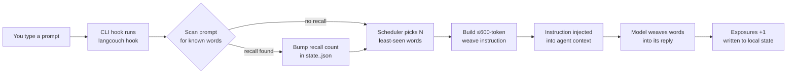

# LangCouch 🛋️

[English](README.md) · Русский · [O'zbekcha](README.uz.md)

*Переведено с README.md (дата исходника: 2026-09-25). При расхождении основной считается английская версия.*

**Учите язык, не вставая с дивана и не выходя из терминала.**

LangCouch вплетает слова изучаемого языка в ответы вашего AI-агента для кода (Claude Code, opencode, Codex CLI). Это техника *diglot weave*: вы работаете как обычно, а в ответах постепенно появляются слова на новом языке. Сначала 3–5 на ответ, потом чаще и сложнее, вплоть до словосочетаний и простых конструкций. Никаких уроков. Погружение вместо зубрёжки.

> Вы: «почему падает деплой?»
> Агент: «Порт 8080 всё ещё держит **viejo** (старый) процесс от вашего **primero** (первый) утреннего запуска. Завершите его командой `lsof -ti :8080 | xargs kill`, и деплой пройдёт **ahora** (сейчас).»

Из коробки 10 изучаемых языков. Подсказки (перевод в скобках) бывают на английском, русском или узбекском.

## Зачем я это сделал

Я много читаю каждый день, и сейчас большая часть этого текста — ответы моих AI-агентов в терминале. Чтение на изучаемом языке — один из самых старых способов его выучить, и Toucan делает ровно это для веб-страниц в браузере. Для терминала такого не было, поэтому я сделал LangCouch для себя. Он бесплатен для всех, кому он тоже нужен.

## Быстрый старт

**Требование:** [bun](https://bun.sh) или Node.js ≥ 22.6 (проверить: `bun -v` или `node -v`). Если ни того, ни другого нет, плагин остаётся неактивным, и Claude скажет об этом в начале сессии.

### Как плагин Claude Code (рекомендуется)

```
/plugin marketplace add shmsk/LangCouch
/plugin install langcouch@langcouch
# restart the session — replies start weaving Spanish (default: es, level 2)
```

Настройка не нужна: ни `npm install`, ни сборки, хук сам создаёт конфиг при первом запуске. Управление прямо из Claude Code: `/langcouch:status`, `/langcouch:lang pt`, `/langcouch:level up`, `/langcouch:pause` / `/langcouch:resume`, `/langcouch:spinner on`, а свой язык добавляется через `/langcouch:add-language <language>`.

**Подсказки на вашем языке:** укажите `"native"` в `~/.langcouch/config.json`: `en` (по умолчанию), `ru` или `uz` (узбекский, латиница). От этого зависят подсказки в ответах и принимаемые ответы в квизе.

### Ручная установка хука

Для варианта с клоном нужен один `bun install` (только dev-зависимости; runtime-зависимостей у LangCouch нет).

```bash
git clone https://github.com/shmsk/LangCouch && cd LangCouch
bun install
bun src/cli.ts init                       # create ~/.langcouch
bun src/cli.ts install claude            # hook into the project's .claude/settings.json
# restart your Claude Code session — replies start weaving Spanish
```

Выберите один способ установки, а не оба. Если всё же совместите, защита от двойной доставки не даст счётчикам задвоиться. Интерактивный `quiz` работает в терминале: используйте ручной клон или вызовите CLI из кэша плагина (`~/.claude/plugins/cache/langcouch/…/scripts/cli.sh quiz`).

### Как плагин opencode

```
git clone https://github.com/shmsk/LangCouch && cd LangCouch
bun install
bun src/cli.ts install opencode           # project scope (.opencode/plugin/)
#   or:  bun src/cli.ts install opencode --scope user   # global (~/.config/opencode/plugin/)
# quit and restart opencode — replies start weaving Spanish
```

Одна команда ставит два пути, и оба работают одновременно:

- **Плагин (основной, надёжный)**: opencode находит его сам. Он цепляется к `experimental.chat.messages.transform`, запускает `langcouch hook` на вашем последнем сообщении и добавляет блок `<langcouch>` в контекст. Работает на любой модели.
- **Секция в AGENTS.md (запасной, экспериментальный)**: если плагины отключены или плагин не загрузился, модель получает указание сама запускать `langcouch hook` в начале каждого ответа. Зависит от того, слушается ли модель.

Защита от двойной доставки не даст счётчикам задвоиться, если оба пути сработают на один промпт.

### Как хук Codex CLI

```bash
git clone https://github.com/shmsk/LangCouch && cd LangCouch
bun install
bun src/cli.ts install codex --scope user   # ~/.codex/hooks.json (or --scope project: ./.codex/hooks.json)
# start codex, open /hooks and trust the langcouch hook — replies start weaving Spanish
```

Codex не запускает хуки, которые вы не одобрили, поэтому шаг с `/hooks` нужен один раз (и снова, если команда хука изменится). Хуку с `--scope project` нужно ещё, чтобы сам проект был доверенным. Если у вас стояла старая экспериментальная версия, установщик сам удалит её секцию из `AGENTS.md`. Сейчас Codex показывает вставленную инструкцию в переписке как видимое developer-сообщение ([openai/codex#16933](https://github.com/openai/codex/issues/16933)); это чисто косметика.

## Не станут ли ответы агента хуже?

Всё устроено так, чтобы не стали. Инструкция запрещает трогать блоки кода, inline-код, идентификаторы, команды, пути, URL, цитаты и технические термины и прямо говорит модели, что смысл и качество ответа всегда важнее вплетения. Цена: одна короткая инструкция (≤600 токенов) на промпт. Если нужна чистая сессия, `/langcouch:pause` выключает вплетение сразу, а `/langcouch:resume` возвращает.

## Как это работает

Браузерные расширения (Toucan, Vocabo) переписывают DOM страницы. В CLI переписать ответ задним числом нельзя, поэтому LangCouch подкладывает короткую инструкцию через хук CLI, и вплетает слова сама модель. Ядро ничего не знает о конкретных CLI, адаптеры тонкие (архитектура вдохновлена [context-mode](https://github.com/mksglu/context-mode)).



- **Словарь по концептам**: значения хранятся один раз в `concepts.json` (id, часть речи, tier, подсказки для каждого родного языка); каждый `wordlists/<lang>.json` — тонкая карта «концепт → лемма», так что новый язык — это один небольшой файл, а подсказки не расходятся
- **Словари**: ~400 базовых значимых слов на язык (существительные, глаголы, прилагательные, наречия), без служебных слов; поле tier оставляет место для уровня до 1000 слов, который открывается, когда база усвоена примерно на 80%
- **Прогресс по каждому языку**: состояние лежит в `~/.langcouch/state.<lang>.json` с ключом по id концепта, поэтому прогресс переживает исправления лемм и сравним между языками («вы знаете *солнце* в 3 языках из 5»)
- **SRS-lite**: сначала слова, которые показывались реже всего, ротация, усвоенные слова уходят в хвост повторения (≤20%)
- **Сигнал вспоминания**: увидеть слово не значит его знать. Слово считается усвоенным, только когда вы сами его использовали (оно появилось в вашем промпте или вы прошли `quiz`), либо после гораздо большей пассивной дозы
- **Уровни 1–10**: слова → словосочетания (4+) → простые конструкции (7+), по правилам разблокировки из `grammar/<lang>.json`
- **Родной язык**: если вы учите свой родной язык (например, `en` при native `en`), подсказки берутся из другого языка

## Поддерживаемые языки

| Язык | Код | Слов | Грамматические конструкции |
|---|---|---|---|
| Английский (США) | `en` | 402 | — |
| Английский (Великобритания) | `en-GB` | 402, как в американском, кроме 9 (*colour*, *centre*, *film*…) | — |
| Немецкий | `de` | 402 | — |
| Французский | `fr` | 402 | — |
| Итальянский | `it` | 402 | — |
| Испанский (Испания) | `es` | 402 | 10 |
| Испанский (Латинская Америка) | `es-419` | 402, как в испанском, кроме 9 (*carro*, *computadora*, *lindo*…) | 10 |
| Португальский (Португалия) | `pt` | 402 | — |
| Португальский (Бразилия) | `pt-BR` | 402, как в португальском, кроме 8 (*trem*, *celular*, *cachorro*…) | — |
| Турецкий | `tr` | 402 | — |

Код нужен для переключения языка, например `/langcouch:lang es-419` (или просто `/langcouch:lang latam`).

Каждый встроенный словарь прошёл аудит второй моделью (другого вендора, чем та, что его написала). Английские глаголы записаны как `to work`, `to love`: в английском существительное и глагол часто пишутся одинаково, а каждому концепту нужно своё слово. В ответах они всё равно склоняются по контексту (*worked*, *she loves*).

Новый язык — это один JSON-файл. Только для себя: запустите `/langcouch:add-language Georgian` в Claude Code, файл появится в `~/.langcouch/wordlists/` и переживёт обновления плагина. Для всех: откройте PR, см. [docs/AddLanguage.md](docs/AddLanguage.md). Документ написан так, чтобы AI-агент для кода мог пройти его целиком сам.

Региональные варианты работают так же: `pt-BR.json` перечисляет только слова, где бразильский португальский отличается от `pt`, остальное берётся из базы, а прогресс считается отдельно. `/langcouch:add-language Brazilian Portuguese` создаёт такой вариант, `/langcouch:lang pt-br` переключает на него.

## Поддерживаемые CLI

| CLI | Статус | Установка | Механизм |
|---|---|---|---|
| Claude Code | **Production** | `/plugin marketplace add shmsk/LangCouch` → `/plugin install langcouch@langcouch` или `langcouch install claude` | хук `UserPromptSubmit` (добавление в контекст, надёжно) |
| opencode | **Production** (плагин) + **экспериментально** (запасной путь) | `langcouch install opencode [--scope project\|user]` | хук плагина `experimental.chat.messages.transform` + запасная секция в AGENTS.md |
| Codex CLI | **Production** | `langcouch install codex [--scope project\|user]` | хук `UserPromptSubmit` в `hooks.json` (добавление в контекст, надёжно) |

Адаптер для вашего CLI приветствуется, см. [CONTRIBUTING.md](CONTRIBUTING.md). Контракт хука, который обязан соблюдать любой адаптер: никогда не ломать сессию хоста (при любой ошибке ничего не печатать и выйти с кодом 0).

## Команды

| Команда | Что делает |
|---|---|
| `init` | создаёт конфиг (идемпотентно) |
| `status` | уровень и прогресс по каждому языку, где есть состояние |
| `lang [code]` | переключает изучаемый язык / показывает доступные (ваши собственные помечены `local`) |
| `validate <code> [--full]` | проверяет словарь, например добавленный вами в `~/.langcouch/wordlists/` |
| `level <1-10\|up\|down>` | интенсивность вплетения |
| `quiz [n]` | проверка усвоения (по умолчанию 5 слов); проваленное слово возвращается в ротацию |
| `pause` / `resume` | выключатель вплетения |
| `spinner <on\|off\|status>` | по желанию: слова, которые вы учите, в подсказках спиннера Claude Code |
| `instruction` | печатает инструкцию для модели (не засчитывая показы) |
| `hook` | режим хука CLI (засчитывает показы и ищет в промпте вспомненные слова; при любой ошибке выходит с кодом 0, чтобы не ломать сессию хоста) |
| `install claude [--scope project\|user]` | регистрирует хук UserPromptSubmit |
| `install opencode [--scope project\|user]` | ставит плагин + запасную секцию в AGENTS.md для opencode |
| `install codex [--scope project\|user]` | регистрирует хук UserPromptSubmit в `hooks.json` Codex CLI |

## Подсказки в спиннере (по желанию)

Пока Claude Code думает, его спиннер показывает подсказки. `/langcouch:spinner on` добавляет туда до 5 слов, которые вы сейчас учите (`LangCouch · frío = cold`), и обновляет их в начале каждой сессии. Это бесплатный бонус: подсказки в спиннере не засчитываются как показы.

Плагин не может поставлять подсказки спиннера сам, поэтому эта функция аккуратно пишет в ваш `~/.claude/settings.json`:

- **Выключено по умолчанию.** Установка LangCouch никогда не трогает ваши настройки.
- **Только наши строки.** Каждая добавленная подсказка начинается с `LangCouch · `; ваши подсказки, `excludeDefault` и все остальные ключи не трогаются. Если файл не валидный JSON, ничего не пишется.
- **Бэкап и атомарная запись.** Перед первым изменением исходный файл копируется в `~/.langcouch/settings.backup.json`.
- **Чистое выключение.** `/langcouch:spinner off` удаляет все строки с префиксом `LangCouch · `, а также ключ `spinnerTipsOverride`, если его создали мы.

## Приватность

Хук работает локально. Он читает ваш промпт только чтобы найти в нём уже показанные слова (сигнал вспоминания). Промпт никогда не логируется, не отправляется по сети и нигде не хранится. На диск пишется только файл состояния для каждого языка в `~/.langcouch/` (читаемый JSON), который можно посмотреть, забэкапить или удалить через `rm -rf` в любой момент. У LangCouch нет сетевых обращений и нет телеметрии.

## Удаление

- **Плагин Claude Code:** если вы включали спиннер, **сначала** выполните `/langcouch:spinner off` (у Claude Code нет хука удаления, так что плагин не может прибраться за собой сам). Затем `/plugin uninstall langcouch@langcouch` и перезапустите сессию. Уже удалили с включённым спиннером? Удалите строки, начинающиеся с `LangCouch · `, из `spinnerTipsOverride.tips` в `~/.claude/settings.json`.
- **Ручной хук Claude Code:** удалите запись `UserPromptSubmit`, команда которой заканчивается на `src/cli.ts hook`, из `.claude/settings.json` (или `~/.claude/settings.json`, если ставили с `--scope user`).
- **opencode:** удалите `langcouch.ts` из `.opencode/plugin/` (или `~/.config/opencode/plugin/`) и секцию между `<!-- langcouch:start -->` и `<!-- langcouch:end -->` в `AGENTS.md`.
- **Codex CLI:** удалите записи `UserPromptSubmit` и `SessionStart`, команда которых заканчивается на `src/cli.ts hook`, из `~/.codex/hooks.json` (или `.codex/hooks.json` для `--scope project`).
- **Ваш прогресс:** `rm -rf ~/.langcouch` (не делайте этого, если можете вернуться: прогресс переживает переустановку).

## Участие в проекте

Самый ценный вклад — ваш язык, и [docs/AddLanguage.md](docs/AddLanguage.md) написан так, чтобы ваш AI-агент мог сделать всё сам. Цикл разработки, тесты и базовые правила — в [CONTRIBUTING.md](CONTRIBUTING.md).

## Планы

- Словарь второго уровня (до 1000 слов на язык), открывается при ~80% усвоения базы
- Полноценное интервальное повторение SM-2 (сейчас SRS-lite)
- Испанские герундии в глаголах спиннера («Pensando…»)
- Адаптер для Gemini CLI
- Больше языков. Может, ваш? ([docs/AddLanguage.md](docs/AddLanguage.md))

## Лицензия

[MIT](LICENSE): можно бесплатно использовать, изменять, форкать и распространять.
