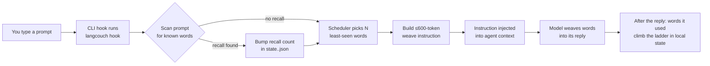

# LangCouch 🛋️

[English](README.md) · Русский · [O'zbekcha](README.uz.md)

*Переведено с README.md (дата исходника: 2026-09-25). При расхождении основной считается английская версия.*

**Учите язык, не вставая с дивана и не выходя из терминала.**

LangCouch вплетает слова изучаемого языка в ответы вашего AI-агента для кода (Claude Code, opencode, Codex CLI, Hermes Agent, OpenClaw и Gemini CLI в бете). Это техника *diglot weave*: вы работаете как обычно, а в ответах постепенно появляются слова на новом языке. Сначала 3–5 на ответ, потом чаще и сложнее, вплоть до правил словообразования, словосочетаний и простых конструкций. Никаких уроков. Погружение вместо зубрёжки.

> Вы: «почему падает деплой?»
> Агент: «Порт 8080 всё ещё держит **viejo** (старый) процесс от вашего **primero** (первый) утреннего запуска. Завершите его командой `lsof -ti :8080 | xargs kill`, и деплой пройдёт **ahora** (сейчас).»

Из коробки 10 изучаемых языков. Подсказки (перевод в скобках) бывают на английском, русском или узбекском: на том из них, на котором вы пишете сообщение.

## Что нового в 0.9.2

- **Карточки засчитывают смысл.** «to work», «the child» и частые синонимы («kid» вместо child, «малыш» вместо «ребёнок») теперь верные. После промаха кнопка «My answer was right» отменяет его.

## Что нового в 0.9.1

- **Карточки входят в LangCouch.** `/cards` появляется после обычного обновления, отдельно ставить ничего не нужно. Если в 0.9.0 вы ставили `langcouch-cards`, удалите его: `/plugin uninstall langcouch-cards@langcouch`.

## Что нового в 0.9.0

- **Карточки.** `/cards`: сначала слова, которым пришёл срок, в обе стороны (с 3-й ступени лестницы ещё и ваш язык → изучаемый), потом слова входного теста. Прогресс общий с вплетением.
- **Старые данные.** Данные версий до 0.7.6 больше не тестируются: сначала обновитесь до 0.7.6 (CHANGELOG, Upgrade notes).

## Что нового в 0.8.0

- **Числа от 1 до 1000.** Каждый язык теперь учит 30 числительных, из которых строится любое число (0–20, десятки, 100, 1000), по одному на ответ, рядом с цифрой: 3 (**tre**). Остальное объясняют короткие правила: в английском выучить 11 и 12, дальше *-teen*; во французском 70 это 60+10, а 80 это 4×20; в турецком десятки надо выучить.
- **Ложные друзья на вашем языке.** Предупреждение рядом с правилом словообразования теперь даёт настоящее значение и по-русски или по-узбекски, а не только по-английски: *attualmente = сейчас*.

## Что нового в 0.7.6

- **Входной тест.** Уже знаете часть языка? `langcouch placement` (или `/langcouch:placement` в Claude Code) спрашивает слова из списка, и те, что вы перевели верно, пропускают стадию нового. LangCouch предлагает тест, когда вы начинаете язык, и когда вы пишете, что слова слишком простые.

## Что нового в 0.7.5

- **Переводы на том языке, на котором вы пишете.** Напишите агенту по-русски, и придёт **casa** (дом); напишите по-английски, и придёт **casa** (house). Ничего переключать не нужно. Если LangCouch не может определить язык, он берёт ваш `native` и один раз спрашивает, какой язык вам нужен.
- **Gemini CLI, бета.** `langcouch install gemini` регистрирует хуки. Адаптер написан по справочнику хуков Gemini и покрыт тестами, но на живом Gemini CLI его ещё не запускали.

## Что нового в 0.7.0

- **Прогресс можно перенести на другой компьютер.** `langcouch export` сохраняет его в один файл, `langcouch import <файл>` вливает на другой стороне. Если вы там уже начали учить, ничего не теряется: см. [Перенос на другой компьютер](#перенос-на-другой-компьютер).

## Что нового в 0.6.0

- **Интервальное повторение.** Слово возвращается через 30 минут, 8 часов, день, 4 дня, 2 недели, месяц и потом через полгода. На следующую ступень оно переходит, только если ответ его действительно использовал.
- **Честный подсчёт.** LangCouch читает готовый ответ, поэтому слово, которое модель пропустила, не засчитывается как выученное и приходит снова на следующем ходу.
- **Переводы исчезают.** Новое слово приходит как **casa** (house). Знакомое приходит просто как **casa**, а в конце ответа стоит одна строка `casa = house`. У слов, которые вы уже знаете, перевода нет совсем.
- **Только подходящие слова.** Модель берёт слово, только если ответу и так нужен этот смысл. Слово, которое долго пропускают, может попасть в одну короткую ремарку, но никогда в код или текст, который вы будете копировать.

Мы сравнили это со старым поведением на четырёх моделях: ответы остались такими же хорошими, а слова читаются естественнее. [Как справляется каждая модель](evals/MODELS.md) (на английском). Старое вплетение возвращает `langcouch mode 1`. Если вы ставили LangCouch не как плагин Claude Code, посмотрите [заметки к обновлению](CHANGELOG.md).

## Зачем я это сделал

Я много читаю каждый день, и сейчас большая часть этого текста — ответы моих AI-агентов в терминале. Чтение на изучаемом языке — один из самых старых способов его выучить, и Toucan делает ровно это для веб-страниц в браузере. Для терминала такого не было, поэтому я сделал LangCouch для себя. Он бесплатен для всех, кому он тоже нужен.

## Быстрый старт

**Требование:** [bun](https://bun.sh) или Node.js ≥ 22.6 (проверить: `bun -v` или `node -v`). Если ни того, ни другого нет, плагин остаётся неактивным, и Claude скажет об этом в начале сессии.

### Как плагин Claude Code (рекомендуется)

```
/plugin marketplace add shmsk/LangCouch
/plugin install langcouch@langcouch
# restart the session — replies start weaving Spanish (default: es, level 2)
```

Настройка не нужна: ни `npm install`, ни сборки, хук сам создаёт конфиг при первом запуске. Управление прямо из Claude Code: `/langcouch:status`, `/langcouch:lang pt`, `/langcouch:level up`, `/langcouch:mode 3`, `/langcouch:pause` / `/langcouch:resume`, `/langcouch:spinner on`, `/langcouch:placement`, а свой язык добавляется через `/langcouch:add-language <language>`.

**Карточки:** `/cards` открывает панель в терминале, во вкладке Code в Desktop, в VS Code и на телефоне. Она повторяет слова, которым пришёл срок, в обе стороны (изучаемый язык → ваш, а с 3-й ступени лестницы ещё и ваш → изучаемый), потом задаёт слова входного теста. Проверяет и записывает каждую карточку сам LangCouch, так что у карточек и вплетённых ответов один общий прогресс. macOS и Linux; входят в LangCouch с 0.9.1.

**Подсказки на вашем языке:** перевод следует за языком вашего сообщения. Кириллица даёт русский; латиница даёт ваш `native`, если это `en` или `uz` (узбекский, латиница), иначе английский. `langcouch native <en|ru|uz>` (по умолчанию `en`) задаёт запасной язык для сообщения, которое LangCouch не может прочитать, а также язык ответов в квизе и подсказок в спиннере.

### Ручная установка хука

Для варианта с клоном нужен один `bun install` (только dev-зависимости; runtime-зависимостей у LangCouch нет).

```bash
git clone https://github.com/shmsk/LangCouch && cd LangCouch
bun install
bun src/cli.ts init                       # create ~/.langcouch
bun src/cli.ts install claude            # hook into the project's .claude/settings.json
# restart your Claude Code session — replies start weaving Spanish
```

Выберите один способ установки, а не оба. Если всё же совместите, защита от двойной доставки не даст счётчикам задвоиться. Интерактивный `quiz` работает в терминале: используйте ручной клон или вызовите CLI из кэша плагина (`~/.claude/plugins/cache/langcouch/…/scripts/cli.sh quiz`).

### Как плагин opencode

```
git clone https://github.com/shmsk/LangCouch && cd LangCouch
bun install
bun src/cli.ts install opencode           # project scope (.opencode/plugin/)
#   or:  bun src/cli.ts install opencode --scope user   # global (~/.config/opencode/plugin/)
# quit and restart opencode — replies start weaving Spanish
```

Одна команда ставит два пути, и оба работают одновременно:

- **Плагин (основной, надёжный)**: opencode находит его сам. Он цепляется к `experimental.chat.messages.transform`, запускает `langcouch hook` на вашем последнем сообщении и добавляет блок `<langcouch>` в контекст. Работает на любой модели.
- **Секция в AGENTS.md (запасной, экспериментальный)**: если плагины отключены или плагин не загрузился, модель получает указание сама запускать `langcouch hook` в начале каждого ответа. Зависит от того, слушается ли модель.

Защита от двойной доставки не даст счётчикам задвоиться, если оба пути сработают на один промпт.

### Как хук Codex CLI

```bash
git clone https://github.com/shmsk/LangCouch && cd LangCouch
bun install
bun src/cli.ts install codex --scope user   # ~/.codex/hooks.json (or --scope project: ./.codex/hooks.json)
# start codex, open /hooks and trust the langcouch hook — replies start weaving Spanish
```

Codex не запускает хуки, которые вы не одобрили, поэтому шаг с `/hooks` нужен один раз (и снова, если команда хука изменится). Хуку с `--scope project` нужно ещё, чтобы сам проект был доверенным. Если у вас стояла старая экспериментальная версия, установщик сам удалит её секцию из `AGENTS.md`. Сейчас Codex показывает вставленную инструкцию в переписке как видимое developer-сообщение ([openai/codex#16933](https://github.com/openai/codex/issues/16933)); это чисто косметика.

### Как хук Gemini CLI (бета)

```bash
git clone https://github.com/shmsk/LangCouch && cd LangCouch
bun install
bun src/cli.ts install gemini --scope user   # ~/.gemini/settings.json (or --scope project: ./.gemini/settings.json)
# start gemini — replies start weaving Spanish
```

Бета: адаптер написан по [справочнику хуков](https://github.com/google-gemini/gemini-cli/blob/main/docs/hooks/reference.md) Gemini CLI (`BeforeAgent` добавляет инструкцию, `AfterAgent` читает ответ обратно) и покрыт тестами, но на живом Gemini CLI его пока никто не запускал. Если у вас слова не вплетаются, пожалуйста, [заведите issue](https://github.com/shmsk/LangCouch/issues). Перед запуском нового хука уровня проекта Gemini спрашивает разрешение: разрешите `langcouch`.

### Как плагин Hermes Agent

```bash
git clone https://github.com/shmsk/LangCouch && cd LangCouch
bun install
bun src/cli.ts install hermes           # $HERMES_HOME/plugins/langcouch/ (default ~/.hermes)
hermes plugins enable langcouch         # Hermes plugins are opt-in
# restart hermes — replies start weaving Spanish
```

Плагин — небольшой Python-файл, который через хук Hermes `pre_llm_call` передаёт каждый ход в CLI LangCouch, поэтому он одинаково работает и в CLI, и в мессенджерах вроде Telegram. Управлять им можно из любой сессии: `/langcouch status`, `/langcouch lang pt`, `/langcouch level up`, `/langcouch pause` / `/langcouch resume`. Ставить Python отдельно не нужно, хватит того, что уже идёт вместе с Hermes.

### Как плагин OpenClaw

```bash
git clone https://github.com/shmsk/LangCouch && cd LangCouch
bun install
bun src/cli.ts install openclaw         # generates the plugin in ~/.langcouch/openclaw-plugin/
openclaw plugins install --link ~/.langcouch/openclaw-plugin --force --accept-capabilities
openclaw config set plugins.entries.langcouch.hooks.allowConversationAccess true --strict-json
openclaw plugins enable langcouch
```

OpenClaw запускает хуки промпта только у тех плагинов, которым вы это разрешили, поэтому строка с `allowConversationAccess` обязательна. Плагин использует хук `before_prompt_build`, а `/langcouch status`, `/langcouch lang pt`, `/langcouch pause` работают в любом канале чата. Провайдер `claude-cli` в OpenClaw хуки промпта не запускает ([openclaw/openclaw#65157](https://github.com/openclaw/openclaw/issues/65157)); все остальные провайдеры запускают.

## Не станут ли ответы агента хуже?

Всё устроено так, чтобы не стали. Инструкция запрещает трогать блоки кода, inline-код, идентификаторы, команды, пути, URL, цитаты и технические термины и прямо говорит модели, что смысл и качество ответа всегда важнее вплетения. Цена: одна короткая инструкция (≤600 токенов) на промпт, которая в основном читается из кэша промптов: около 1–3% от обычной сессии ([подробнее](docs/TokenUsage.md), на английском). Как с этим справляются четыре модели: [evals/MODELS.md](evals/MODELS.md), на английском. Если нужна чистая сессия, `/langcouch:pause` выключает вплетение сразу, а `/langcouch:resume` возвращает.

## Как это работает

Браузерные расширения (Toucan, Vocabo) переписывают DOM страницы. В CLI переписать ответ задним числом нельзя, поэтому LangCouch подкладывает короткую инструкцию через хук CLI, и вплетает слова сама модель. Ядро ничего не знает о конкретных CLI, адаптеры тонкие (архитектура вдохновлена [context-mode](https://github.com/mksglu/context-mode)).


```mermaid
flowchart LR
    A[You type a prompt] --> B[CLI hook runs<br/>langcouch hook]
    B --> C{Scan prompt<br/>for known words}
    C -->|recall found| D[Bump recall count<br/>in state.<lang>.json]
    C -->|no recall| E[Scheduler picks N<br/>least-seen words]
    D --> E
    E --> F[Build ≤600-token<br/>weave instruction]
    F --> G[Instruction injected<br/>into agent context]
    G --> H[Model weaves words<br/>into its reply]
    H --> I[After the reply: words it used<br/>climb the ladder in local state]
```

- **Словарь по концептам**: значения хранятся один раз в `concepts.json` (id, часть речи, tier, подсказки для каждого родного языка); каждый `wordlists/<lang>.json` — тонкая карта «концепт → лемма», так что новый язык — это один небольшой файл, а подсказки не расходятся
- **Словари**: ~400 базовых значимых слов на язык (существительные, глаголы, прилагательные, наречия) и 30 числительных, без служебных слов; поле tier оставляет место для уровня до 1000 слов, который открывается, когда база усвоена примерно на 80%
- **Прогресс по каждому языку**: состояние лежит в `~/.langcouch/state.<lang>.json` с ключом по id концепта, поэтому прогресс переживает исправления лемм и сравним между языками («вы знаете *солнце* в 3 языках из 5»)
- **Лесенка интервалов**: каждое слово возвращается через 30 минут, 8 часов, 1 день, 4 дня, 2 недели, 1 месяц, затем через 6 месяцев. На ступень вверх оно поднимается, только когда ответ действительно его использует, пока слово «созрело»; созревшие слова идут первыми, а четверть каждого списка остаётся свободной для новых слов
- **Честный подсчёт**: после ответа хук Stop (или событие хоста «после ответа») читает его обратно, и показанными считаются только те слова, которые ответ использовал. Хост без такого события, как и раньше, считает выданные слова
- **Переводы тают**: новое слово приходит как **casa** (house). Начиная с четвёртой ступени оно стоит просто как **casa**, а перевод даётся одной строкой в конце (`casa = house · nombre = name`). С пятой ступени (усвоено) перевода нет совсем, а усвоенные слова возвращаются как вращающаяся выборка, которую модель может использовать свободно, так что доля языка в ответах растёт
- **Только к месту, плюс подталкивание**: модель вплетает слово, только если ответу и так нужен его смысл, поэтому ничего не выдумывается ради слова. Единственное исключение: одно-два слова, которые всё время не попадали в ответы, можно вставить в короткое отступление или в заключительную строку, но никогда не в код, факты или текст, который вы скопируете
- **Сигнал вспоминания**: увидеть слово не значит его знать. Слово, которое вы использовали в своём промпте или правильно ответили в `quiz`, поднимается на ступень; неверный ответ в quiz возвращает его в начало
- **Входной тест**: уже знаете часть языка? `langcouch placement` в терминале или `/langcouch:placement` в Claude Code спрашивает ещё не усвоенные слова из списка, самые частые первыми. Слово, переведённое верно, пропускает стадию нового и сразу попадает в усвоенные (повтор через две недели); незнакомое просто остаётся новым. Прогресс сохраняется после каждого слова, можно остановиться и продолжить позже. LangCouch предлагает тест один раз, когда вы начинаете язык, и снова, если вы пишете, что слова слишком простые
- **Режимы**: `langcouch mode 3` это всё описанное выше (по умолчанию). `mode 2` вплетает только те слова, которые подходят к месту, а `mode 1` просит использовать каждое слово из списка; оба засчитывают слово в момент выдачи
- **Уровни 1–10**: слова с 1-го уровня; [правила словообразования](#правила-словообразования) со 2-го (`patterns/<lang>.json`); словосочетания с 4-го и простые предложения с 7-го, на конструкциях из `grammar/<lang>.json`, если они есть у языка
- **Родной язык**: если вы учите свой родной язык (например, `en` при native `en`), подсказки берутся из другого языка

## Поддерживаемые языки

| Язык | Код | Слов | Грамматические конструкции | Правила словообразования | Правила чисел |
|---|---|---|---|---|---|
| Английский (США) | `en` | 432 | — | 7 (для русскоязычных) | 5 |
| Английский (Великобритания) | `en-GB` | 432, как в американском, кроме 9 (*colour*, *centre*, *film*…) | — | 7 (из американского) | 5 (1 своё: *and* после hundred) |
| Немецкий | `de` | 432 | — | 8 | 7 |
| Французский | `fr` | 432 | — | 8 | 8 |
| Итальянский | `it` | 432 | — | 8 | 7 |
| Испанский (Испания) | `es` | 432 | 10 | 8 | 7 |
| Испанский (Латинская Америка) | `es-419` | 432, как в испанском, кроме 9 (*carro*, *computadora*, *lindo*…) | 10 + 2 региональные (*ustedes*, претерит для «сегодня») | 8 (из испанского Испании) | 7 (из испанского Испании) |
| Португальский (Португалия) | `pt` | 432 | — | 8 | 6 |
| Португальский (Бразилия) | `pt-BR` | 432, как в португальском, кроме 12 (*trem*, *celular*, *dezesseis*…) | — | 8 (из португальского Португалии) | 6 (1 своё: *dezesseis*) |
| Турецкий | `tr` | 432 | — | 5 | 5 |

Код нужен для переключения языка, например `/langcouch:lang es-419` (или просто `/langcouch:lang latam`).

Каждый встроенный словарь прошёл аудит второй моделью (другого вендора, чем та, что его написала). Английские глаголы записаны как `to work`, `to love`: в английском существительное и глагол часто пишутся одинаково, а каждому концепту нужно своё слово. В ответах они всё равно склоняются по контексту (*worked*, *she loves*).

Новый язык — это один JSON-файл. Только для себя: запустите `/langcouch:add-language Georgian` в Claude Code, файл появится в `~/.langcouch/wordlists/` и переживёт обновления плагина. Для всех: откройте PR, см. [docs/AddLanguage.md](docs/AddLanguage.md). Документ написан так, чтобы AI-агент для кода мог пройти его целиком сам.

Региональные варианты работают так же: `pt-BR.json` перечисляет только слова, где бразильский португальский отличается от `pt`, остальное берётся из базы. `/langcouch:add-language Brazilian Portuguese` создаёт такой вариант, `/langcouch:lang pt-br` переключает на него.

Переход на вариант не начинает обучение заново. У слов, которые пишутся одинаково, один общий прогресс: если вы учили испанский Испании и переключились на `es-419`, *casa* и все остальные слова остаются выученными, а учить нужно только 9 отличающихся. Они идут первыми, рядом с испанским словом: *carro = car, Spain: coche*. С грамматикой так же: сначала идут региональные конструкции (*ustedes trabajan*, а не *vosotros trabajáis*). Если слово базы в регионе варианта грубое, контраст об этом предупреждает: *tomar = to take, Spain: coger (vulgar in much of Latin America)*.

## Правила словообразования

Многие слова строятся одинаково в нескольких языках. *Революция* по-испански *revolución*, по-португальски *revolução*, по-итальянски *rivoluzione*, по-французски *révolution*. Выучите правило *-ция → -ción* один раз, и вы сможете читать сотни испанских слов, которые и так почти знаете. Так вплетение быстрее доходит до фраз.

- **Когда:** со 2-го уровня (он стоит по умолчанию) каждый ответ учит одно правило на примере: *-ция → -ción (revolución = революция)*.
- **За пределами списка слов:** ответ, который учит правилу, может использовать ещё одно слово по нему, даже если его нет среди ваших ~400.
- **С вашей стороны:** суффикс показывается на вашем родном языке. Русскоязычный видит *-ция → -ción*, англоязычный видит *-tion → -ción*. Некоторые правила есть только для одной стороны: *-ировать → -ieren* (*kopieren*) для русскоязычных, *-ly → -mente* для англоязычных.
- **Прогресс:** правило считается введённым после трёх ответов, после чего начинается следующее. `status` показывает это как *Word-building rules: 1/8 introduced*.
- **Ложные друзья:** правило предупреждает о словах, которые на него похожи, но значат другое, например *actual = текущий* рядом с *-al*. Значение дано на том языке, на котором вы пишете.
- **Где лежат данные:** правила в `patterns/<lang>.json`, ложные друзья и грубые слова в `falseFriends/<lang>.json`. Сколько правил у каждого языка, видно в таблице в разделе [Поддерживаемые языки](#поддерживаемые-языки). Каждое правило и пример сверены со словарём (в основном Wiktionary), а потом проверены второй моделью другого вендора.

## Числа

Любое число до 1000 строится из 30 слов: 0–20, десятки, 100 и 1000. Они стоят в вашем списке как обычные слова, не больше одного на ответ, и вплетаются рядом с цифрой, чтобы факт оставался читаемым: *деплой занял 3 (**tre**) минуты*.

- **Остальное через правила.** Когда в ответе есть числительное, LangCouch заодно показывает, как строятся числа побольше, по одному правилу за раз: *11–16 это готовые слова: undici, dodici… (e.g. 13 = tredici)*. После этого ответ может использовать число, построенное так, даже если его нет в списке.
- **У каждого языка своя логика.** В английском выучить 11 и 12, дальше *-teen*. Во французском 70 это *soixante-dix* (60+10), а 80 это *quatre-vingts* (4×20). В немецком единицы идут первыми: *einundzwanzig* (один-и-двадцать). В турецком десятки надо выучить, и узбекоязычные узнают несколько (*kırk*, *elli*).
- **Прогресс:** правило считается введённым после трёх ответов, потом место возвращается правилу словообразования. `status` показывает *Number rules: 2/7 introduced*.
- **Где лежат данные:** числительные в словарях, правила в `numbers/<lang>.json`, у каждого ссылка на страницу Wiktionary (все ссылки проверены), всё вычитано второй моделью.

Что менялось в каждой версии, есть в [CHANGELOG.md](CHANGELOG.md). После обновления `status` один раз показывает, что нового.

## Поддерживаемые CLI

| CLI | Статус | Установка | Механизм |
|---|---|---|---|
| Claude Code | **Production** | `/plugin marketplace add shmsk/LangCouch` → `/plugin install langcouch@langcouch` или `langcouch install claude` | хук `UserPromptSubmit` (добавление в контекст, надёжно); `Stop` читает ответ обратно |
| opencode | **Production** (плагин) + **экспериментально** (запасной путь) | `langcouch install opencode [--scope project\|user]` | хук плагина `experimental.chat.messages.transform` + запасная секция в AGENTS.md; `session.idle` читает ответ обратно |
| Codex CLI | **Production** | `langcouch install codex [--scope project\|user]` | хук `UserPromptSubmit` в `hooks.json` (добавление в контекст, надёжно); `Stop` читает ответ обратно |
| Gemini CLI | **Бета** (вживую пока не проверен) | `langcouch install gemini [--scope project\|user]` | хук `BeforeAgent` в `settings.json` (JSON `additionalContext`); `AfterAgent` читает ответ обратно |
| Hermes Agent | **Production** | `langcouch install hermes` | хук плагина `pre_llm_call` (контекст добавляется к вашему сообщению); `post_llm_call` читает ответ обратно |
| OpenClaw | **Production** | `langcouch install openclaw` | хук плагина `before_prompt_build` (`prependContext`); `agent_end` читает ответ обратно |

Codex CLI, opencode, Hermes Agent и OpenClaw устанавливаются на чистый CI-раннер и проверяются от начала до конца ([workflow hosts-smoke](.github/workflows/hosts-smoke.yml)): плагин загружается, блок доходит до модели, а настоящие модели на OpenRouter вплетают выданные им слова.

Адаптер для вашего CLI приветствуется, см. [CONTRIBUTING.md](CONTRIBUTING.md). Контракт хука, который обязан соблюдать любой адаптер: никогда не ломать сессию хоста (при любой ошибке ничего не печатать и выйти с кодом 0).

## Команды

| Команда | Что делает |
|---|---|
| `init` | создаёт конфиг (идемпотентно) |
| `status` | уровень и прогресс по каждому языку, где есть состояние |
| `lang [code]` | переключает изучаемый язык / показывает доступные (ваши собственные помечены `local`) |
| `validate <code> [--full]` | проверяет словарь, например добавленный вами в `~/.langcouch/wordlists/` |
| `native [en\|ru\|uz]` | ваш язык: переводы, когда язык сообщения неясен, ответы в квизе, подсказки в спиннере |
| `level <1-10\|up\|down>` | интенсивность вплетения |
| `mode [1\|2\|3]` | алгоритм вплетения: 3 лесенка интервалов (по умолчанию), 2 только подходящие к месту слова, 1 каждое слово из списка |
| `quiz [n]` | проверка усвоения (по умолчанию 5 слов); проваленное слово возвращается в ротацию |
| `placement [n] [--reset]` | проверить, какие слова из списка вы уже знаете: введите перевод, Enter = не знаю, `q` = стоп; знакомые слова пропускают стадию нового. `placement next [n]` / `placement answer <слово>=<перевод>...` делают то же партиями (так работает `/langcouch:placement`); `--reset` снова спросит слова с ответом «не знаю» |
| `cards status \| next [n] \| answer … \| reveal … \| grade …` | JSON для мода карточек (`/cards`): что пора повторить, проверка и запись каждой карточки; вызывать вручную не нужно |
| `pause` / `resume` | выключатель вплетения |
| `export [файл\|-] [--force]` | сохранить прогресс, настройки и ваши словари в один файл, по умолчанию `~/langcouch-export-<дата>.json` (`-` печатает его; существующий файл заменяется только с `--force`) |
| `import <файл> [--config]` | влить экспорт в прогресс этой машины, оставив лучшее с обеих сторон; `--config` берёт и его настройки |
| `spinner <on\|off\|status>` | по желанию: слова, которые вы учите, в подсказках спиннера Claude Code |
| `instruction` | печатает инструкцию для модели (не засчитывая показы) |
| `hook` | режим хука CLI: перед ответом строит инструкцию и ищет в промпте вспомненные слова; после него (событие `Stop`) засчитывает слова, которые ответ использовал. При любой ошибке выходит с кодом 0, чтобы не ломать сессию хоста |
| `install claude [--scope project\|user]` | регистрирует хуки UserPromptSubmit, SessionStart и Stop |
| `install opencode [--scope project\|user]` | ставит плагин + запасную секцию в AGENTS.md для opencode |
| `install codex [--scope project\|user]` | регистрирует хуки UserPromptSubmit, SessionStart и Stop в `hooks.json` Codex CLI |
| `install gemini [--scope project\|user]` | бета: регистрирует хуки BeforeAgent, SessionStart и AfterAgent в `settings.json` Gemini CLI |
| `install hermes` | ставит плагин Hermes Agent в `$HERMES_HOME/plugins/langcouch/` |
| `install openclaw` | генерирует плагин OpenClaw и печатает команды, которые подключают и включают его |

## Подсказки в спиннере (по желанию)

Пока Claude Code думает, его спиннер показывает подсказки. `/langcouch:spinner on` добавляет туда до 5 слов, которые вы сейчас учите (`LangCouch · frío = cold`), и обновляет их в начале каждой сессии. Это бесплатный бонус: подсказки в спиннере не засчитываются как показы.

Плагин не может поставлять подсказки спиннера сам, поэтому эта функция аккуратно пишет в ваш `~/.claude/settings.json`:

- **Выключено по умолчанию.** Установка LangCouch никогда не трогает ваши настройки.
- **Только наши строки.** Каждая добавленная подсказка начинается с `LangCouch · `; ваши подсказки, `excludeDefault` и все остальные ключи не трогаются. Если файл не валидный JSON, ничего не пишется.
- **Бэкап и атомарная запись.** Перед первым изменением исходный файл копируется в `~/.langcouch/settings.backup.json`.
- **Чистое выключение.** `/langcouch:spinner off` удаляет все строки с префиксом `LangCouch · `, а также ключ `spinnerTipsOverride`, если его создали мы.

## Перенос на другой компьютер

Прогресс хранится в `~/.langcouch/`, поэтому все CLI на одной машине уже видят общий. Чтобы перенести его на другой компьютер:

```bash
langcouch export                 # пишет ~/langcouch-export-YYYY-MM-DD.json
langcouch import ~/Downloads/langcouch-export-2026-10-01.json   # на другой машине
```

В чате то же самое: `/langcouch:export` и `/langcouch:import <файл>` (Claude Code) или `/langcouch export` и `/langcouch import <файл>` (Hermes, OpenClaw).

Импорт сливает, а не перезаписывает. Если вы уже начали тот же язык на другой машине, слова, которые есть только там, остаются, слова только из экспорта добавляются, а у слова, которое есть в обоих местах, остаётся лучшая запись: больше показов и вспоминаний, более высокая ступень лесенки повторений. Локальные настройки остаются, если не передать `--config`, а ваши словари сохраняются, если отличаются. Перед любыми изменениями импорт копирует старые файлы в `~/.langcouch/backups/`. Повторный импорт того же файла или перенос обратно ничего не меняет.

Один компромисс: если одно и то же слово вы учили на обеих машинах, счётчики не складываются (5 и 10 дадут 10, а не 15). Если складывать, всё посчиталось бы дважды, как только файл съездит туда и обратно.

## Приватность

Хук работает локально. Он читает ваш промпт только чтобы найти в нём уже показанные слова (сигнал вспоминания). Промпт никогда не логируется, не отправляется по сети и нигде не хранится. На диск пишется только файл состояния для каждого языка в `~/.langcouch/` (читаемый JSON), который можно посмотреть, забэкапить или удалить через `rm -rf` в любой момент. У LangCouch нет сетевых обращений и нет телеметрии.

Когда ответ готов, хук ещё и читает его (хост передаёт его сам, либо он есть в локальном транскрипте Claude Code), чтобы засчитать только те слова, которые ответ действительно использовал. Слова, предложенные на текущий ход, до этого лежат в `~/.langcouch/served.json`. Сам ответ не сохраняется, и ничего не покидает ваш компьютер. `langcouch mode 1` или `mode 2` это отключает.

## Удаление

- **Плагин Claude Code:** если вы включали спиннер, **сначала** выполните `/langcouch:spinner off` (у Claude Code нет хука удаления, так что плагин не может прибраться за собой сам). Затем `/plugin uninstall langcouch@langcouch` и перезапустите сессию. Уже удалили с включённым спиннером? Удалите строки, начинающиеся с `LangCouch · `, из `spinnerTipsOverride.tips` в `~/.claude/settings.json`.
- **Ручной хук Claude Code:** удалите записи `UserPromptSubmit`, `SessionStart` и `Stop`, команда которых заканчивается на `src/cli.ts hook`, из `.claude/settings.json` (или `~/.claude/settings.json`, если ставили с `--scope user`).
- **opencode:** удалите `langcouch.ts` из `.opencode/plugin/` (или `~/.config/opencode/plugin/`) и секцию между `<!-- langcouch:start -->` и `<!-- langcouch:end -->` в `AGENTS.md`.
- **Codex CLI:** удалите записи `UserPromptSubmit`, `SessionStart` и `Stop`, команда которых заканчивается на `src/cli.ts hook`, из `~/.codex/hooks.json` (или `.codex/hooks.json` для `--scope project`).
- **Gemini CLI:** удалите записи `BeforeAgent`, `SessionStart` и `AfterAgent` с именем `langcouch` из `~/.gemini/settings.json` (или `.gemini/settings.json` для `--scope project`).
- **Hermes Agent:** `hermes plugins disable langcouch`, затем удалите `~/.hermes/plugins/langcouch/` (или каталог в вашем `$HERMES_HOME`).
- **OpenClaw:** `openclaw plugins uninstall langcouch`, затем удалите `~/.langcouch/openclaw-plugin/`.
- **Ваш прогресс:** `rm -rf ~/.langcouch` (не делайте этого, если можете вернуться: прогресс переживает переустановку).

## Обратная связь

Есть идея или что-то бесит? Пригодится и то, и другое.

- **Конкретное пожелание:** [предложите фичу](https://github.com/shmsk/LangCouch/issues/new?template=feature-request.md).
- **Сырая идея или вопрос:** [начните обсуждение](https://github.com/shmsk/LangCouch/discussions).
- **Что-то сломалось:** [сообщите о баге](https://github.com/shmsk/LangCouch/issues/new?template=bug-report.md).

## Участие в проекте

Самый ценный вклад — ваш язык, и [docs/AddLanguage.md](docs/AddLanguage.md) написан так, чтобы ваш AI-агент мог сделать всё сам. Цикл разработки, тесты и базовые правила — в [CONTRIBUTING.md](CONTRIBUTING.md).

## Планы

- Грамматические конструкции не только для испанского (pt, it, fr, de, en, tr), с региональными оверлеями для pt-BR и en-GB
- Словарь второго уровня (до 1000 слов на язык), открывается при ~80% усвоения базы
- Лексические блоки (целые фразы), когда большая часть ядра усвоена
- Испанские герундии в глаголах спиннера («Pensando…»)
- Gemini CLI: выход из беты после проверки на живом Gemini CLI
- Больше языков. Может, ваш? ([docs/AddLanguage.md](docs/AddLanguage.md))

## Лицензия

[MIT](LICENSE): можно бесплатно использовать, изменять, форкать и распространять.
