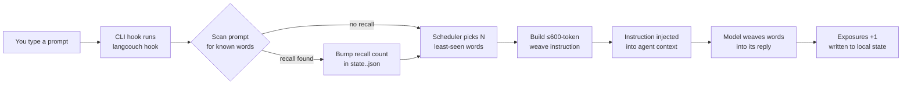

# LangCouch 🛋️

[English](README.md) · [Русский](README.ru.md) · O'zbekcha

*README.md dan tarjima qilingan (manba sanasi: 2026-09-25). Farq boʻlsa, inglizcha versiya asosiy hisoblanadi.*

**Divandan turmasdan — yoki terminalingizni tark etmasdan — til oʻrganing.**

LangCouch siz oʻrganayotgan tildagi soʻzlarni AI kodlash agentingizning javoblariga toʻqib boradi (Claude Code, opencode, Codex CLI). Bu *diglot weave* texnikasi: siz odatdagidek ishlaysiz, javoblar esa asta-sekin maqsadli til soʻzlari bilan toʻqilib boradi — dastlab har javobda 3–5 ta, keyin tez-tez va murakkabroq, hatto soʻz birikmalari va oddiy gap qurilishlarigacha. Darslar yoʻq. Oʻqish oʻrniga — immersiya (til muhitiga toʻliq singib ketish).

> Siz: "nega deploy muvaffaqiyatsiz boʻlyapti?"
> Agent: "8080-portni ertalabki **primero** (birinchi) ishga tushirishdan qolgan **viejo** (eski) jarayon hali ham band qilib turibdi. Uni `lsof -ti :8080 | xargs kill` bilan toʻxtating, deploy **ahora** (hozir) oʻtadi."

10 ta maqsadli til qutidan tayyor holda keladi. Glosslar (qavs ichidagi tarjima) ingliz, rus yoki oʻzbek tilida beriladi.

## Nega buni yaratdim

Men har kuni koʻp oʻqiyman, va hozir bu matnning katta qismi terminaldagi AI agentlarimning javoblaridir. Oʻrganayotgan tilingizda oʻqish uni oʻzlashtirishning eng qadimiy usullaridan biri, Toucan esa brauzerda veb-sahifalar uchun aynan shuni qiladi. Terminal uchun bunday vosita yoʻq edi, shuning uchun LangCouch'ni oʻzim uchun yaratdim. Uni istagan har bir kishi bepul foydalanishi mumkin.

## Tezkor boshlash

**Talab:** [bun](https://bun.sh) yoki Node.js ≥ 22.6 (`bun -v` yoki `node -v` bilan tekshiring). Ikkalasi ham topilmasa, plagin faolsiz qoladi va Claude buni sessiya boshida sizga aytadi.

### Claude Code plagini sifatida (tavsiya etiladi)

```
/plugin marketplace add shmsk/LangCouch
/plugin install langcouch@langcouch
# restart the session — replies start weaving Spanish (default: es, level 2)
```

Sozlash shart emas: na `npm install`, na build bosqichi kerak — hook birinchi ishlatilganda oʻz konfiguratsiyasini avtomatik yaratadi. Uni Claude Code ichidan `/langcouch:status`, `/langcouch:lang pt`, `/langcouch:level up`, `/langcouch:pause` / `/langcouch:resume`, `/langcouch:spinner on` buyruqlari bilan boshqaring, oʻz tilingizni esa `/langcouch:add-language <language>` bilan qoʻshing.

**Oʻz tilingizdagi glosslar:** `~/.langcouch/config.json` faylida `"native"` qiymatini `en` (standart), `ru` yoki `uz` (oʻzbek, lotin yozuvi) ga oʻrnating. Toʻqilgan matndagi glosslar va qabul qilinadigan quiz javoblari shunga mos boʻladi.

### Qoʻlda hook oʻrnatish

Klon qilingan yoʻlda bitta `bun install` kifoya (faqat dev bogʻliqliklar; LangCouchning runtime bogʻliqliklari yoʻq).

```bash
git clone https://github.com/shmsk/LangCouch && cd LangCouch
bun install
bun src/cli.ts init                       # create ~/.langcouch
bun src/cli.ts install claude            # hook into the project's .claude/settings.json
# restart your Claude Code session — replies start weaving Spanish
```

Ikkalasidan bittasini tanlang, ikkovini birga emas. Baribir ikkalasini qoʻshsangiz ham, takroriy yetkazishga qarshi himoya hisoblashni toʻgʻri saqlaydi. Interaktiv `quiz` terminalda ishlaydi: qoʻlda klon qilingan versiyadan foydalaning, yoki CLI'ni plagin keshi ichida chaqiring (`~/.claude/plugins/cache/langcouch/…/scripts/cli.sh quiz`).

### opencode plagini sifatida

```
git clone https://github.com/shmsk/LangCouch && cd LangCouch
bun install
bun src/cli.ts install opencode           # project scope (.opencode/plugin/)
#   or:  bun src/cli.ts install opencode --scope user   # global (~/.config/opencode/plugin/)
# quit and restart opencode — replies start weaving Spanish
```

Bitta buyruq ikkita yoʻlni oʻrnatadi, ikkalasi ham bir vaqtda faol boʻladi:

- **Plagin (asosiy, ishonchli)** — opencode tomonidan avtomatik aniqlanadi. `experimental.chat.messages.transform` ga ulanib, oxirgi foydalanuvchi xabaringizda `langcouch hook` ni ishga tushiradi va kontekstga `<langcouch>` blokini kiritadi. Barcha modellarda ishlaydi.
- **AGENTS.md boʻlimi (zaxira, eksperimental)** — agar plaginlarni oʻchirib qoʻysangiz yoki plagin yuklanmasa, modelga har javob boshida `langcouch hook`ni oʻzi ishga tushirish koʻrsatmasi beriladi. Bu modelning koʻrsatmaga rioya qilishiga bogʻliq.

Agar ikkala yoʻl ham bitta soʻrov uchun ishga tushsa, takroriy yetkazishga qarshi himoya hisoblashni toʻgʻri saqlaydi.

### Codex CLI hooki sifatida

```bash
git clone https://github.com/shmsk/LangCouch && cd LangCouch
bun install
bun src/cli.ts install codex --scope user   # ~/.codex/hooks.json (or --scope project: ./.codex/hooks.json)
# start codex, open /hooks and trust the langcouch hook — replies start weaving Spanish
```

Codex siz koʻrib chiqmagan hooklarni ishga tushirmaydi, shuning uchun `/hooks` qadami bir marta kerak (hook buyrugʻi oʻzgarsa, yana). `--scope project` hooki uchun loyihaning oʻzi ham ishonchli boʻlishi kerak. Agar eski eksperimental versiya oʻrnatilgan boʻlsa, oʻrnatuvchi uning `AGENTS.md` boʻlimini oʻzi olib tashlaydi. Hozircha Codex qoʻshilgan koʻrsatmani suhbatda koʻrinadigan developer xabari sifatida koʻrsatadi ([openai/codex#16933](https://github.com/openai/codex/issues/16933)); bu faqat tashqi koʻrinish masalasi.

## Bu agentimning javoblarini yomonlashtiradimi?

Yoʻq, aynan shunday boʻlmasligi uchun moʻljallangan. Toʻqish koʻrsatmasi kod bloklari, inline kod, identifikatorlar, buyruqlar, yoʻllar, URL manzillar, iqtiboslar va texnik atamalarga tegishni taqiqlaydi hamda modelga javobning maʼnosi va sifati toʻqishdan har doim ustun ekanini aytadi. Buning narxi — har bir soʻrov uchun bitta qisqa koʻrsatma (≤600 token). Toza sessiya kerak boʻlsa, `/langcouch:pause` uni darhol toʻxtatadi, `/langcouch:resume` esa qaytaradi.

## Bu qanday ishlaydi

Brauzer kengaytmalari (Toucan, Vocabo) sahifa DOM'ini qayta yozadi. CLI'da esa keyinchalik qayta yozish imkoni yoʻq — shuning uchun LangCouch CLI hook orqali qisqa koʻrsatma kiritadi, toʻqishni esa modelning oʻzi amalga oshiradi. Yadro hech qanday CLI haqida bilmaydi — adapterlar yupqa qatlam xolos (arxitektura [context-mode](https://github.com/mksglu/context-mode)dan ilhomlangan).



- **Kontseptga bogʻlangan lugʻat**: maʼnolar `concepts.json`da bir marta saqlanadi (id, pos, tier, har bir ona til uchun glosslar); har bir `wordlists/<lang>.json` esa yupqa kontsept→lemma xaritasi, shuning uchun yangi til qoʻshish — bitta kichik fayl, va glosslar hech qachon bir-biridan chetlanmaydi
- **Soʻz roʻyxatlari**: har bir til uchun ~400 ta asosiy mazmun soʻzi (ot/fe'l/sifat/ravish), yordamchi soʻzlarsiz; tier maydoni →1000 soʻzlik bosqich uchun joy ajratadi, u yadro ~80% oʻzlashtirilganda ochiladi
- **Har bir til boʻyicha progress**: holat `~/.langcouch/state.<lang>.json` faylida, kontsept id boʻyicha saqlanadi — progress lemma tuzatishlaridan omon qoladi va tillar oʻrtasida solishtirish mumkin ("siz *quyosh* soʻzini 5 tildan 3 tasida bilasiz")
- **SRS-lite**: eng kam koʻrsatilgan soʻzlar birinchi navbatda, aylanma tartib, oʻzlashtirilgan soʻzlar ≤20% qayta koʻrib chiqish qatoriga tushadi
- **Yodga tushirish signali**: koʻrish hali bilim emas — soʻz faqat siz uni faol qoʻllaganingizda (u sizning oʻz soʻrovingizda paydo boʻladi yoki `quiz`dan oʻtasiz) yoki ancha kattaroq passiv dozadan keyin oʻzlashtirilgan hisoblanadi
- **1–10 darajalar**: soʻzlar → soʻz birikmalari (4+dan) → oddiy gap qurilishlari (7+dan), bu `grammar/<lang>.json` ochish qoidalari bilan boshqariladi
- **Ona tili**: agar siz oʻz ona tilingizni oʻrganayotgan boʻlsangiz (masalan, native `en` bilan `en`), glosslar boshqa tilga oʻtadi

## Qoʻllab-quvvatlanadigan tillar

| Til | Kod | Soʻzlar | Grammatik qurilmalar |
|---|---|---|---|
| Ingliz tili (AQSH) | `en` | 402 | — |
| Ingliz tili (Britaniya) | `en-GB` | 402, AQSH bilan bir xil, 9 tasidan tashqari (*colour*, *centre*, *film*…) | — |
| Nemis tili | `de` | 402 | — |
| Fransuz tili | `fr` | 402 | — |
| Italyan tili | `it` | 402 | — |
| Ispan tili (Ispaniya) | `es` | 402 | 10 |
| Ispan tili (Lotin Amerikasi) | `es-419` | 402, Ispaniya bilan bir xil, 9 tasidan tashqari (*carro*, *computadora*, *lindo*…) | 10 |
| Portugal tili (Portugaliya) | `pt` | 402 | — |
| Portugal tili (Braziliya) | `pt-BR` | 402, Portugaliya bilan bir xil, 8 tasidan tashqari (*trem*, *celular*, *cachorro*…) | — |
| Turk tili | `tr` | 402 | — |

Kod tilni almashtirish uchun kerak, masalan `/langcouch:lang es-419` (yoki shunchaki `/langcouch:lang latam`).

Har bir tayyor roʻyxat ikkinchi model auditidan oʻtgan (uni yozgan modeldan boshqa yetkazib beruvchi). Ingliz fe'llari `to work`, `to love` koʻrinishida keltiriladi: ingliz tilida ot va fe'l koʻpincha bir xil yoziladi, shuning uchun har bir kontseptga oʻz soʻzi kerak. Toʻqish jarayonida ular baribir kontekstga mos ravishda tuslanadi (*worked*, *she loves*).

Tilingizni qoʻshish — bitta JSON fayl bilan. Faqat oʻzingiz uchun: Claude Code ichida `/langcouch:add-language Georgian` buyrugʻini bajaring, fayl esa `~/.langcouch/wordlists/` ichiga tushadi va u yerda plagin yangilanishlaridan omon qoladi. Hamma uchun: PR oching, qarang: [docs/AddLanguage.md](docs/AddLanguage.md). Hujjat AI kodlash agenti uni boshidan oxirigacha bajara olishi uchun yozilgan.

Mintaqaviy variantlar ham xuddi shunday ishlaydi: `pt-BR.json` faqat Braziliya portugal tili `pt`dan farq qiladigan soʻzlarni sanab oʻtadi, qolgani asosiy fayldan olinadi, progress esa alohida kuzatiladi. `/langcouch:add-language Brazilian Portuguese` buyrugʻi shunday variant yaratadi; `/langcouch:lang pt-br` esa unga oʻtkazadi.

## Qoʻllab-quvvatlanadigan CLI'lar

| CLI | Holat | Oʻrnatish | Mexanizm |
|---|---|---|---|
| Claude Code | **Ishlab chiqarishda** | `/plugin marketplace add shmsk/LangCouch` → `/plugin install langcouch@langcouch`, yoki `langcouch install claude` | `UserPromptSubmit` hook (kontekstga kiritish, ishonchli) |
| opencode | **Ishlab chiqarishda** (plagin) + **eksperimental** (zaxira) | `langcouch install opencode [--scope project\|user]` | `experimental.chat.messages.transform` plagin hooki + AGENTS.md orqali oʻz-oʻzidan ishlaydigan zaxira |
| Codex CLI | **Production** | `langcouch install codex [--scope project\|user]` | `hooks.json`dagi `UserPromptSubmit` hook (kontekstga qoʻshish, ishonchli) |

Oʻzingiznikini qoʻshish mumkin — qarang: [CONTRIBUTING.md](CONTRIBUTING.md). Har qanday adapter rioya qilishi kerak boʻlgan hook shartnomasi: xost sessiyasini hech qachon buzmaslik (har qanday xatoda hech narsa chop etmasdan 0 bilan chiqish).

## Buyruqlar

| Buyruq | Nima qiladi |
|---|---|
| `init` | konfiguratsiyani yaratadi (idempotent) |
| `status` | holati mavjud har bir til uchun daraja va progressni koʻrsatadi |
| `lang [code]` | maqsadli tilni almashtiradi / mavjudlarini roʻyxatlaydi (oʻzingiznikilar `local` deb belgilanadi) |
| `validate <code> [--full]` | soʻz roʻyxatini tekshiradi, masalan, siz `~/.langcouch/wordlists/` ga qoʻshgan roʻyxatni |
| `level <1-10\|up\|down>` | toʻqish intensivligi |
| `quiz [n]` | oʻzlashtirishni tekshiradi (standart 5 ta soʻz); notoʻgʻri javob berilgan soʻz yana aylanmaga qaytadi |
| `pause` / `resume` | toʻqishni oʻchirish/qayta yoqish tugmasi |
| `spinner <on\|off\|status>` | ixtiyoriy: oʻrganayotgan soʻzlaringiz Claude Code spinner maslahatlarida |
| `instruction` | toʻqish koʻrsatmasini chop etadi (duchor boʻlishlarni belgilamasdan) |
| `hook` | CLI-hook rejimi (duchor boʻlishlarni belgilaydi va soʻrovingizni yodga tushirishlar uchun skanerlaydi; har qanday xatoda 0 bilan chiqadi, shuning uchun xost sessiyasini hech qachon buzmaydi) |
| `install claude [--scope project\|user]` | `UserPromptSubmit` hookni roʻyxatdan oʻtkazadi |
| `install opencode [--scope project\|user]` | opencode uchun plagin + AGENTS.md zaxirasini oʻrnatadi |
| `install codex [--scope project\|user]` | Codex CLI `hooks.json` fayliga UserPromptSubmit hookini roʻyxatdan oʻtkazadi |

## Spinner maslahatlari (ixtiyoriy)

Claude Code oʻylayotganda uning spinneri maslahatlarni almashtirib koʻrsatadi. `/langcouch:spinner on` u yerga hozir oʻrganayotgan 5 tagacha soʻzingizni qoʻshadi (`LangCouch · frío = cold`) va har bir sessiya boshida yangilaydi. Bu bepul bonus: spinner maslahatlari koʻrsatish sifatida hisoblanmaydi.

Plagin spinner maslahatlarini oʻzi yetkazib bera olmaydi, shuning uchun bu funksiya `~/.claude/settings.json` faylingizga ehtiyotkorlik bilan yozadi:

- **Standart holatda oʻchiq.** LangCouch oʻrnatilishi sozlamalaringizga hech qachon tegmaydi.
- **Faqat bizning qatorlar.** Qoʻshilgan har bir maslahat `LangCouch · ` bilan boshlanadi; sizning maslahatlaringiz, `excludeDefault` va boshqa barcha kalitlar oʻzgarmaydi. Fayl yaroqli JSON boʻlmasa, hech narsa yozilmaydi.
- **Zaxira nusxa va atomar yozish.** Birinchi oʻzgarishdan oldin asl fayl `~/.langcouch/settings.backup.json` ga nusxalanadi.
- **Toza oʻchirish.** `/langcouch:spinner off` `LangCouch · ` prefiksli barcha qatorlarni, agar `spinnerTipsOverride` kalitini biz yaratgan boʻlsak, uni ham oʻchiradi.

## Maxfiylik

Hook lokal tarzda ishlaydi. U soʻrovingizni faqat allaqachon koʻrgan soʻzlaringizni skanerlash uchun oʻqiydi (yodga tushirish signali) — soʻrovingiz hech qachon loglanmaydi, tarmoq orqali yuborilmaydi yoki hech qayerda saqlanmaydi. Diskka yoziladigan yagona narsa — `~/.langcouch/` ichidagi har bir til uchun holat fayli (odam oʻqiy oladigan JSON), uni istalgan vaqtda koʻrishingiz, zaxiralashingiz yoki `rm -rf` bilan oʻchirishingiz mumkin. LangCouchning tarmoq interfeysi va telemetriyasi yoʻq.

## Oʻchirib tashlash

- **Claude Code plagini:** agar spinnerni yoqqan boʻlsangiz, **avval** `/langcouch:spinner off` ni bajaring (Claude Code da oʻchirish hooki yoʻq, shuning uchun plagin oʻzidan keyin tozalay olmaydi). Keyin `/plugin uninstall langcouch@langcouch` va sessiyani qayta ishga tushiring. Spinner yoqilgan holda allaqachon oʻchirib yubordingizmi? `~/.claude/settings.json` dagi `spinnerTipsOverride.tips` dan `LangCouch · ` bilan boshlanadigan qatorlarni oʻchiring.
- **Qoʻlda oʻrnatilgan Claude Code hooki:** `.claude/settings.json` faylida (yoki `--scope user` bilan oʻrnatgan boʻlsangiz `~/.claude/settings.json`da) buyrugʻi `src/cli.ts hook` bilan tugaydigan `UserPromptSubmit` yozuvini oʻchiring.
- **opencode:** `.opencode/plugin/` dan (yoki `~/.config/opencode/plugin/` dan) `langcouch.ts` faylini va `AGENTS.md` ichidagi `<!-- langcouch:start -->` bilan `<!-- langcouch:end -->` orasidagi boʻlimni oʻchiring.
- **Codex CLI:** `~/.codex/hooks.json` (yoki `--scope project` uchun `.codex/hooks.json`) faylidan buyrugʻi `src/cli.ts hook` bilan tugaydigan `UserPromptSubmit` va `SessionStart` yozuvlarini oʻchiring.
- **Progressingiz:** `rm -rf ~/.langcouch` (agar qaytib kelishingiz mumkin boʻlsa, buni bajarmang — progress qayta oʻrnatishlardan omon qoladi).

## Hissa qoʻshish

Eng qimmatli hissa — bu sizning tilingiz, va [docs/AddLanguage.md](docs/AddLanguage.md) AI agentingiz uni boshidan oxirigacha bajara olishi uchun yozilgan. Ishlab chiqish sikli, testlar va asosiy qoidalar [CONTRIBUTING.md](CONTRIBUTING.md) da berilgan.

## Yoʻl xaritasi

- 2-daraja lugʻati (har bir til uchun →1000 soʻz), yadro ~80% oʻzlashtirilganda ochiladi
- Toʻliq SM-2 oraliq takrorlash tizimi (hozircha SRS-lite)
- Spinner fe'llarida ispancha gerundiylar («Pensando…»)
- Gemini CLI adapteri
- Yana koʻproq tillar — sizniki ham boʻladimi? ([docs/AddLanguage.md](docs/AddLanguage.md))

## Litsenziya

[MIT](LICENSE): erkin foydalanish, oʻzgartirish, fork qilish va qayta tarqatish mumkin.
