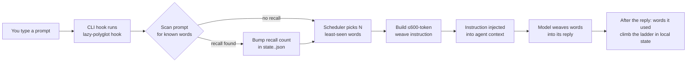

# Lazy Polyglot

[English](README.md) · [Русский](README.ru.md) · O'zbekcha · [Maxfiylik](docs/PRIVACY.md)

*README.md dan tarjima qilingan (manba sanasi: 2026-10-07). Farq boʻlsa, inglizcha versiya asosiy hisoblanadi.*

**Get (almost) accidentally fluent 🙂**  
*(Tilni deyarli tasodifan oʻrganib olasiz 🙂)*

Har kuni baribir oʻqiydigan AI javoblaringiz orqali til oʻrganing.

Lazy Polyglot siz oʻrganayotgan tildagi soʻzlarni AI agentingizning javoblariga toʻqib boradi (Claude Code, OpenCode, Codex CLI, Antigravity CLI, Hermes Agent, OpenClaw va beta holatidagi Gemini CLI). Bu *diglot weave* texnikasi: siz odatdagidek ishlaysiz, javoblar esa asta-sekin maqsadli til soʻzlari bilan toʻqilib boradi — dastlab har javobda 3–5 ta, keyin tez-tez va murakkabroq, hatto soʻz yasash qoidalari, soʻz birikmalari va oddiy gap qurilishlarigacha. Darslar yoʻq. Oʻqish oʻrniga — immersiya (til muhitiga toʻliq singib ketish).

> Siz: "Barselonada dam olish kunlarini rejalashtirishga yordam ber"

> Agent: "**Sábado** (shanba) kunini Gotika kvartalida oʻtkazing: olomon boʻlmaganda, **temprano** (erta) chiqing, kechqurun esa **mar** (dengiz) boʻyida kechki ovqatlaning."

10 ta maqsadli til qutidan tayyor holda keladi. Glosslar (qavs ichidagi tarjima) ingliz, rus yoki oʻzbek tilida beriladi, qaysi birida xabar yozsangiz, shunisida.

## Nega buni yaratdim

Har kuni oʻqiydiganlarimning katta qismi endi AI agentlarimning javoblari. Oʻrganayotgan tilingizda oʻqish uni oʻzlashtirishning eng qadimiy usullaridan biri, shuning uchun bu javoblar yoʻl-yoʻlakay menga bir nechta soʻz oʻrgatishini xohladim. Gʻoya Toucan kabi brauzer kengaytmalaridan olingan: ular xuddi shuni veb-sahifalar bilan qiladi. AI agentlar uchun bunday vosita yoʻq edi, shuning uchun Lazy Polyglot'ni oʻzim uchun yaratdim. Uni istagan har bir kishi bepul foydalanishi mumkin.

## Bu qanday ishlaydi


- **Siz odatdagidek ishlaysiz.** Har bir javobdan oldin Lazy Polyglot agentga bir nechta soʻzni sezdirmasdan aytadi, agent esa ularni mos joyga qoʻyadi.
- **Yangi soʻzlar tarjima bilan keladi.** Bir necha javobdan keyin tarjima oxiridagi bitta qisqa qatorga koʻchadi, keyin esa yoʻqoladi.
- **Soʻzlar unutay deganingizda qaytadi:** 30 daqiqadan keyin, soʻng 8 soat, bir kun, 4 kun, 2 hafta va hokazo. Faqat javobda haqiqatan ishlatilgan soʻz hisobga olinadi.
- **Daraja oshgani sari koʻproq.** Avval alohida soʻzlar; 2-darajadan (standart) soʻzlar qanday yasalishi ham (*-tion → -ción*); 4-darajadan qisqa iboralar, 7-darajadan oddiy gaplar. `/lazy-polyglot:level up` darajani oshiradi.
- **Tarjima sizning tilingizda:** ingliz, rus yoki oʻzbek tilida, qaysi birida yozsangiz.
- **Hammasi kompyuteringizda qoladi.** Progress `~/.lazy-polyglot/` dagi kichik fayl, hech narsa hech qayerga yuborilmaydi.

Texnik versiyasi [Ichki tuzilish](#ichki-tuzilish) boʻlimida.

## Kartochkalar va boshqa qoʻshimchalar (Claude Code)

**Kartochkalar.** `/cards` deb yozing, Lazy Polyglot vaqti kelgan soʻzlarni ikki tomonga soʻraydi (ispancha → oʻzbekcha, keyinroq oʻzbekcha → ispancha). Kartochkalar va toʻqilgan javoblarning progressi bitta, shuning uchun kartochkada toʻgʻri topgan soʻzingiz javoblarda kamroq chiqadi.


Terminalda, Desktop ilovasining Code boʻlimida, VS Code'da va mobil ilovada ishlaydi (macOS va Linux; Claude Code 2.1.287 yoki undan yangisi). Terminalda kartochka oddiy matn, boshqa joylarda yuqoridagi animatsiyadagidek koʻrinadi. Desktop'da `/cards` boʻlmasa, ilovani yangilang.

**Ikkita kichik ixtiyoriy imkoniyat:**

- `/lazy-polyglot:cards-status on` pastdagi holat qatorida nechta kartochka kutayotganini koʻrsatadi.
- `/lazy-polyglot:spinner on` Claude oʻylayotganda oʻrganayotgan soʻzlaringizni koʻrsatadi. [Batafsil](#spinner-maslahatlari-ixtiyoriy).

## Bu agentimning javoblarini yomonlashtiradimi?

Yoʻq, aynan shunday boʻlmasligi uchun moʻljallangan. Toʻqish koʻrsatmasi kod bloklari, inline kod, identifikatorlar, buyruqlar, yoʻllar, URL manzillar, iqtiboslar va texnik atamalarga tegishni taqiqlaydi hamda modelga javobning maʼnosi va sifati toʻqishdan har doim ustun ekanini aytadi. Buning narxi — har bir soʻrov uchun bitta qisqa koʻrsatma (≤600 token), u asosan prompt keshidan oʻqiladi: odatiy sessiyaning taxminan 1–3% ([batafsil](docs/TokenUsage.md), ingliz tilida). Toʻrtta model buni qanday uddalashi: [evals/MODELS.md](evals/MODELS.md), ingliz tilida. Toza sessiya kerak boʻlsa, `/lazy-polyglot:pause` uni darhol toʻxtatadi, `/lazy-polyglot:resume` esa qaytaradi.

## 0.9.8 da nima yangi

- **Ingliz, portugal va italyan tillari uchun grammatika.** 4-darajadan boshlab qurilmalar endi faqat ispan tilida emas, `en`, `en-GB`, `pt`, `pt-BR` va `it` da ham bor: *the house is big*, *estou trabalhando*, *lo studente*. Britaniya inglizchasi va Braziliya portugalchasi avval oʻzinikini oʻrgatadi: *have you got a car? (US: do you have a car?)*, *você trabalha (Portugal: tu trabalhas)*.
- **Hafta kunlari va oylar** barcha tillarda, 19 ta yangi soʻz (endi 451 ta).
- **(0.9.7) Yangi nom: Lazy Polyglot.** Plagin ham, soʻzlar ham, progress ham oldingidek. Buyruqlar endi `/lazy-polyglot:…` (masalan, `/lazy-polyglot:status`), CLI `lazy-polyglot` deb ataladi, maʼlumotlar papkasi esa `~/.lazy-polyglot`: u birinchi ishga tushishda oʻzi koʻchiriladi. Plaginni eski nom ostida oʻrnatgan boʻlsangiz, oʻtish taxminan bir daqiqa oladi: [UPGRADING.md](UPGRADING.md) ga qarang.

Oldingi versiyalar [CHANGELOG.md](CHANGELOG.md) da (ingliz tilida).

## Nima uchun yangi nom

Plagin Anthropic'ning rasmiy plaginlar katalogiga kiryapti, yangi nom esa uni u yerda uchratgan hamma uchun tezroq tushunarli. Boshqa hech narsa oʻzgarmaydi. Eski versiyani oʻrnatgan boʻlsangiz, eski marketplace'ni `/plugin marketplace remove langcouch` bilan oʻchiring, yangisini qoʻshing, progressingiz saqlanadi. Qadamlar [UPGRADING.md](UPGRADING.md) da; ularni siz uchun AI agent ham bajara oladi.

## Tezkor boshlash

Eng oson yoʻli: AI agentingizdan (Claude Code, Codex, OpenCode, Antigravity, Hermes Agent, OpenClaw yoki boshqasi) soʻrang. Unga buni yuboring:

```
Install Lazy Polyglot for me: https://github.com/shmsk/lazy-polyglot
```

Agent bu sahifani oʻqib, kerakli qadamlarni bajaradi. Agar biror qadamni oʻzingiz yozishingiz kerak boʻlsa (Claude Code'da bu pastdagi ikki `/plugin` qatori), u aytadi. Keyin sessiyani qayta ishga tushiring, javoblarda ispancha soʻzlar paydo boʻladi. Boshqa tilni oʻrganish uchun agentga ayting yoki `/lazy-polyglot:lang` ni ishlating (masalan, `/lazy-polyglot:lang fr`).

**Kerak boʻladi:** [bun](https://bun.sh) yoki Node.js 22.6 yoki undan yangisi (`bun -v` yoki `node -v` bilan tekshiring). Ularsiz plagin oʻchiq qoladi va Claude buni sessiya boshida aytadi.

## Qoʻlda oʻrnatish

### Claude Code plagini sifatida (tavsiya etiladi)

```
/plugin marketplace add shmsk/lazy-polyglot
/plugin install lazy-polyglot@lazy-polyglot
# restart the session — replies start weaving Spanish (default: es, level 2)
```

Sozlash shart emas: na `npm install`, na build bosqichi kerak — hook birinchi ishlatilganda oʻz konfiguratsiyasini avtomatik yaratadi. Uni Claude Code ichidan `/lazy-polyglot:status`, `/lazy-polyglot:lang pt`, `/lazy-polyglot:level up`, `/lazy-polyglot:mode 3`, `/lazy-polyglot:pause` / `/lazy-polyglot:resume`, `/lazy-polyglot:spinner on`, `/lazy-polyglot:placement` buyruqlari bilan boshqaring, oʻz tilingizni esa `/lazy-polyglot:add-language <language>` bilan qoʻshing.

**Kartochkalar:** `/cards` buyrugʻi ochadi: terminalda, Desktop'ning Code boʻlimida, VS Code'da va telefonda ochiladigan panel. U vaqti kelgan soʻzlarni ikki tomonga takrorlaydi (oʻrganilayotgan til → sizning tilingiz, zinapoyaning 3-bosqichidan esa sizning tilingiz → oʻrganilayotgan til), keyin daraja testi soʻzlarini soʻraydi. Har bir kartochkani Lazy Polyglot oʻzi tekshiradi va yozib boradi, shuning uchun kartochkalar va javoblarga toʻqilgan soʻzlarning natijasi bitta. macOS va Linux; 0.9.1 dan beri Lazy Polyglot ichida. Terminaldan tashqarida har bir kartochka fleshkarta sifatida chiziladi (0.9.3 dan beri). Har bir soʻz va javob yonida bayroq va til nomi koʻrinadi (0.9.4 dan beri). Claude Code 2.1.287 yoki undan yangisi kerak; Desktop ilovasida Claude Code'ning oʻz nusxasi bor, shuning uchun u yerda `/cards` boʻlmasa, ilovani yangilang.

**Oʻz tilingizdagi glosslar:** tarjimalar xabaringiz tiliga mos keladi. Kirill yozuvi ruscha tarjima beradi; lotin yozuvi `native` qiymatingizni beradi, agar u `en` yoki `uz` (oʻzbek, lotin yozuvi) boʻlsa, aks holda inglizcha. `lazy-polyglot native <en|ru|uz>` (standart `en`) Lazy Polyglot oʻqiy olmaydigan xabar uchun zaxira tilni, shuningdek quiz javoblari va spinner maslahatlari tilini belgilaydi.

### Qoʻlda hook oʻrnatish

Klon qilingan yoʻlda bitta `bun install` kifoya (faqat dev bogʻliqliklar; Lazy Polyglot'ning runtime bogʻliqliklari yoʻq).

```bash
git clone https://github.com/shmsk/lazy-polyglot && cd lazy-polyglot
bun install
bun src/cli.ts init                       # create ~/.lazy-polyglot
bun src/cli.ts install claude            # hook into the project's .claude/settings.json
# restart your Claude Code session — replies start weaving Spanish
```

Ikkalasidan bittasini tanlang, ikkovini birga emas. Baribir ikkalasini qoʻshsangiz ham, takroriy yetkazishga qarshi himoya hisoblashni toʻgʻri saqlaydi. Interaktiv `quiz` terminalda ishlaydi: qoʻlda klon qilingan versiyadan foydalaning, yoki CLI'ni plagin keshi ichida chaqiring (`~/.claude/plugins/cache/lazy-polyglot/…/scripts/cli.sh quiz`).

### OpenCode plagini sifatida

```
git clone https://github.com/shmsk/lazy-polyglot && cd lazy-polyglot
bun install
bun src/cli.ts install opencode           # project scope (.opencode/plugin/)
#   or:  bun src/cli.ts install opencode --scope user   # global (~/.config/opencode/plugin/)
# quit and restart OpenCode — replies start weaving Spanish
```

Bitta buyruq ikkita yoʻlni oʻrnatadi, ikkalasi ham bir vaqtda faol boʻladi:

- **Plagin (asosiy, ishonchli)** — OpenCode tomonidan avtomatik aniqlanadi. `experimental.chat.messages.transform` ga ulanib, oxirgi foydalanuvchi xabaringizda `lazy-polyglot hook` ni ishga tushiradi va kontekstga `<lazy-polyglot>` blokini kiritadi. Barcha modellarda ishlaydi.
- **AGENTS.md boʻlimi (zaxira, eksperimental)** — agar plaginlarni oʻchirib qoʻysangiz yoki plagin yuklanmasa, modelga har javob boshida `lazy-polyglot hook`ni oʻzi ishga tushirish koʻrsatmasi beriladi. Bu modelning koʻrsatmaga rioya qilishiga bogʻliq.

Agar ikkala yoʻl ham bitta soʻrov uchun ishga tushsa, takroriy yetkazishga qarshi himoya hisoblashni toʻgʻri saqlaydi.

### Codex CLI hooki sifatida

```bash
git clone https://github.com/shmsk/lazy-polyglot && cd lazy-polyglot
bun install
bun src/cli.ts install codex --scope user   # ~/.codex/hooks.json (or --scope project: ./.codex/hooks.json)
# start codex, open /hooks and trust the lazy-polyglot hook — replies start weaving Spanish
```

Codex siz koʻrib chiqmagan hooklarni ishga tushirmaydi, shuning uchun `/hooks` qadami bir marta kerak (hook buyrugʻi oʻzgarsa, yana). `--scope project` hooki uchun loyihaning oʻzi ham ishonchli boʻlishi kerak. Agar eski eksperimental versiya oʻrnatilgan boʻlsa, oʻrnatuvchi uning `AGENTS.md` boʻlimini oʻzi olib tashlaydi. Hozircha Codex qoʻshilgan koʻrsatmani suhbatda koʻrinadigan developer xabari sifatida koʻrsatadi ([openai/codex#16933](https://github.com/openai/codex/issues/16933)); bu faqat tashqi koʻrinish masalasi. Ollama orqali (`ollama launch codex`) soʻzlar hozircha toʻqilmaydi: Ollama koʻrsatmani yoʻqotadi, chunki suhbat boshida boʻlmagan `developer` xabarlarini eʼtiborsiz qoldiradi.

### Antigravity CLI plagini sifatida

```bash
git clone https://github.com/shmsk/lazy-polyglot && cd lazy-polyglot
bun install
bun src/cli.ts install antigravity --scope user   # ~/.gemini/config/plugins/lazy-polyglot (or --scope project: ./.agents/plugins/lazy-polyglot)
# start agy — replies start weaving Spanish
```

Plagin har bir model chaqiruvidan oldin koʻrsatma qoʻshadi (`PreInvocation`) va navbat tugaganda javobni transkriptdan qayta oʻqiydi (`Stop`). U yana qisqa qoida ham oʻrnatadi: `<lazy-polyglot>` xabari sizning oʻz plaginingizdan keladi. Usiz Gemini bu xabarni hozirgina oʻqilgan fayldan kelgan prompt injection deb oʻylashi mumkin. `agy -p /hooks` ikkita `lazy-polyglot` hookini koʻrsatishi kerak; `agy plugin disable lazy-polyglot` plaginni oʻchiradi. Sozlamalar agy ichida ham ishlaydi: `/lazy-polyglot:lang fr`, `/lazy-polyglot:level up`, `/lazy-polyglot:pause`, `/lazy-polyglot:status` yoki agentdan tilni almashtirishni shunchaki soʻrang.

### Gemini CLI hooki sifatida (beta)

```bash
git clone https://github.com/shmsk/lazy-polyglot && cd lazy-polyglot
bun install
bun src/cli.ts install gemini --scope user   # ~/.gemini/settings.json (or --scope project: ./.gemini/settings.json)
# start gemini — replies start weaving Spanish
```

Beta: adapter Gemini CLI'ning [hooklar qoʻllanmasi](https://github.com/google-gemini/gemini-cli/blob/main/docs/hooks/reference.md) asosida yozilgan (`BeforeAgent` koʻrsatma qoʻshadi, `AfterAgent` javobni qayta oʻqiydi) va testlar bilan qoplangan, lekin jonli Gemini CLI'da hali hech kim ishga tushirib koʻrmagan. Soʻzlar toʻqilmasa, iltimos, [issue oching](https://github.com/shmsk/lazy-polyglot/issues). Loyiha darajasidagi yangi hookni ishga tushirishdan oldin Gemini ruxsat soʻraydi: `lazy-polyglot` ga ruxsat bering.

### Hermes Agent plagini sifatida

```bash
git clone https://github.com/shmsk/lazy-polyglot && cd lazy-polyglot
bun install
bun src/cli.ts install hermes           # $HERMES_HOME/plugins/lazy-polyglot/ (default ~/.hermes)
hermes plugins enable lazy-polyglot         # Hermes plugins are opt-in
# restart hermes — replies start weaving Spanish
```

Plagin — Hermes'ning `pre_llm_call` hooki orqali har bir navbatni Lazy Polyglot CLI'ga uzatadigan kichik Python fayli, shuning uchun u CLI'da ham, Telegram kabi gateway platformalarida ham bir xil ishlaydi. Uni istalgan sessiyadan `/lazy-polyglot status`, `/lazy-polyglot lang pt`, `/lazy-polyglot level up`, `/lazy-polyglot pause` / `/lazy-polyglot resume` bilan boshqaring. Hermes bilan birga keladigan Pythondan tashqari sizga Python kerak emas.

### OpenClaw plagini sifatida

```bash
git clone https://github.com/shmsk/lazy-polyglot && cd lazy-polyglot
bun install
bun src/cli.ts install openclaw         # generates the plugin in ~/.lazy-polyglot/openclaw-plugin/
openclaw plugins install --link ~/.lazy-polyglot/openclaw-plugin --force --accept-capabilities
openclaw config set plugins.entries.lazy-polyglot.hooks.allowConversationAccess true --strict-json
openclaw plugins enable lazy-polyglot
```

OpenClaw prompt hooklarini faqat siz ruxsat bergan plaginlar uchun ishga tushiradi, shuning uchun `allowConversationAccess` qatori shart. Plagin `before_prompt_build` hookidan foydalanadi, `/lazy-polyglot status`, `/lazy-polyglot lang pt`, `/lazy-polyglot pause` esa istalgan chat kanalida ishlaydi. OpenClaw'ning `claude-cli` provayderi prompt hooklarini ishga tushirmaydi ([openclaw/openclaw#65157](https://github.com/openclaw/openclaw/issues/65157)); qolgan barcha provayderlar ishga tushiradi.

## Ichki tuzilish

Brauzer kengaytmalari (Toucan, Vocabo) sahifa DOM'ini qayta yozadi. CLI'da esa keyinchalik qayta yozish imkoni yoʻq — shuning uchun Lazy Polyglot CLI hook orqali qisqa koʻrsatma kiritadi, toʻqishni esa modelning oʻzi amalga oshiradi. Yadro hech qanday CLI haqida bilmaydi — adapterlar yupqa qatlam xolos (arxitektura [context-mode](https://github.com/mksglu/context-mode)dan ilhomlangan).


```mermaid
flowchart LR
    A[You type a prompt] --> B[CLI hook runs<br/>lazy-polyglot hook]
    B --> C{Scan prompt<br/>for known words}
    C -->|recall found| D[Bump recall count<br/>in state.<lang>.json]
    C -->|no recall| E[Scheduler picks N<br/>least-seen words]
    D --> E
    E --> F[Build ≤600-token<br/>weave instruction]
    F --> G[Instruction injected<br/>into agent context]
    G --> H[Model weaves words<br/>into its reply]
    H --> I[After the reply: words it used<br/>climb the ladder in local state]
```

- **Kontseptga bogʻlangan lugʻat**: maʼnolar `data/concepts.json`da bir marta saqlanadi (id, pos, tier, har bir ona til uchun glosslar); har bir `data/wordlists/<lang>.json` esa yupqa kontsept→lemma xaritasi, shuning uchun yangi til qoʻshish — bitta kichik fayl, va glosslar hech qachon bir-biridan chetlanmaydi
- **Soʻz roʻyxatlari**: har bir til uchun ~400 ta asosiy mazmun soʻzi (ot/fe'l/sifat/ravish) va 30 ta son, yordamchi soʻzlarsiz; tier maydoni →1000 soʻzlik bosqich uchun joy ajratadi, u yadro ~80% oʻzlashtirilganda ochiladi
- **Har bir til boʻyicha progress**: holat `~/.lazy-polyglot/state.<lang>.json` faylida, kontsept id boʻyicha saqlanadi — progress lemma tuzatishlaridan omon qoladi va tillar oʻrtasida solishtirish mumkin ("siz *quyosh* soʻzini 5 tildan 3 tasida bilasiz")
- **Oraliqlar zinasi**: har bir soʻz 30 daqiqadan, 8 soatdan, 1 kundan, 4 kundan, 2 haftadan, 1 oydan, soʻng 6 oydan keyin qaytadi. U zinadan bir pogʻona faqat vaqti kelganda javob uni haqiqatan ishlatsagina koʻtariladi; vaqti kelgan soʻzlar birinchi turadi, har bir roʻyxatning choragi esa yangi soʻzlar uchun boʻsh qoladi
- **Halol hisob**: javobdan keyin Stop hooki (yoki xostning "javobdan keyin" hodisasi) uni qayta oʻqiydi va faqat javob ishlatgan soʻzlar koʻrsatilgan hisoblanadi. Bunday hodisasi yoʻq xost avvalgidek berilgan soʻzlarni hisoblaydi
- **Tarjimalar soʻnadi**: yangi soʻz **casa** (house) koʻrinishida keladi. Toʻrtinchi pogʻonadan boshlab u oddiy **casa** boʻlib turadi, tarjima esa oxirgi bir qatorda beriladi (`casa = house · nombre = name`). Beshinchi pogʻonadan (oʻzlashtirilgan) tarjima umuman boʻlmaydi, oʻzlashtirilgan soʻzlar esa model erkin ishlatishi mumkin boʻlgan aylanuvchi tanlama sifatida qaytadi, shuning uchun javoblarda til ulushi oshib boradi
- **Faqat joyiga tushsa, yana turtki**: model soʻzni faqat javobga uning maʼnosi baribir kerak boʻlgan joyga toʻqiydi, shuning uchun soʻz uchun hech narsa oʻylab topilmaydi. Yagona istisno: tez-tez tushib qolgan bir-ikki soʻzni qisqa chekinishga yoki yakuniy qatorga qoʻyish mumkin, lekin hech qachon kodga, faktlarga yoki nusxa koʻchiradigan matnga emas
- **Yodga tushirish signali**: koʻrish hali bilim emas. Oʻz soʻrovingizda ishlatgan yoki `quiz`da toʻgʻri javob bergan soʻz bir pogʻona koʻtariladi; quizdagi notoʻgʻri javob uni boshiga qaytaradi
- **Daraja testi**: tilning bir qismini allaqachon bilasizmi? Terminalda `lazy-polyglot placement` yoki Claude Code'da `/lazy-polyglot:placement` roʻyxatdagi hali oʻzlashtirilmagan soʻzlarni, eng koʻp ishlatiladiganlaridan boshlab soʻraydi. Toʻgʻri tarjima qilingan soʻz yangi soʻz bosqichini oʻtkazib, toʻgʻridan-toʻgʻri oʻzlashtirilganlarga oʻtadi (ikki haftadan keyin takrorlanadi); bilmagan soʻzingiz shunchaki yangi boʻlib qoladi. Har bir soʻzdan keyin saqlanadi, toʻxtab, keyin davom ettirish mumkin. Lazy Polyglot testni til boshlanganda bir marta, soʻzlar juda oson deb yozsangiz yana taklif qiladi
- **Rejimlar**: `lazy-polyglot mode 3` yuqoridagilarning hammasi (standart). `mode 2` faqat joyiga tushadigan soʻzlarni toʻqiydi, `mode 1` esa roʻyxatdagi har bir soʻzni soʻraydi; ikkalasi ham soʻzni berilgan paytda hisoblaydi
- **1–10 darajalar**: soʻzlar 1-darajadan; soʻz yasash qoidalari 2-darajadan (`data/patterns/<lang>.json`); soʻz birikmalari 4-darajadan va oddiy gaplar 7-darajadan, agar tilda boʻlsa, `data/grammar/<lang>.json` dagi qurilmalar asosida
- **Ona tili**: agar siz oʻz ona tilingizni oʻrganayotgan boʻlsangiz (masalan, native `en` bilan `en`), glosslar boshqa tilga oʻtadi

## Qoʻllab-quvvatlanadigan tillar

| Til | Kod | Soʻzlar | Grammatik qurilmalar | Soʻz yasash qoidalari | Son qoidalari | Talaffuz |
|---|---|---|---|---|---|---|
| Ingliz tili (AQSH) | `en` | 451 | 12 | 7 (rus tilida soʻzlashuvchilar uchun) | 5 | AQSH |
| Ingliz tili (Britaniya) | `en-GB` | 451, AQSH bilan bir xil, 9 tasidan tashqari (*colour*, *centre*, *film*…) | 12 + 3 mintaqaviy (*have you got*, *the team are*, *have you eaten yet*) | 7 (AQSHdan) | 5 (1 tasi oʻziniki: hundred dan keyin *and*) | Britaniya (248 ta soʻz AQSHnikidan farq qiladi) |
| Nemis tili | `de` | 451 | — | 8 | 7 | — |
| Fransuz tili | `fr` | 451 | — | 8 | 8 | ✓ |
| Italyan tili | `it` | 451 | 12 | 8 | 7 | — |
| Ispan tili (Ispaniya) | `es` | 451 | 10 | 8 | 7 | — |
| Ispan tili (Lotin Amerikasi) | `es-419` | 451, Ispaniya bilan bir xil, 9 tasidan tashqari (*carro*, *computadora*, *lindo*…) | 10 + 2 mintaqaviy (*ustedes*, bugungi ish uchun preterit) | 8 (Ispaniyadan) | 7 (Ispaniyadan) | — |
| Portugal tili (Portugaliya) | `pt` | 451 | 11 | 8 | 6 | Portugaliya |
| Portugal tili (Braziliya) | `pt-BR` | 451, Portugaliya bilan bir xil, 12 tasidan tashqari (*trem*, *celular*, *dezesseis*…) | 10 + 3 mintaqaviy (*você*, *estou trabalhando*, *eu me chamo*) | 8 (Portugaliyadan) | 6 (1 tasi oʻziniki: *dezesseis*) | Braziliya (335 ta soʻz Portugaliyanikidan farq qiladi) |
| Turk tili | `tr` | 451 | — | 5 | 5 | — |

Kod tilni almashtirish uchun kerak, masalan `/lazy-polyglot:lang es-419` (yoki shunchaki `/lazy-polyglot:lang latam`).

Har bir tayyor roʻyxat ikkinchi model auditidan oʻtgan (uni yozgan modeldan boshqa yetkazib beruvchi). Ingliz fe'llari `to work`, `to love` koʻrinishida keltiriladi: ingliz tilida ot va fe'l koʻpincha bir xil yoziladi, shuning uchun har bir kontseptga oʻz soʻzi kerak. Toʻqish jarayonida ular baribir kontekstga mos ravishda tuslanadi (*worked*, *she loves*).

Tilingizni qoʻshish — bitta JSON fayl bilan. Faqat oʻzingiz uchun: Claude Code ichida `/lazy-polyglot:add-language Georgian` buyrugʻini bajaring, fayl esa `~/.lazy-polyglot/wordlists/` ichiga tushadi va u yerda plagin yangilanishlaridan omon qoladi. Hamma uchun: PR oching, qarang: [docs/AddLanguage.md](docs/AddLanguage.md). Hujjat AI kodlash agenti uni boshidan oxirigacha bajara olishi uchun yozilgan.

Mintaqaviy variantlar ham xuddi shunday ishlaydi: `pt-BR.json` faqat Braziliya portugal tili `pt`dan farq qiladigan soʻzlarni sanab oʻtadi, qolgani esa asosiy fayldan olinadi. `/lazy-polyglot:add-language Brazilian Portuguese` buyrugʻi shunday variant yaratadi; `/lazy-polyglot:lang pt-br` esa unga oʻtkazadi.

Variantga oʻtganda oʻrganish boshidan boshlanmaydi. Ikkalasida bir xil yoziladigan soʻzlarning progressi umumiy: Ispaniya ispan tilini oʻrganib, `es-419`ga oʻtsangiz, *casa* va boshqa soʻzlar oʻrganilgan boʻlib qoladi, faqat farq qiladigan 9 ta soʻzni oʻrganasiz. Ular birinchi keladi, Ispaniya soʻzi bilan yonma-yon: *carro = car, Spain: coche*. Grammatika ham shunday: avval mintaqaviy konstruksiyalar keladi (*vosotros trabajáis* emas, *ustedes trabajan*). Agar asosiy tildagi soʻz variant mintaqasida qoʻpol boʻlsa, qiyoslash bu haqda ogohlantiradi: *tomar = to take, Spain: coger (vulgar in much of Latin America)*.

## Talaffuz

Fransuz, ingliz va portugal tillari yozilishicha oʻqilmaydi, shuning uchun ulardagi yangi soʻzlar talaffuzi bilan keladi, siz allaqachon oʻqiy oladigan harflarda:

| Nimani koʻrasiz | Sozlama |
|---|---|
| **maison** (uy) | `off` |
| **maison** [mezon] (uy) | `native`, standart: oʻzbek harflarida, rus harflarida ([мезо́н]) yoki inglizcha yozuvda ([meh-ZAWN]), siz yozayotgan tilda |
| **maison** [mɛzɔ̃] (uy) | `ipa`: Xalqaro fonetik alifbo |

Lazy Polyglot har bir til uchun bir marta soʻraydi va bu uch variantni roʻyxatingizdagi soʻz bilan koʻrsatadi; keyin `/lazy-polyglot:reading off|native|ipa` tanlovni oʻzgartiradi. Talaffuz faqat yangi soʻzlarda boʻladi va tarjima bilan birga yoʻqoladi. Uni kartochkalar va spinner maslahatlari ham koʻrsatadi. Ispan, italyan, nemis va turk tillari yozilishiga yetarlicha yaqin, ularda talaffuz yoʻq.

Talaffuzlar Wiktionary'dan IPA koʻrinishida olingan, har bir soʻzga bittadan: Amerika va Britaniya inglizchasi, Yevropa va Braziliya portugalchasining har biri oʻziniki. Harflar IPA'dan yasaladi va soʻzni ovoz chiqarib oʻqish uchun taxminiy; aniq shakl IPA. Tilga talaffuz qoʻshish bitta JSON fayl, qarang: [docs/AddLanguage.md](docs/AddLanguage.md).

## Soʻz yasash qoidalari

Koʻp soʻzlar bir nechta tilda bir xil tuziladi. *Revolution* ispanchada *revolución*, portugalchada *revolução*, italyanchada *rivoluzione*, fransuzchada *révolution*, ruschada *революция*. *-tion → -ción* qoidasini bir marta oʻrgansangiz, deyarli biladigan yuzlab ispancha soʻzlarni oʻqiy olasiz. Shu tufayli toʻqish iboralarga tezroq oʻtadi.

- **Qachon:** 2-darajadan (standart daraja) boshlab har bir javob bitta qoidani misol bilan oʻrgatadi: *-tion → -ción (revolución = revolution)*.
- **Roʻyxatdan tashqari:** qoidani oʻrgatayotgan javob shu qoida boʻyicha tuzilgan yana bitta soʻzni ishlatishi mumkin, hatto u sizning ~400 soʻzingiz orasida boʻlmasa ham.
- **Sizning tomoningiz:** qoʻshimcha ona tilingizda koʻrsatiladi. Ingliz tilida soʻzlashuvchi *-tion → -ción* ni, rus tilida soʻzlashuvchi *-ция → -ción* ni koʻradi. Oʻzbek tili uchun alohida qoidalar hozircha yoʻq, shuning uchun inglizcha tomoni koʻrsatiladi.
- **Progress:** qoida uchta javobdan keyin kiritilgan hisoblanadi, soʻng keyingisi boshlanadi. `status` buni *Word-building rules: 1/8 introduced* deb koʻrsatadi.
- **Soxta doʻstlar:** qoida unga oʻxshagan, lekin boshqa maʼnoli soʻzlar haqida ogohlantiradi, masalan *-al* yonida *actual = joriy*. Maʼno siz yozayotgan tilda beriladi.
- **Maʼlumotlar qayerda:** qoidalar `data/patterns/<lang>.json` da, soxta doʻstlar va qoʻpol soʻzlar `data/falseFriends/<lang>.json` da. Har bir tildagi qoidalar soni “Qoʻllab-quvvatlanadigan tillar” jadvalida. Har bir qoida va misol lugʻat bilan (asosan Wiktionary) solishtirilgan, soʻng boshqa yetkazib beruvchining ikkinchi modeli tomonidan tekshirilgan.

## Sonlar

1000 gacha boʻlgan har qanday son 30 ta soʻzdan tuziladi: 0–20, oʻnliklar, 100 va 1000. Ular roʻyxatingizda oddiy soʻzlar kabi turadi, har javobda bittadan koʻp emas, va fakt oʻqiladigan qolishi uchun raqam yonida toʻqiladi: *deploy 3 (**tre**) daqiqa davom etdi*.

- **Qolgani qoidalar orqali.** Javobda son boʻlsa, Lazy Polyglot kattaroq sonlar qanday tuzilishini ham koʻrsatadi, bir vaqtda bitta qoida: *11–16 tayyor soʻzlar: undici, dodici… (e.g. 13 = tredici)*. Shundan soʻng javob shu tarzda tuzilgan sonni ishlatishi mumkin, hatto u roʻyxatda boʻlmasa ham.
- **Har bir tilning oʻz mantiqi bor.** Ingliz tilida 11 va 12 ni yodlaysiz, keyin *-teen*. Fransuz tilida 70 bu *soixante-dix* (60+10), 80 esa *quatre-vingts* (4×20). Nemis tilida birlik oldin keladi: *einundzwanzig* (bir-va-yigirma). Turk tilida oʻnliklarni yodlash kerak, oʻzbekcha soʻzlashuvchilar ulardan bir nechtasini taniydi (*kırk*, *elli*).
- **Progress:** qoida uchta javobdan keyin kiritilgan hisoblanadi, soʻng oʻrin soʻz yasash qoidasiga qaytadi. `status` buni *Number rules: 2/7 introduced* deb koʻrsatadi.
- **Maʼlumotlar qayerda:** sonlar soʻz roʻyxatlarida, qoidalar `data/numbers/<lang>.json` da, har biri Wiktionary sahifasiga havola qiladi (barcha havolalar tekshirilgan) va ikkinchi model tomonidan koʻrib chiqilgan.

Har bir versiyada nima oʻzgargani [CHANGELOG.md](CHANGELOG.md) faylida. Yangilanishdan keyin `status` yangi versiyadagi oʻzgarishlarni bir marta koʻrsatadi.

Nimadir notoʻgʻrimi? Avval yangi versiya bor-yoʻqligini tekshiring: ehtimol, bu allaqachon tuzatilgan. Qolgani [docs/TROUBLESHOOTING.md](docs/TROUBLESHOOTING.md) da (ingliz tilida). Agentdan «Lazy Polyglot nega X qilyapti» deb soʻrang, u ham shu maslahatni oladi.

## Qoʻllab-quvvatlanadigan CLI'lar

| CLI | Holat | Oʻrnatish | Mexanizm |
|---|---|---|---|
| Claude Code | **Ishlab chiqarishda** | `/plugin marketplace add shmsk/lazy-polyglot` → `/plugin install lazy-polyglot@lazy-polyglot`, yoki `lazy-polyglot install claude` | `UserPromptSubmit` hook (kontekstga kiritish, ishonchli); `Stop` javobni qayta oʻqiydi |
| OpenCode | **Ishlab chiqarishda** (plagin) + **eksperimental** (zaxira) | `lazy-polyglot install opencode [--scope project\|user]` | `experimental.chat.messages.transform` plagin hooki + AGENTS.md orqali oʻz-oʻzidan ishlaydigan zaxira; `session.idle` javobni qayta oʻqiydi |
| Codex CLI | **Production** | `lazy-polyglot install codex [--scope project\|user]` | `hooks.json`dagi `UserPromptSubmit` hook (kontekstga qoʻshish, ishonchli); `Stop` javobni qayta oʻqiydi |
| Antigravity CLI | **Production** (qoʻlda jonli sinalgan, CI'da emas) | `lazy-polyglot install antigravity [--scope project\|user]` | `PreInvocation` plagin hooki (har bir model chaqiruvidan oldin `ephemeralMessage`) va plagin qoidasi; `Stop` javobni transkriptdan qayta oʻqiydi |
| Gemini CLI | **Beta** (jonli sinalmagan) | `lazy-polyglot install gemini [--scope project\|user]` | `settings.json`dagi `BeforeAgent` hook (JSON `additionalContext`); `AfterAgent` javobni qayta oʻqiydi |
| Hermes Agent | **Production** | `lazy-polyglot install hermes` | `pre_llm_call` plagin hooki (kontekst xabaringizga qoʻshiladi); `post_llm_call` javobni qayta oʻqiydi |
| OpenClaw | **Production** | `lazy-polyglot install openclaw` | `before_prompt_build` plagin hooki (`prependContext`); `agent_end` javobni qayta oʻqiydi |

Codex CLI, OpenCode, Hermes Agent va OpenClaw toza CI runnerga oʻrnatilib, boshidan oxirigacha sinovdan oʻtkaziladi ([hosts-smoke workflow](.github/workflows/hosts-smoke.yml)): plagin yuklanadi, blok modelga yetib boradi, OpenRouterdagi haqiqiy modellar esa ularga berilgan soʻzlarni toʻqiydi.

Oʻzingiznikini qoʻshish mumkin — qarang: [CONTRIBUTING.md](.github/CONTRIBUTING.md). Har qanday adapter rioya qilishi kerak boʻlgan hook shartnomasi: xost sessiyasini hech qachon buzmaslik (har qanday xatoda hech narsa chop etmasdan 0 bilan chiqish).

## Buyruqlar

| Buyruq | Nima qiladi |
|---|---|
| `init` | konfiguratsiyani yaratadi (idempotent) |
| `status` | holati mavjud har bir til uchun daraja va progressni koʻrsatadi |
| `lang [code]` | maqsadli tilni almashtiradi / mavjudlarini roʻyxatlaydi (oʻzingiznikilar `local` deb belgilanadi) |
| `validate <code> [--full]` | soʻz roʻyxatini tekshiradi, masalan, siz `~/.lazy-polyglot/wordlists/` ga qoʻshgan roʻyxatni |
| `native [en\|ru\|uz]` | sizning tilingiz: xabar tili noaniq boʻlganda tarjimalar, quiz javoblari, spinner maslahatlari |
| `level <1-10\|up\|down>` | toʻqish intensivligi |
| `mode [1\|2\|3]` | toʻqish algoritmi: 3 oraliqlar zinasi (standart), 2 faqat joyiga tushadigan soʻzlar, 1 roʻyxatdagi har bir soʻz |
| `quiz [n]` | oʻzlashtirishni tekshiradi (standart 5 ta soʻz); notoʻgʻri javob berilgan soʻz yana aylanmaga qaytadi |
| `placement [n] [--reset]` | roʻyxatdagi qaysi soʻzlarni allaqachon bilishingizni tekshiradi: tarjimani yozing, Enter = bilmayman, `q` = toʻxtash; bilgan soʻzlaringiz yangi soʻz bosqichini oʻtkazib yuboradi. `placement next [n]` / `placement answer <soʻz>=<tarjima>...` xuddi shuni guruhlab bajaradi (`/lazy-polyglot:placement` shundan foydalanadi); `--reset` «bilmayman» javobli soʻzlarni qayta soʻraydi |
| `cards status \| next [n] \| answer … \| reveal … \| grade …` | kartochkalar modi (`/cards`) uchun JSON: nimani takrorlash vaqti kelgani, har bir kartochkani tekshirish va yozib borish; oʻzingiz chaqirishingiz shart emas |
| `pause` / `resume` | toʻqishni oʻchirish/qayta yoqish tugmasi |
| `export [fayl\|-] [--force]` | natija, sozlamalar va oʻz lugʻatlaringizni bitta faylga saqlash, odatda `~/lazy-polyglot-export-<sana>.json` (`-` uni chiqaradi; mavjud fayl faqat `--force` bilan almashtiriladi) |
| `import <fayl> [--config]` | eksportni shu kompyuterdagi natijaga qoʻshish, ikki tomonning eng yaxshisini qoldirib; `--config` uning sozlamalarini ham oladi |
| `reading <off\|native\|ipa\|status>` | yangi fransuzcha, inglizcha va portugalcha soʻzlarning talaffuzi: sizning harflaringizda (standart), IPA'da yoki umuman yoʻq |
| `spinner <on\|off\|status>` | ixtiyoriy: oʻrganayotgan soʻzlaringiz Claude Code spinner maslahatlarida |
| `cards-status <on\|off\|status>` | ixtiyoriy: takrorlashni kutayotgan kartochkalar soni Claude Code holat qatorida (`/cards` bir marta soʻraydi) |
| `instruction` | toʻqish koʻrsatmasini chop etadi (duchor boʻlishlarni belgilamasdan) |
| `hook` | CLI-hook rejimi: javobdan oldin koʻrsatma tuzadi va soʻrovingizni yodga tushirishlar uchun skanerlaydi; undan keyin (`Stop` yuki) javob ishlatgan soʻzlarni hisoblaydi. Har qanday xatoda 0 bilan chiqadi, shuning uchun xost sessiyasini hech qachon buzmaydi |
| `install claude [--scope project\|user]` | UserPromptSubmit, SessionStart va Stop hooklarini roʻyxatdan oʻtkazadi |
| `install opencode [--scope project\|user]` | opencode uchun plagin + AGENTS.md zaxirasini oʻrnatadi |
| `install codex [--scope project\|user]` | Codex CLI `hooks.json` fayliga UserPromptSubmit, SessionStart va Stop hooklarini roʻyxatdan oʻtkazadi |
| `install antigravity [--scope project\|user]` | Antigravity CLI (`agy`) plaginini oʻrnatadi: PreInvocation va Stop hooklari hamda bitta qoida |
| `install gemini [--scope project\|user]` | beta: Gemini CLI `settings.json` fayliga BeforeAgent, SessionStart va AfterAgent hooklarini roʻyxatdan oʻtkazadi |
| `install hermes` | Hermes Agent plaginini `$HERMES_HOME/plugins/lazy-polyglot/` ichiga oʻrnatadi |
| `install openclaw` | OpenClaw plaginini yaratadi va uni ulash hamda yoqish buyruqlarini chop etadi |

## Spinner maslahatlari (ixtiyoriy)

Claude Code oʻylayotganda uning spinneri maslahatlarni almashtirib koʻrsatadi. `/lazy-polyglot:spinner on` u yerga hozir oʻrganayotgan 5 tagacha soʻzingizni qoʻshadi (`Lazy Polyglot · frío = cold`) va har bir sessiya boshida yangilaydi. Bu bepul bonus: spinner maslahatlari koʻrsatish sifatida hisoblanmaydi.

Plagin spinner maslahatlarini oʻzi yetkazib bera olmaydi, shuning uchun bu funksiya `~/.claude/settings.json` faylingizga ehtiyotkorlik bilan yozadi:

- **Standart holatda oʻchiq.** Lazy Polyglot oʻrnatilishi sozlamalaringizga hech qachon tegmaydi.
- **Faqat bizning qatorlar.** Qoʻshilgan har bir maslahat `Lazy Polyglot · ` bilan boshlanadi; sizning maslahatlaringiz, `excludeDefault` va boshqa barcha kalitlar oʻzgarmaydi. Fayl yaroqli JSON boʻlmasa, hech narsa yozilmaydi.
- **Zaxira nusxa va atomar yozish.** Birinchi oʻzgarishdan oldin asl fayl `~/.lazy-polyglot/settings.backup.json` ga nusxalanadi.
- **Toza oʻchirish.** `/lazy-polyglot:spinner off` `Lazy Polyglot · ` prefiksli barcha qatorlarni, agar `spinnerTipsOverride` kalitini biz yaratgan boʻlsak, uni ham oʻchiradi.

## Boshqa kompyuterga koʻchirish

Natija `~/.lazy-polyglot/` ichida saqlanadi, shuning uchun bitta kompyuterdagi barcha CLI'lar uni allaqachon birga koʻradi. Uni boshqa kompyuterga olib oʻtish uchun:

```bash
lazy-polyglot export                 # ~/lazy-polyglot-export-YYYY-MM-DD.json faylini yozadi
lazy-polyglot import ~/Downloads/lazy-polyglot-export-2026-10-01.json   # boshqa kompyuterda
```

Chatda ham xuddi shunday: `/lazy-polyglot:export` va `/lazy-polyglot:import <fayl>` (Claude Code) yoki `/lazy-polyglot export` va `/lazy-polyglot import <fayl>` (Hermes, OpenClaw).

Import ustidan yozmaydi, birlashtiradi. Agar boshqa kompyuterda shu tilni allaqachon boshlagan boʻlsangiz, faqat oʻsha yerda bor soʻzlar qoladi, faqat eksportda bor soʻzlar qoʻshiladi, ikkalasida ham bor soʻz uchun esa yaxshiroq yozuv qoladi: koʻproq koʻrsatish va yodga tushirish, takrorlash zinapoyasining yuqoriroq pogʻonasi. Lokal sozlamalar `--config` berilmasa oʻzgarmaydi, oʻz lugʻatlaringiz farq qilsa saqlab qolinadi. Biror narsani oʻzgartirishdan oldin import eski fayllarni `~/.lazy-polyglot/backups/` ga nusxalaydi. Bir faylni ikki marta import qilish yoki uni qaytarib yuborish hech narsani oʻzgartirmaydi.

Bitta murosa: bir soʻzni ikkala kompyuterda ham oʻrgangan boʻlsangiz, hisoblagichlar qoʻshilmaydi (5 va 10 — 15 emas, 10 boʻladi). Qoʻshilsa, fayl borib-kelishi bilan hammasi ikki marta hisoblanib ketardi.

## Maxfiylik

Hook lokal tarzda ishlaydi. U soʻrovingizni faqat allaqachon koʻrgan soʻzlaringizni skanerlash uchun oʻqiydi (yodga tushirish signali) — soʻrovingiz hech qachon loglanmaydi, tarmoq orqali yuborilmaydi yoki hech qayerda saqlanmaydi. Diskka yoziladigan yagona narsa — `~/.lazy-polyglot/` ichidagi har bir til uchun holat fayli (odam oʻqiy oladigan JSON), uni istalgan vaqtda koʻrishingiz, zaxiralashingiz yoki `rm -rf` bilan oʻchirishingiz mumkin. Lazy Polyglot'ning tarmoq interfeysi va telemetriyasi yoʻq.

Javob tugagach, hook uni ham oʻqiydi (xost oʻzi uzatadi yoki u Claude Codeʼning lokal transkriptida bor) — faqat javobda haqiqatan ishlatilgan soʻzlarni hisoblash uchun. Shu paytgacha joriy navbat uchun taklif qilingan soʻzlar `~/.lazy-polyglot/served.json` faylida turadi. Javobning oʻzi saqlanmaydi va hech narsa kompyuteringizdan chiqmaydi. `lazy-polyglot mode 1` yoki `mode 2` buni oʻchiradi.

### Kompyuteringizda nima ishga tushadi

- **Hooklar** (Claude Code `UserPromptSubmit`, `SessionStart`, `Stop`): har biri `scripts/hook.sh` ni ishga tushiradi, u esa `src/cli.ts hook` ni `bun` (yoki Node 22.6+) bilan ishga tushiradi. Soʻrovda kontekstga soʻzlar haqidagi koʻrsatmani qoʻshadi, javob tugagach javobda ishlatilgan soʻzlarni hisoblaydi. Faqat `~/.lazy-polyglot/` ni oʻqiydi va unga yozadi.
- **`/cards` modi** bitta dasturni ishga tushiradi: `/bin/sh <plugin>/scripts/cli.sh cards …`, ya'ni oʻsha Lazy Polyglot CLI, kartochkalarni tanlash, tekshirish va saqlash uchun (`/bin/sh`, chunki `scripts/cli.sh` shell-skript boʻlib, `bun` yoki Node’ni tanlaydi). Bu skriptni topish uchun `LAZY_POLYGLOT_CLI`, `LANGCOUCH_CLI`, `HOME` oʻzgaruvchilarini va `~/.claude/plugins/installed_plugins.json` faylini oʻqiydi. Hech qayerga hech narsa yubormaydi va tarmoqqa chiqmaydi: u ishga tushiradigan dastur lokal. U bitta buyruq qoʻshadi, `/cards`, va uning `command.run` hooki faqat shu buyruqqa javob beradi: kartochkalar panelini ochadi.
- **Claude Code sozlamalari:** `~/.claude/settings.json` ga faqat `/lazy-polyglot:spinner on` yozadi (soʻzlaringiz spinner maslahatlari sifatida), `off` esa aynan shu qatorlarni oʻchiradi.
- **`/lazy-polyglot:add-language`** faqat `~/.lazy-polyglot/` ichiga yoza oladi.
- **Eʼtibor bermasa ham boʻladigan fayllar:** `evals/` — turli AI modellar soʻzlarni qanchalik yaxshi toʻqishini tekshiradigan mening sinov stendim. U faqat men qoʻlda, oʻz OpenRouter kalitim bilan ishga tushirganimda ishlaydi; plagin uni hech qachon ishga tushirmaydi va sizdan kalit soʻramaydi. `bunfig.toml`, `package.json` va `bun.lock` testlar va tiplarni tekshirish uchun, ulardan sizga hech narsa oʻrnatilmaydi.

## Oʻchirib tashlash

- **Claude Code plagini:** agar spinnerni yoqqan boʻlsangiz, **avval** `/lazy-polyglot:spinner off` ni bajaring (Claude Code da oʻchirish hooki yoʻq, shuning uchun plagin oʻzidan keyin tozalay olmaydi). Keyin `/plugin uninstall lazy-polyglot@lazy-polyglot` va sessiyani qayta ishga tushiring. Spinner yoqilgan holda allaqachon oʻchirib yubordingizmi? `~/.claude/settings.json` dagi `spinnerTipsOverride.tips` dan `Lazy Polyglot · ` bilan boshlanadigan qatorlarni oʻchiring.
- **Qoʻlda oʻrnatilgan Claude Code hooki:** `.claude/settings.json` faylida (yoki `--scope user` bilan oʻrnatgan boʻlsangiz `~/.claude/settings.json`da) buyrugʻi `src/cli.ts hook` bilan tugaydigan `UserPromptSubmit`, `SessionStart` va `Stop` yozuvlarini oʻchiring.
- **OpenCode:** `.opencode/plugin/` dan (yoki `~/.config/opencode/plugin/` dan) `lazy-polyglot.ts` faylini va `AGENTS.md` ichidagi `<!-- lazy-polyglot:start -->` bilan `<!-- lazy-polyglot:end -->` orasidagi boʻlimni oʻchiring.
- **Codex CLI:** `~/.codex/hooks.json` (yoki `--scope project` uchun `.codex/hooks.json`) faylidan buyrugʻi `src/cli.ts hook` bilan tugaydigan `UserPromptSubmit`, `SessionStart` va `Stop` yozuvlarini oʻchiring.
- **Antigravity CLI:** `agy plugin disable lazy-polyglot` yoki `~/.gemini/config/plugins/lazy-polyglot/` papkasini oʻchiring (`--scope project` uchun `.agents/plugins/lazy-polyglot/`).
- **Gemini CLI:** `~/.gemini/settings.json` (yoki `--scope project` uchun `.gemini/settings.json`) faylidan nomi `lazy-polyglot` boʻlgan `BeforeAgent`, `SessionStart` va `AfterAgent` yozuvlarini oʻchiring.
- **Hermes Agent:** `hermes plugins disable lazy-polyglot`, keyin `~/.hermes/plugins/lazy-polyglot/` papkasini (yoki `$HERMES_HOME` ichidagisini) oʻchiring.
- **OpenClaw:** `openclaw plugins uninstall lazy-polyglot`, keyin `~/.lazy-polyglot/openclaw-plugin/` papkasini oʻchiring.
- **Progressingiz:** `rm -rf ~/.lazy-polyglot` (agar qaytib kelishingiz mumkin boʻlsa, buni bajarmang — progress qayta oʻrnatishlardan omon qoladi).

## Fikr-mulohaza

Gʻoyangiz bormi yoki nimadir jonga tegyaptimi? Ikkalasi ham foydali.

- **Aniq istak:** [funksiya taklif qiling](https://github.com/shmsk/lazy-polyglot/issues/new?template=feature-request.md).
- **Xom gʻoya yoki savol:** [muhokama boshlang](https://github.com/shmsk/lazy-polyglot/discussions).
- **Nimadir buzildi:** [xato haqida xabar bering](https://github.com/shmsk/lazy-polyglot/issues/new?template=bug-report.md).

## Hissa qoʻshish

Eng qimmatli hissa — bu sizning tilingiz, va [docs/AddLanguage.md](docs/AddLanguage.md) AI agentingiz uni boshidan oxirigacha bajara olishi uchun yozilgan. Ishlab chiqish sikli, testlar va asosiy qoidalar [CONTRIBUTING.md](.github/CONTRIBUTING.md) da berilgan.

## Yoʻl xaritasi

- Fransuz, nemis va turk tillari uchun grammatik qurilmalar
- 2-daraja lugʻati (har bir til uchun →1000 soʻz), yadro ~80% oʻzlashtirilganda ochiladi
- Leksik bloklar (butun iboralar), yadroning katta qismi oʻzlashtirilgach
- Spinner fe'llarida ispancha gerundiylar («Pensando…»)
- Yana koʻproq tillar — sizniki ham boʻladimi? ([docs/AddLanguage.md](docs/AddLanguage.md))

## Litsenziya

[MIT](LICENSE): erkin foydalanish, oʻzgartirish, fork qilish va qayta tarqatish mumkin.
