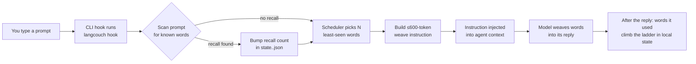

# LangCouch 🛋️

[English](README.md) · [Русский](README.ru.md) · O'zbekcha

*README.md dan tarjima qilingan (manba sanasi: 2026-09-25). Farq boʻlsa, inglizcha versiya asosiy hisoblanadi.*

**Divandan turmasdan — yoki terminalingizni tark etmasdan — til oʻrganing.**

LangCouch siz oʻrganayotgan tildagi soʻzlarni AI kodlash agentingizning javoblariga toʻqib boradi (Claude Code, opencode, Codex CLI, Hermes Agent, OpenClaw). Bu *diglot weave* texnikasi: siz odatdagidek ishlaysiz, javoblar esa asta-sekin maqsadli til soʻzlari bilan toʻqilib boradi — dastlab har javobda 3–5 ta, keyin tez-tez va murakkabroq, hatto soʻz yasash qoidalari, soʻz birikmalari va oddiy gap qurilishlarigacha. Darslar yoʻq. Oʻqish oʻrniga — immersiya (til muhitiga toʻliq singib ketish).

> Siz: "nega deploy muvaffaqiyatsiz boʻlyapti?"
> Agent: "8080-portni ertalabki **primero** (birinchi) ishga tushirishdan qolgan **viejo** (eski) jarayon hali ham band qilib turibdi. Uni `lsof -ti :8080 | xargs kill` bilan toʻxtating, deploy **ahora** (hozir) oʻtadi."

10 ta maqsadli til qutidan tayyor holda keladi. Glosslar (qavs ichidagi tarjima) ingliz, rus yoki oʻzbek tilida beriladi.

## 0.6.0 da nima yangi

- **Oraliqli takrorlash.** Har bir soʻz 30 daqiqa, 8 soat, bir kun, 4 kun, 2 hafta, bir oy va keyin 6 oydan soʻng qaytadi. Javob uni haqiqatan ishlatgandagina soʻz keyingi pogʻonaga oʻtadi.
- **Halol hisob.** LangCouch tayyor javobni oʻqiydi, shuning uchun model tashlab ketgan soʻz oʻrganilgan deb hisoblanmaydi va keyingi navbatda yana keladi.
- **Tarjimalar asta-sekin yoʻqoladi.** Yangi soʻz **casa** (house) koʻrinishida keladi. Tanish soʻz shunchaki **casa** boʻlib keladi, javob oxirida esa bitta `casa = house` qatori turadi. Siz biladigan soʻzlarga tarjima berilmaydi.
- **Faqat mos soʻzlar.** Model soʻzni faqat javobga shu maʼno baribir kerak boʻlgan joyda ishlatadi. Uzoq vaqt tashlab ketilgan soʻz bitta qisqa izohga tushishi mumkin, lekin hech qachon kodga yoki siz nusxa oladigan matnga emas.

Buni toʻrtta modelda eski xatti-harakat bilan solishtirdik: javoblar avvalgidek yaxshi qoldi, soʻzlar esa tabiiyroq oʻqiladi. [Har bir model qanday uddalaydi](evals/MODELS.md) (ingliz tilida). Eski toʻqishni `langcouch mode 1` qaytaradi. LangCouch'ni Claude Code plagini sifatida oʻrnatmagan boʻlsangiz, [yangilanish eslatmalarini](CHANGELOG.md) koʻring.

## Nega buni yaratdim

Men har kuni koʻp oʻqiyman, va hozir bu matnning katta qismi terminaldagi AI agentlarimning javoblaridir. Oʻrganayotgan tilingizda oʻqish uni oʻzlashtirishning eng qadimiy usullaridan biri, Toucan esa brauzerda veb-sahifalar uchun aynan shuni qiladi. Terminal uchun bunday vosita yoʻq edi, shuning uchun LangCouch'ni oʻzim uchun yaratdim. Uni istagan har bir kishi bepul foydalanishi mumkin.

## Tezkor boshlash

**Talab:** [bun](https://bun.sh) yoki Node.js ≥ 22.6 (`bun -v` yoki `node -v` bilan tekshiring). Ikkalasi ham topilmasa, plagin faolsiz qoladi va Claude buni sessiya boshida sizga aytadi.

### Claude Code plagini sifatida (tavsiya etiladi)

```
/plugin marketplace add shmsk/LangCouch
/plugin install langcouch@langcouch
# restart the session — replies start weaving Spanish (default: es, level 2)
```

Sozlash shart emas: na `npm install`, na build bosqichi kerak — hook birinchi ishlatilganda oʻz konfiguratsiyasini avtomatik yaratadi. Uni Claude Code ichidan `/langcouch:status`, `/langcouch:lang pt`, `/langcouch:level up`, `/langcouch:mode 3`, `/langcouch:pause` / `/langcouch:resume`, `/langcouch:spinner on` buyruqlari bilan boshqaring, oʻz tilingizni esa `/langcouch:add-language <language>` bilan qoʻshing.

**Oʻz tilingizdagi glosslar:** `~/.langcouch/config.json` faylida `"native"` qiymatini `en` (standart), `ru` yoki `uz` (oʻzbek, lotin yozuvi) ga oʻrnating. Toʻqilgan matndagi glosslar va qabul qilinadigan quiz javoblari shunga mos boʻladi.

### Qoʻlda hook oʻrnatish

Klon qilingan yoʻlda bitta `bun install` kifoya (faqat dev bogʻliqliklar; LangCouchning runtime bogʻliqliklari yoʻq).

```bash
git clone https://github.com/shmsk/LangCouch && cd LangCouch
bun install
bun src/cli.ts init                       # create ~/.langcouch
bun src/cli.ts install claude            # hook into the project's .claude/settings.json
# restart your Claude Code session — replies start weaving Spanish
```

Ikkalasidan bittasini tanlang, ikkovini birga emas. Baribir ikkalasini qoʻshsangiz ham, takroriy yetkazishga qarshi himoya hisoblashni toʻgʻri saqlaydi. Interaktiv `quiz` terminalda ishlaydi: qoʻlda klon qilingan versiyadan foydalaning, yoki CLI'ni plagin keshi ichida chaqiring (`~/.claude/plugins/cache/langcouch/…/scripts/cli.sh quiz`).

### opencode plagini sifatida

```
git clone https://github.com/shmsk/LangCouch && cd LangCouch
bun install
bun src/cli.ts install opencode           # project scope (.opencode/plugin/)
#   or:  bun src/cli.ts install opencode --scope user   # global (~/.config/opencode/plugin/)
# quit and restart opencode — replies start weaving Spanish
```

Bitta buyruq ikkita yoʻlni oʻrnatadi, ikkalasi ham bir vaqtda faol boʻladi:

- **Plagin (asosiy, ishonchli)** — opencode tomonidan avtomatik aniqlanadi. `experimental.chat.messages.transform` ga ulanib, oxirgi foydalanuvchi xabaringizda `langcouch hook` ni ishga tushiradi va kontekstga `<langcouch>` blokini kiritadi. Barcha modellarda ishlaydi.
- **AGENTS.md boʻlimi (zaxira, eksperimental)** — agar plaginlarni oʻchirib qoʻysangiz yoki plagin yuklanmasa, modelga har javob boshida `langcouch hook`ni oʻzi ishga tushirish koʻrsatmasi beriladi. Bu modelning koʻrsatmaga rioya qilishiga bogʻliq.

Agar ikkala yoʻl ham bitta soʻrov uchun ishga tushsa, takroriy yetkazishga qarshi himoya hisoblashni toʻgʻri saqlaydi.

### Codex CLI hooki sifatida

```bash
git clone https://github.com/shmsk/LangCouch && cd LangCouch
bun install
bun src/cli.ts install codex --scope user   # ~/.codex/hooks.json (or --scope project: ./.codex/hooks.json)
# start codex, open /hooks and trust the langcouch hook — replies start weaving Spanish
```

Codex siz koʻrib chiqmagan hooklarni ishga tushirmaydi, shuning uchun `/hooks` qadami bir marta kerak (hook buyrugʻi oʻzgarsa, yana). `--scope project` hooki uchun loyihaning oʻzi ham ishonchli boʻlishi kerak. Agar eski eksperimental versiya oʻrnatilgan boʻlsa, oʻrnatuvchi uning `AGENTS.md` boʻlimini oʻzi olib tashlaydi. Hozircha Codex qoʻshilgan koʻrsatmani suhbatda koʻrinadigan developer xabari sifatida koʻrsatadi ([openai/codex#16933](https://github.com/openai/codex/issues/16933)); bu faqat tashqi koʻrinish masalasi.

### Hermes Agent plagini sifatida

```bash
git clone https://github.com/shmsk/LangCouch && cd LangCouch
bun install
bun src/cli.ts install hermes           # $HERMES_HOME/plugins/langcouch/ (default ~/.hermes)
hermes plugins enable langcouch         # Hermes plugins are opt-in
# restart hermes — replies start weaving Spanish
```

Plagin — Hermes'ning `pre_llm_call` hooki orqali har bir navbatni LangCouch CLI'ga uzatadigan kichik Python fayli, shuning uchun u CLI'da ham, Telegram kabi gateway platformalarida ham bir xil ishlaydi. Uni istalgan sessiyadan `/langcouch status`, `/langcouch lang pt`, `/langcouch level up`, `/langcouch pause` / `/langcouch resume` bilan boshqaring. Hermes bilan birga keladigan Pythondan tashqari sizga Python kerak emas.

### OpenClaw plagini sifatida

```bash
git clone https://github.com/shmsk/LangCouch && cd LangCouch
bun install
bun src/cli.ts install openclaw         # generates the plugin in ~/.langcouch/openclaw-plugin/
openclaw plugins install --link ~/.langcouch/openclaw-plugin --force --accept-capabilities
openclaw config set plugins.entries.langcouch.hooks.allowConversationAccess true --strict-json
openclaw plugins enable langcouch
```

OpenClaw prompt hooklarini faqat siz ruxsat bergan plaginlar uchun ishga tushiradi, shuning uchun `allowConversationAccess` qatori shart. Plagin `before_prompt_build` hookidan foydalanadi, `/langcouch status`, `/langcouch lang pt`, `/langcouch pause` esa istalgan chat kanalida ishlaydi. OpenClaw'ning `claude-cli` provayderi prompt hooklarini ishga tushirmaydi ([openclaw/openclaw#65157](https://github.com/openclaw/openclaw/issues/65157)); qolgan barcha provayderlar ishga tushiradi.

## Bu agentimning javoblarini yomonlashtiradimi?

Yoʻq, aynan shunday boʻlmasligi uchun moʻljallangan. Toʻqish koʻrsatmasi kod bloklari, inline kod, identifikatorlar, buyruqlar, yoʻllar, URL manzillar, iqtiboslar va texnik atamalarga tegishni taqiqlaydi hamda modelga javobning maʼnosi va sifati toʻqishdan har doim ustun ekanini aytadi. Buning narxi — har bir soʻrov uchun bitta qisqa koʻrsatma (≤600 token), u asosan prompt keshidan oʻqiladi: odatiy sessiyaning taxminan 1–3% ([batafsil](docs/TokenUsage.md), ingliz tilida). Toʻrtta model buni qanday uddalashi: [evals/MODELS.md](evals/MODELS.md), ingliz tilida. Toza sessiya kerak boʻlsa, `/langcouch:pause` uni darhol toʻxtatadi, `/langcouch:resume` esa qaytaradi.

## Bu qanday ishlaydi

Brauzer kengaytmalari (Toucan, Vocabo) sahifa DOM'ini qayta yozadi. CLI'da esa keyinchalik qayta yozish imkoni yoʻq — shuning uchun LangCouch CLI hook orqali qisqa koʻrsatma kiritadi, toʻqishni esa modelning oʻzi amalga oshiradi. Yadro hech qanday CLI haqida bilmaydi — adapterlar yupqa qatlam xolos (arxitektura [context-mode](https://github.com/mksglu/context-mode)dan ilhomlangan).


```mermaid
flowchart LR
    A[You type a prompt] --> B[CLI hook runs<br/>langcouch hook]
    B --> C{Scan prompt<br/>for known words}
    C -->|recall found| D[Bump recall count<br/>in state.<lang>.json]
    C -->|no recall| E[Scheduler picks N<br/>least-seen words]
    D --> E
    E --> F[Build ≤600-token<br/>weave instruction]
    F --> G[Instruction injected<br/>into agent context]
    G --> H[Model weaves words<br/>into its reply]
    H --> I[After the reply: words it used<br/>climb the ladder in local state]
```

- **Kontseptga bogʻlangan lugʻat**: maʼnolar `concepts.json`da bir marta saqlanadi (id, pos, tier, har bir ona til uchun glosslar); har bir `wordlists/<lang>.json` esa yupqa kontsept→lemma xaritasi, shuning uchun yangi til qoʻshish — bitta kichik fayl, va glosslar hech qachon bir-biridan chetlanmaydi
- **Soʻz roʻyxatlari**: har bir til uchun ~400 ta asosiy mazmun soʻzi (ot/fe'l/sifat/ravish), yordamchi soʻzlarsiz; tier maydoni →1000 soʻzlik bosqich uchun joy ajratadi, u yadro ~80% oʻzlashtirilganda ochiladi
- **Har bir til boʻyicha progress**: holat `~/.langcouch/state.<lang>.json` faylida, kontsept id boʻyicha saqlanadi — progress lemma tuzatishlaridan omon qoladi va tillar oʻrtasida solishtirish mumkin ("siz *quyosh* soʻzini 5 tildan 3 tasida bilasiz")
- **Oraliqlar zinasi**: har bir soʻz 30 daqiqadan, 8 soatdan, 1 kundan, 4 kundan, 2 haftadan, 1 oydan, soʻng 6 oydan keyin qaytadi. U zinadan bir pogʻona faqat vaqti kelganda javob uni haqiqatan ishlatsagina koʻtariladi; vaqti kelgan soʻzlar birinchi turadi, har bir roʻyxatning choragi esa yangi soʻzlar uchun boʻsh qoladi
- **Halol hisob**: javobdan keyin Stop hooki (yoki xostning "javobdan keyin" hodisasi) uni qayta oʻqiydi va faqat javob ishlatgan soʻzlar koʻrsatilgan hisoblanadi. Bunday hodisasi yoʻq xost avvalgidek berilgan soʻzlarni hisoblaydi
- **Tarjimalar soʻnadi**: yangi soʻz **casa** (house) koʻrinishida keladi. Toʻrtinchi pogʻonadan boshlab u oddiy **casa** boʻlib turadi, tarjima esa oxirgi bir qatorda beriladi (`casa = house · nombre = name`). Beshinchi pogʻonadan (oʻzlashtirilgan) tarjima umuman boʻlmaydi, oʻzlashtirilgan soʻzlar esa model erkin ishlatishi mumkin boʻlgan aylanuvchi tanlama sifatida qaytadi, shuning uchun javoblarda til ulushi oshib boradi
- **Faqat joyiga tushsa, yana turtki**: model soʻzni faqat javobga uning maʼnosi baribir kerak boʻlgan joyga toʻqiydi, shuning uchun soʻz uchun hech narsa oʻylab topilmaydi. Yagona istisno: tez-tez tushib qolgan bir-ikki soʻzni qisqa chekinishga yoki yakuniy qatorga qoʻyish mumkin, lekin hech qachon kodga, faktlarga yoki nusxa koʻchiradigan matnga emas
- **Yodga tushirish signali**: koʻrish hali bilim emas. Oʻz soʻrovingizda ishlatgan yoki `quiz`da toʻgʻri javob bergan soʻz bir pogʻona koʻtariladi; quizdagi notoʻgʻri javob uni boshiga qaytaradi
- **Rejimlar**: `langcouch mode 3` yuqoridagilarning hammasi (standart). `mode 2` faqat joyiga tushadigan soʻzlarni toʻqiydi, `mode 1` esa roʻyxatdagi har bir soʻzni soʻraydi; ikkalasi ham soʻzni berilgan paytda hisoblaydi
- **1–10 darajalar**: soʻzlar 1-darajadan; soʻz yasash qoidalari 2-darajadan (`patterns/<lang>.json`); soʻz birikmalari 4-darajadan va oddiy gaplar 7-darajadan, agar tilda boʻlsa, `grammar/<lang>.json` dagi qurilmalar asosida
- **Ona tili**: agar siz oʻz ona tilingizni oʻrganayotgan boʻlsangiz (masalan, native `en` bilan `en`), glosslar boshqa tilga oʻtadi

## Qoʻllab-quvvatlanadigan tillar

| Til | Kod | Soʻzlar | Grammatik qurilmalar | Soʻz yasash qoidalari |
|---|---|---|---|---|
| Ingliz tili (AQSH) | `en` | 402 | — | 7 (rus tilida soʻzlashuvchilar uchun) |
| Ingliz tili (Britaniya) | `en-GB` | 402, AQSH bilan bir xil, 9 tasidan tashqari (*colour*, *centre*, *film*…) | — | 7 (AQSHdan) |
| Nemis tili | `de` | 402 | — | 8 |
| Fransuz tili | `fr` | 402 | — | 8 |
| Italyan tili | `it` | 402 | — | 8 |
| Ispan tili (Ispaniya) | `es` | 402 | 10 | 8 |
| Ispan tili (Lotin Amerikasi) | `es-419` | 402, Ispaniya bilan bir xil, 9 tasidan tashqari (*carro*, *computadora*, *lindo*…) | 10 + 2 mintaqaviy (*ustedes*, bugungi ish uchun preterit) | 8 (Ispaniyadan) |
| Portugal tili (Portugaliya) | `pt` | 402 | — | 8 |
| Portugal tili (Braziliya) | `pt-BR` | 402, Portugaliya bilan bir xil, 8 tasidan tashqari (*trem*, *celular*, *cachorro*…) | — | 8 (Portugaliyadan) |
| Turk tili | `tr` | 402 | — | 5 |

Kod tilni almashtirish uchun kerak, masalan `/langcouch:lang es-419` (yoki shunchaki `/langcouch:lang latam`).

Har bir tayyor roʻyxat ikkinchi model auditidan oʻtgan (uni yozgan modeldan boshqa yetkazib beruvchi). Ingliz fe'llari `to work`, `to love` koʻrinishida keltiriladi: ingliz tilida ot va fe'l koʻpincha bir xil yoziladi, shuning uchun har bir kontseptga oʻz soʻzi kerak. Toʻqish jarayonida ular baribir kontekstga mos ravishda tuslanadi (*worked*, *she loves*).

Tilingizni qoʻshish — bitta JSON fayl bilan. Faqat oʻzingiz uchun: Claude Code ichida `/langcouch:add-language Georgian` buyrugʻini bajaring, fayl esa `~/.langcouch/wordlists/` ichiga tushadi va u yerda plagin yangilanishlaridan omon qoladi. Hamma uchun: PR oching, qarang: [docs/AddLanguage.md](docs/AddLanguage.md). Hujjat AI kodlash agenti uni boshidan oxirigacha bajara olishi uchun yozilgan.

Mintaqaviy variantlar ham xuddi shunday ishlaydi: `pt-BR.json` faqat Braziliya portugal tili `pt`dan farq qiladigan soʻzlarni sanab oʻtadi, qolgani esa asosiy fayldan olinadi. `/langcouch:add-language Brazilian Portuguese` buyrugʻi shunday variant yaratadi; `/langcouch:lang pt-br` esa unga oʻtkazadi.

Variantga oʻtganda oʻrganish boshidan boshlanmaydi. Ikkalasida bir xil yoziladigan soʻzlarning progressi umumiy: Ispaniya ispan tilini oʻrganib, `es-419`ga oʻtsangiz, *casa* va boshqa soʻzlar oʻrganilgan boʻlib qoladi, faqat farq qiladigan 9 ta soʻzni oʻrganasiz. Ular birinchi keladi, Ispaniya soʻzi bilan yonma-yon: *carro = car, Spain: coche*. Grammatika ham shunday: avval mintaqaviy konstruksiyalar keladi (*vosotros trabajáis* emas, *ustedes trabajan*). Agar asosiy tildagi soʻz variant mintaqasida qoʻpol boʻlsa, qiyoslash bu haqda ogohlantiradi: *tomar = to take, Spain: coger (vulgar in much of Latin America)*.

## Soʻz yasash qoidalari

Koʻp soʻzlar bir nechta tilda bir xil tuziladi. *Revolution* ispanchada *revolución*, portugalchada *revolução*, italyanchada *rivoluzione*, fransuzchada *révolution*, ruschada *революция*. *-tion → -ción* qoidasini bir marta oʻrgansangiz, deyarli biladigan yuzlab ispancha soʻzlarni oʻqiy olasiz. Shu tufayli toʻqish iboralarga tezroq oʻtadi.

- **Qachon:** 2-darajadan (standart daraja) boshlab har bir javob bitta qoidani misol bilan oʻrgatadi: *-tion → -ción (revolución = revolution)*.
- **Roʻyxatdan tashqari:** qoidani oʻrgatayotgan javob shu qoida boʻyicha tuzilgan yana bitta soʻzni ishlatishi mumkin, hatto u sizning ~400 soʻzingiz orasida boʻlmasa ham.
- **Sizning tomoningiz:** qoʻshimcha ona tilingizda koʻrsatiladi. Ingliz tilida soʻzlashuvchi *-tion → -ción* ni, rus tilida soʻzlashuvchi *-ция → -ción* ni koʻradi. Oʻzbek tili uchun alohida qoidalar hozircha yoʻq, shuning uchun inglizcha tomoni koʻrsatiladi.
- **Progress:** qoida uchta javobdan keyin kiritilgan hisoblanadi, soʻng keyingisi boshlanadi. `status` buni *Word-building rules: 1/8 introduced* deb koʻrsatadi.
- **Soxta doʻstlar:** qoida unga oʻxshagan, lekin boshqa maʼnoli soʻzlar haqida ogohlantiradi, masalan *-al* yonida *actual = current*.
- **Maʼlumotlar qayerda:** qoidalar `patterns/<lang>.json` da, soxta doʻstlar va qoʻpol soʻzlar `falseFriends/<lang>.json` da. Har bir tildagi qoidalar soni “Qoʻllab-quvvatlanadigan tillar” jadvalida. Har bir qoida va misol lugʻat bilan (asosan Wiktionary) solishtirilgan, soʻng boshqa yetkazib beruvchining ikkinchi modeli tomonidan tekshirilgan.

Har bir versiyada nima oʻzgargani [CHANGELOG.md](CHANGELOG.md) faylida. Yangilanishdan keyin `status` yangi versiyadagi oʻzgarishlarni bir marta koʻrsatadi.

## Qoʻllab-quvvatlanadigan CLI'lar

| CLI | Holat | Oʻrnatish | Mexanizm |
|---|---|---|---|
| Claude Code | **Ishlab chiqarishda** | `/plugin marketplace add shmsk/LangCouch` → `/plugin install langcouch@langcouch`, yoki `langcouch install claude` | `UserPromptSubmit` hook (kontekstga kiritish, ishonchli); `Stop` javobni qayta oʻqiydi |
| opencode | **Ishlab chiqarishda** (plagin) + **eksperimental** (zaxira) | `langcouch install opencode [--scope project\|user]` | `experimental.chat.messages.transform` plagin hooki + AGENTS.md orqali oʻz-oʻzidan ishlaydigan zaxira; `session.idle` javobni qayta oʻqiydi |
| Codex CLI | **Production** | `langcouch install codex [--scope project\|user]` | `hooks.json`dagi `UserPromptSubmit` hook (kontekstga qoʻshish, ishonchli); `Stop` javobni qayta oʻqiydi |
| Hermes Agent | **Production** | `langcouch install hermes` | `pre_llm_call` plagin hooki (kontekst xabaringizga qoʻshiladi); `post_llm_call` javobni qayta oʻqiydi |
| OpenClaw | **Production** | `langcouch install openclaw` | `before_prompt_build` plagin hooki (`prependContext`); `agent_end` javobni qayta oʻqiydi |

Codex CLI, opencode, Hermes Agent va OpenClaw toza CI runnerga oʻrnatilib, boshidan oxirigacha sinovdan oʻtkaziladi ([hosts-smoke workflow](.github/workflows/hosts-smoke.yml)): plagin yuklanadi, blok modelga yetib boradi, OpenRouterdagi haqiqiy modellar esa ularga berilgan soʻzlarni toʻqiydi.

Oʻzingiznikini qoʻshish mumkin — qarang: [CONTRIBUTING.md](CONTRIBUTING.md). Har qanday adapter rioya qilishi kerak boʻlgan hook shartnomasi: xost sessiyasini hech qachon buzmaslik (har qanday xatoda hech narsa chop etmasdan 0 bilan chiqish).

## Buyruqlar

| Buyruq | Nima qiladi |
|---|---|
| `init` | konfiguratsiyani yaratadi (idempotent) |
| `status` | holati mavjud har bir til uchun daraja va progressni koʻrsatadi |
| `lang [code]` | maqsadli tilni almashtiradi / mavjudlarini roʻyxatlaydi (oʻzingiznikilar `local` deb belgilanadi) |
| `validate <code> [--full]` | soʻz roʻyxatini tekshiradi, masalan, siz `~/.langcouch/wordlists/` ga qoʻshgan roʻyxatni |
| `level <1-10\|up\|down>` | toʻqish intensivligi |
| `mode [1\|2\|3]` | toʻqish algoritmi: 3 oraliqlar zinasi (standart), 2 faqat joyiga tushadigan soʻzlar, 1 roʻyxatdagi har bir soʻz |
| `quiz [n]` | oʻzlashtirishni tekshiradi (standart 5 ta soʻz); notoʻgʻri javob berilgan soʻz yana aylanmaga qaytadi |
| `pause` / `resume` | toʻqishni oʻchirish/qayta yoqish tugmasi |
| `spinner <on\|off\|status>` | ixtiyoriy: oʻrganayotgan soʻzlaringiz Claude Code spinner maslahatlarida |
| `instruction` | toʻqish koʻrsatmasini chop etadi (duchor boʻlishlarni belgilamasdan) |
| `hook` | CLI-hook rejimi: javobdan oldin koʻrsatma tuzadi va soʻrovingizni yodga tushirishlar uchun skanerlaydi; undan keyin (`Stop` yuki) javob ishlatgan soʻzlarni hisoblaydi. Har qanday xatoda 0 bilan chiqadi, shuning uchun xost sessiyasini hech qachon buzmaydi |
| `install claude [--scope project\|user]` | UserPromptSubmit, SessionStart va Stop hooklarini roʻyxatdan oʻtkazadi |
| `install opencode [--scope project\|user]` | opencode uchun plagin + AGENTS.md zaxirasini oʻrnatadi |
| `install codex [--scope project\|user]` | Codex CLI `hooks.json` fayliga UserPromptSubmit, SessionStart va Stop hooklarini roʻyxatdan oʻtkazadi |
| `install hermes` | Hermes Agent plaginini `$HERMES_HOME/plugins/langcouch/` ichiga oʻrnatadi |
| `install openclaw` | OpenClaw plaginini yaratadi va uni ulash hamda yoqish buyruqlarini chop etadi |

## Spinner maslahatlari (ixtiyoriy)

Claude Code oʻylayotganda uning spinneri maslahatlarni almashtirib koʻrsatadi. `/langcouch:spinner on` u yerga hozir oʻrganayotgan 5 tagacha soʻzingizni qoʻshadi (`LangCouch · frío = cold`) va har bir sessiya boshida yangilaydi. Bu bepul bonus: spinner maslahatlari koʻrsatish sifatida hisoblanmaydi.

Plagin spinner maslahatlarini oʻzi yetkazib bera olmaydi, shuning uchun bu funksiya `~/.claude/settings.json` faylingizga ehtiyotkorlik bilan yozadi:

- **Standart holatda oʻchiq.** LangCouch oʻrnatilishi sozlamalaringizga hech qachon tegmaydi.
- **Faqat bizning qatorlar.** Qoʻshilgan har bir maslahat `LangCouch · ` bilan boshlanadi; sizning maslahatlaringiz, `excludeDefault` va boshqa barcha kalitlar oʻzgarmaydi. Fayl yaroqli JSON boʻlmasa, hech narsa yozilmaydi.
- **Zaxira nusxa va atomar yozish.** Birinchi oʻzgarishdan oldin asl fayl `~/.langcouch/settings.backup.json` ga nusxalanadi.
- **Toza oʻchirish.** `/langcouch:spinner off` `LangCouch · ` prefiksli barcha qatorlarni, agar `spinnerTipsOverride` kalitini biz yaratgan boʻlsak, uni ham oʻchiradi.

## Maxfiylik

Hook lokal tarzda ishlaydi. U soʻrovingizni faqat allaqachon koʻrgan soʻzlaringizni skanerlash uchun oʻqiydi (yodga tushirish signali) — soʻrovingiz hech qachon loglanmaydi, tarmoq orqali yuborilmaydi yoki hech qayerda saqlanmaydi. Diskka yoziladigan yagona narsa — `~/.langcouch/` ichidagi har bir til uchun holat fayli (odam oʻqiy oladigan JSON), uni istalgan vaqtda koʻrishingiz, zaxiralashingiz yoki `rm -rf` bilan oʻchirishingiz mumkin. LangCouchning tarmoq interfeysi va telemetriyasi yoʻq.

Javob tugagach, hook uni ham oʻqiydi (xost oʻzi uzatadi yoki u Claude Codeʼning lokal transkriptida bor) — faqat javobda haqiqatan ishlatilgan soʻzlarni hisoblash uchun. Shu paytgacha joriy navbat uchun taklif qilingan soʻzlar `~/.langcouch/served.json` faylida turadi. Javobning oʻzi saqlanmaydi va hech narsa kompyuteringizdan chiqmaydi. `langcouch mode 1` yoki `mode 2` buni oʻchiradi.

## Oʻchirib tashlash

- **Claude Code plagini:** agar spinnerni yoqqan boʻlsangiz, **avval** `/langcouch:spinner off` ni bajaring (Claude Code da oʻchirish hooki yoʻq, shuning uchun plagin oʻzidan keyin tozalay olmaydi). Keyin `/plugin uninstall langcouch@langcouch` va sessiyani qayta ishga tushiring. Spinner yoqilgan holda allaqachon oʻchirib yubordingizmi? `~/.claude/settings.json` dagi `spinnerTipsOverride.tips` dan `LangCouch · ` bilan boshlanadigan qatorlarni oʻchiring.
- **Qoʻlda oʻrnatilgan Claude Code hooki:** `.claude/settings.json` faylida (yoki `--scope user` bilan oʻrnatgan boʻlsangiz `~/.claude/settings.json`da) buyrugʻi `src/cli.ts hook` bilan tugaydigan `UserPromptSubmit`, `SessionStart` va `Stop` yozuvlarini oʻchiring.
- **opencode:** `.opencode/plugin/` dan (yoki `~/.config/opencode/plugin/` dan) `langcouch.ts` faylini va `AGENTS.md` ichidagi `<!-- langcouch:start -->` bilan `<!-- langcouch:end -->` orasidagi boʻlimni oʻchiring.
- **Codex CLI:** `~/.codex/hooks.json` (yoki `--scope project` uchun `.codex/hooks.json`) faylidan buyrugʻi `src/cli.ts hook` bilan tugaydigan `UserPromptSubmit`, `SessionStart` va `Stop` yozuvlarini oʻchiring.
- **Hermes Agent:** `hermes plugins disable langcouch`, keyin `~/.hermes/plugins/langcouch/` papkasini (yoki `$HERMES_HOME` ichidagisini) oʻchiring.
- **OpenClaw:** `openclaw plugins uninstall langcouch`, keyin `~/.langcouch/openclaw-plugin/` papkasini oʻchiring.
- **Progressingiz:** `rm -rf ~/.langcouch` (agar qaytib kelishingiz mumkin boʻlsa, buni bajarmang — progress qayta oʻrnatishlardan omon qoladi).

## Hissa qoʻshish

Eng qimmatli hissa — bu sizning tilingiz, va [docs/AddLanguage.md](docs/AddLanguage.md) AI agentingiz uni boshidan oxirigacha bajara olishi uchun yozilgan. Ishlab chiqish sikli, testlar va asosiy qoidalar [CONTRIBUTING.md](CONTRIBUTING.md) da berilgan.

## Yoʻl xaritasi

- Ispan tilidan tashqari tillar uchun grammatik qurilmalar (pt, it, fr, de, en, tr), pt-BR va en-GB uchun mintaqaviy qatlamlar bilan
- 2-daraja lugʻati (har bir til uchun →1000 soʻz), yadro ~80% oʻzlashtirilganda ochiladi
- Leksik bloklar (butun iboralar), yadroning katta qismi oʻzlashtirilgach
- Spinner fe'llarida ispancha gerundiylar («Pensando…»)
- Gemini CLI adapteri
- Yana koʻproq tillar — sizniki ham boʻladimi? ([docs/AddLanguage.md](docs/AddLanguage.md))

## Litsenziya

[MIT](LICENSE): erkin foydalanish, oʻzgartirish, fork qilish va qayta tarqatish mumkin.
